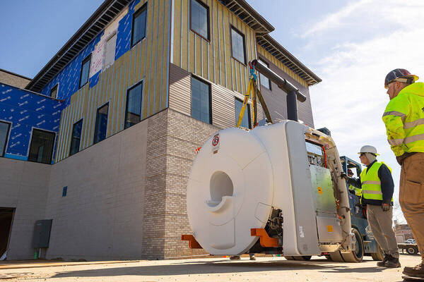

<!-- ## Welcome
Welcome to the Notre Dame Human Neuroimaging Center (ND-HNC) -- Resources for Operations and Computing page! -->

{fig-align="left"}

## Join Us

Follow these [arrival](pages/directions.qmd) instructions for help locating the center, parking, and entry.

Email: [nd-hnc@nd.edu](mailto:nd-hnc@nd.edu).

## About

Our goal is to provide operational support for research conducted at the Notre Dame Human Neuroimaging Center ([ND-HNC](https://neuroimaging.nd.edu/)).

We support every step of your research program:

- [Facilities](pages/facilities.qmd) and [Equipment](pages/equipment.qmd): Understand available resources.
- [Training](pages/training.qmd): Learn to use and gain access to the center.
- Schedule: Book facilities.
- Data collection: Operate research hardware.
- [Compute](pages/compute.qmd): Develop codebase, sandbox testing, local computing, parallelization.
  <!-- - Local machines
  - Local rack
  - Cluster resources -->
- [Storage](pages/storage.qmd): Keep and manage data at various project stages.

## Operation Documents

<!-- - [Forms](pages/forms.qmd): MRI Safety screener, other helpful documents. -->
- [Policies](pages/sops.qmd): ND-HNC policies for use.
- [SOPs](pages/sops.qmd): Standard Operating Procedures and forms.

## Additional Resources

- Grants: Awards to teams invovling the ND-HNC.
- Publications: Papers from teams that collected data at the ND-HNC.
- Wiki: Programming, data, and pipeline help.
