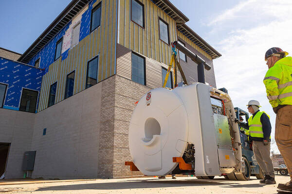

{fig-align="left"}

## Join Us

- Contact: [nd-hnc@nd.edu](mailto:nd-hnc@nd.edu).
- Tours: contact [Alex Musser](pages/people.qmd).
- Prepare: individuals entering [Zones 3 & 4](media/sops/nd-hnc_layout_zones.png) are required to fill out an [MRI Safety Screen](resources/forms/form_RO01_mri_screen.pdf) form.
- Visit: follow these [instructions](pages/directions.qmd) or reference this [flyer](resources/forms/form_RO02_arrival_white.pdf).

## About

We provide operational support for every step of research conducted at the Notre Dame Human Neuroimaging Center ([ND-HNC](https://neuroimaging.nd.edu/)):

- [Facilities](pages/facilities.qmd) and [Equipment](pages/equipment.qmd): Orient to available resources.
- [Training](pages/training.qmd): Learn to use and gain access to the center.
- Schedule: Book facilities.
- [Operate](pages/operate.qmd): Use equipment to collect data.
- [Compute](pages/compute.qmd): Develop codebase, sandbox testing, local computing, parallelization.
- [Storage](pages/storage.qmd): Keep and manage data at various project stages.

## Operation Documents

<!-- - [Forms](pages/forms.qmd): MRI Safety screener, other helpful documents. -->
- [Policies](pages/policies.qmd): ND-HNC policies for use.
- [SOPs](pages/sops.qmd): Standard Operating Procedures and forms.

## Additional Resources

- Grants: Awards to teams invovling the ND-HNC.
- [People](pages/people.qmd): Connect with ND-HNC staff.
- Publications: Papers from teams that collected data at the ND-HNC.
- Wiki: Programming, data, and pipeline help.
