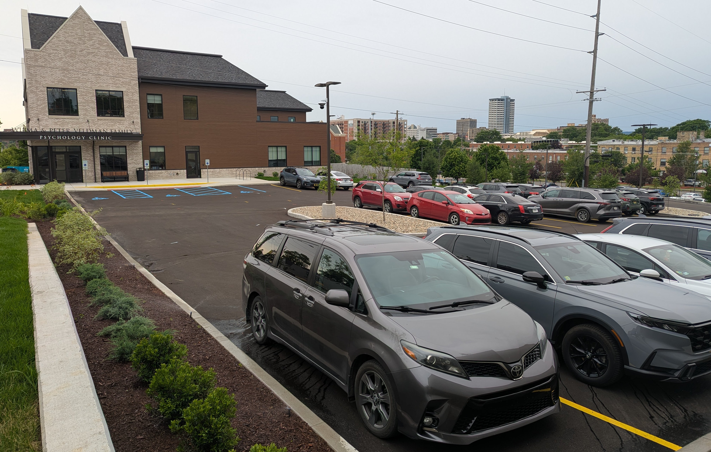

{width=75% fig-align="left"}

## Location
The Notre Dame Human Neuroimaging Center (ND-HNC) is located on the Lower Level of the Veldman Family Psychology Clinic, in downtown South Bend:

<iframe src="https://www.google.com/maps/embed?pb=!1m18!1m12!1m3!1d2979.775060586923!2d-86.24593442311095!3d41.68220117765539!2m3!1f0!2f0!3f0!3m2!1i1024!2i768!4f13.1!3m3!1m2!1s0x8816cd0072b05417%3A0xcf2f4da1ac64eb76!2sVeldman%20Family%20Psychology%20Clinic!5e0!3m2!1sen!2sus!4v1781707911861!5m2!1sen!2sus" width="600" height="450" style="border:0;" allowfullscreen="" loading="lazy" referrerpolicy="no-referrer-when-downgrade"></iframe>
Interactive Map

## Parking
Parking is available for free on the north side of the building (access from Cedar St).

## Entry
- Enter through the building's main (north) door.
- Access to reception is restricted -- it is possible to page the receptionist by pressing the yellow "Call" button.
- Research personnel will meet you in the main reception area and escort you to the ND-HNC.

{width=75%}

## Researchers
For access as a researcher, please reference the following SOPs:

- SOP 301: [Building Access](../resources/sops/300_building/1_access/sop_301_access.pdf){target="_blank"}.
- SOP 202: [Zone Access](../resources/sops/200_operation/2_zone_access/sop_202_zone_access.pdf){target="_blank"}.