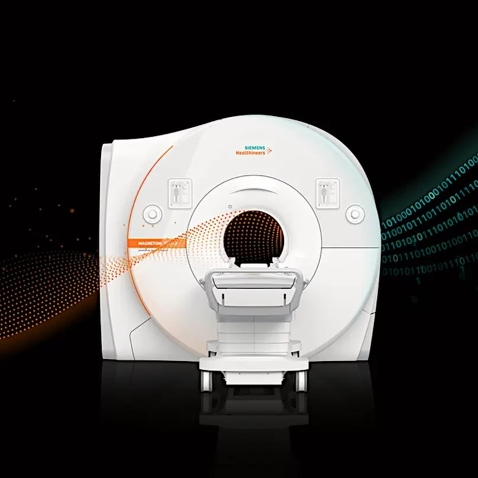
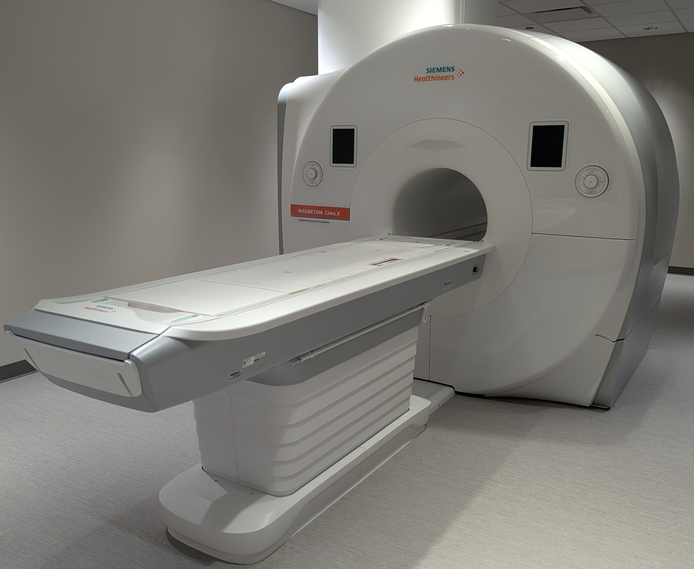
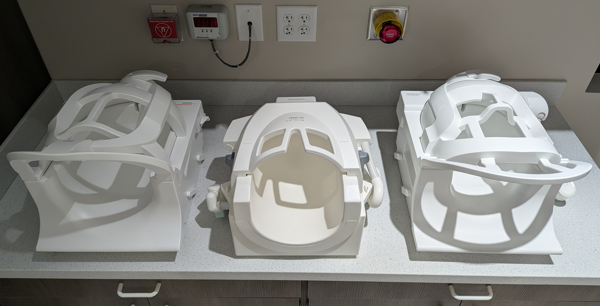
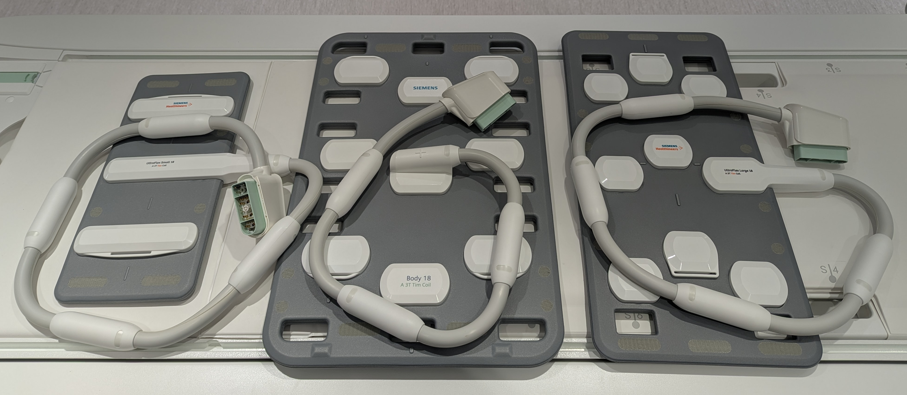
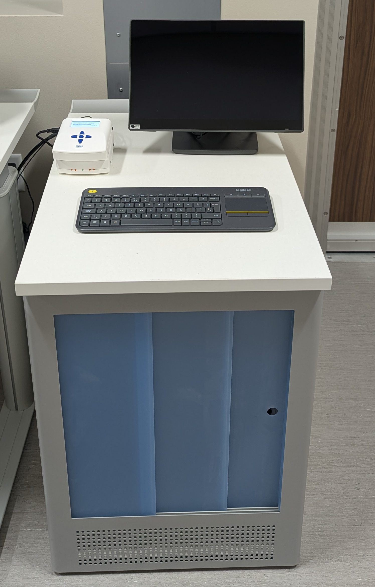
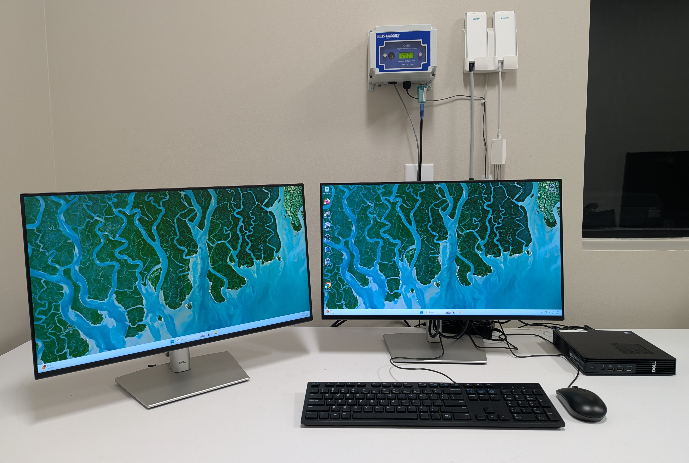
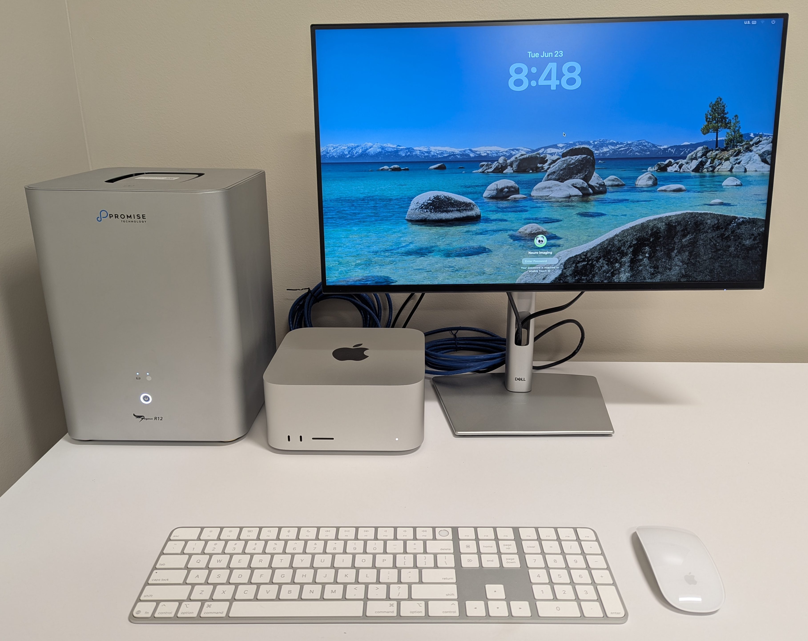
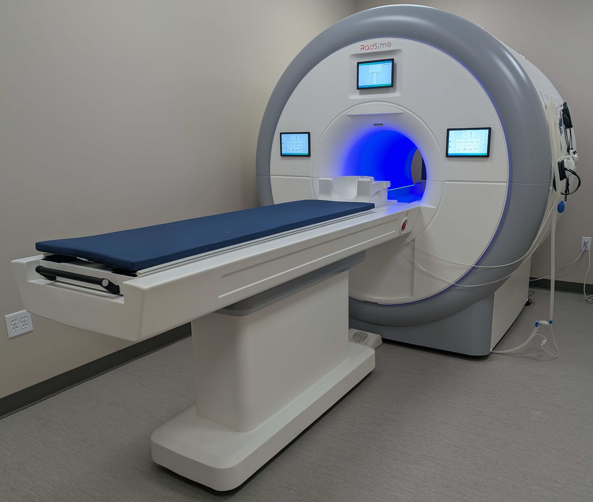

# Overview

<!-- {width=50% fig-align="left"} -->

## 3T Magnetic Resonance Imaging (MRI) System
### Siemens Healthineers MAGNETOM Cima.X 3T

{width=70%}

Our facility features the cutting-edge Siemens MAGNETOM Cima.X 3T system, operating on the latest syngo MR XA61 software platform. Designed with a patient-friendly 60 cm open bore, this system seamlessly bridges high-performance cognitive neuroscience research with advanced clinical diagnostics.

* **Unparalleled Gradient Performance:** Powered by Gemini Gradients, the system delivers a standard maximum amplitude of ≥200 mT/m per axis and a slew rate of 200 T/m/s. Through simultaneous vector addition across all three axes, it can achieve a peak performance of 346 mT/m and 346 T/m/s at a 100% duty cycle—enabling ultra-high spatial resolution and exceptionally fast scanning.
* **Exceptional Field Stability:** The superconducting 3T magnet features state-of-the-art passive and active shimming (including rapid 15-second patient-specific 3D shimming) and a zero helium boil-off rate. 5th-generation active shielding continuously suppresses external environmental magnetic noise.
* **DirectRF Technology:** An all-digital optical design integrates all radiofrequency (RF) transmit and receive components directly into the magnet housing, eliminating electrical noise and maximizing signal stability.
* **Real-Time Motion Correction:** To combat participant movement, the system includes a fully automatic 3D prospective motion correction system that tracks and adjusts for motion in real time across 6 degrees of freedom.

### Radiofrequency (RF) Coils
We offer a versatile suite of high-channel-count coils optimized for high signal-to-noise ratios (SNR), rapid parallel imaging (iPAT), and multi-region coverage.

* **64-Channel Head/Neck Coil:** Our primary neuroimaging array features an anthropomorphic design for maximum SNR and full head/neck coverage. It is highly optimized for fMRI and includes a dedicated rear port for EEG cables, allowing simultaneous EEG/fMRI studies with up to 128 electrodes. The upper section (24 elements) is removable, and the lower section (40 elements) remains on the table for streamlined workflows.
* **32-Channel Head Coil:** Specially optimized for high-resolution structural brain imaging, MR angiography (MRA), and functional MRI. It features an open-view architecture to reduce participant claustrophobia and easily accommodate visual stimulation experiments.
* **BioMatrix Head/Neck 20 Coil:** A tiltable 20-element array featuring integrated CoilShim technology that automatically corrects for local magnetic field inhomogeneities at challenging air-tissue interfaces, such as the frontal sinuses and skull base.

{width=70% fig-align="center"}

* **BioMatrix Spine 32 Coil:** A 32-channel matrix with integrated Respiratory Sensors for automatic respiratory gating and motion-artifact reduction without external bellows.
* **Body 18 Coil:** An ultra-lightweight, 18-element curved matrix for abdominal, thoracic, or torso imaging.
* **Flex Large 4 & Small 4 Coils:** Highly flexible 4-channel local loops paired with a dedicated interface for high-density, targeted imaging of unique anatomical regions.

{width=70% fig-align="center"}

## Functional MRI (fMRI) Task Presentation & Synchronization
### NordicNeuroLab (NNL) Complete fMRI Solution
For cognitive and behavioral paradigms, our center utilizes a fully integrated, medical-grade turnkey hardware and software system from NordicNeuroLab.

* **InroomViewing Device:** Visual tasks are delivered via a 40-inch 4K UHD MR-compatible LCD monitor positioned inside the magnet room. It features a high-contrast display, full image mirroring capabilities, and an integrated front-facing micro-camera for continuous patient surveillance from the console.
* **Fiber-Optic ResponseGrips:** Participant behavioral feedback is captured using ergonomic, 100% fiber-optic handheld units (4 buttons per hand). Containing no electronics, they introduce zero RF interference.
* **NNL SyncBox:** Ensures explicit temporal alignment between the MRI pulse sequences and the stimulus software with a timing accuracy of ±0.5 ms. It intercepts scanner triggers and streams them instantly to the stimulus computer.
* **nordicAktiva Software:** Allows a single operator to manage paradigm execution and image acquisition simultaneously. It includes an extensive library of ready-to-use clinical paradigms (language, motor, etc.) and a custom Paradigm Builder.

{width=40% fig-align="center"}

### Stimulus Control Computer
Task presentation, experimental timing, and multi-modal data integration are also available through a separate, ultra-compact Dell QMB1250 (Micro) workstation located in the control room. Despite its small footprint, this system provides robust, reliable performance tailored for precision behavioral testing and functional neuroimaging paradigms.

* **Core Specifications:** The workstation is powered by an advanced Intel Core Ultra 7 processor, paired with 16 GB of high-speed RAM to ensure seamless multitasking and tight temporal precision during sequence execution. It features a 512 GB solid-state drive (SSD) for rapid local data retrieval and storage of complex multimedia behavioral tasks.
* **Versatile Task Deployment:** The system is fully configured to support and deploy the industry-standard software packages utilized in cognitive neuroscience, including MATLAB (for custom routines and Psychtoolbox), PsychoPy (for Python-based experimental design), and E-Prime (for millisecond-accurate script execution).
* **Psychophysiological Integration:** Beyond driving visual and auditory paradigms via the NordicNeuroLab system, the workstation is specifically engineered and wired to receive real-time psychophysiological inputs (such as GSR, respiration, or heart rate monitoring devices). This setup allows investigators to acquire synchronized behavioral, physiological, and neuroimaging datasets concurrently.

{width=70% fig-align="center"}

## DICOM Capture, Processing, & Storage Workstation
Primary local data ingestion, database archiving, and 3D visualization are driven by an enterprise-tier neuroimaging workstation built for high-throughput data pipelines.

* **High-Performance Computation:** Positioned in the control room, this setup features a state-of-the-art Apple Mac Studio powered by an M4 Max chip (16-core CPU, 40-core GPU) with 48 GB of unified memory and a 1 TB internal SSD. Operating on a ultra-high-bandwidth unified memory architecture, this system enables instantaneous manipulation and rendering of massive, multi-dimensional imaging arrays without data-duplication latency.
* **DICOM Organization & Query via Horos:** The Mac Studio acts as the primary data receiver, pulling raw Digital Imaging and Communications in Medicine (DICOM) files directly from the scanner console. Database management, local archiving, and query/retrieve operations are handled natively via the Horos platform. This 64-bit medical imaging environment automatically indexes and structures incoming subjects, supporting advanced 2D/3D Multi-Planar Reconstructions (MPR), Maximum Intensity Projections (MIP), and high-precision region-of-interest (ROI) tools. For data sharing compliance, Horos utilizes scriptable anonymization utilities to strip Protected Health Information (PHI) before any external export.
* **Massive Fault-Tolerant Storage:** To manage and preserve these large neuroimaging payloads, Horos is configured to organize and archive all datasets directly onto a 104 TB Promise Technology Pegasus hardware RAID system. The array interfaces with the Mac Studio via a high-bandwidth 40 Gbps Thunderbolt connection, completely eliminating I/O bottlenecks when reading, writing, or processing multi-gigabyte 4D fMRI and diffusion timeseries datasets.

{width=60% fig-align="center"}

## Mock Scanner / Participant Training
### Encore MRI Simulator System (Psychology Software Tools)
To maximize data quality and minimize failed scans due to participant anxiety or motion, the center features a dedicated mock scanning environment.

* **Realistic Patient Interface:** Features a realistic diagnostic scanner façade, a standard 60 cm tapered bore, internal cooling fans, and a motorized participant table with dynamic speed controls and a safety squeeze ball.
* **Environmental Realism (SimFx):** Replicates the acoustic and tactile experience of a live scan using high-quality acoustic recordings of GE and Siemens sequences played through amplified speakers and a subwoofer to simulate authentic scanner vibrations.
* **Real-Time Motion Tracking (MoTrak):** Equipped with a head-mounted motion tracking system that monitors head movement and rotation along the X, Y, and Z axes. It can modulate audio/video output to provide immediate feedback, effectively training pediatric or anxious cohorts to remain perfectly still.
* **Console Simulation:** Utilizes IACIT MRI Console Simulation Software to replicate a true operator’s console, allowing staff, students, and investigators to practice protocol execution in a risk-free setting.

{width=70% fig-align="center"}

<!-- ## TODO: Compute -->

# Equipment Statement
## MRI: Siemens Healthineers MAGNETOM Cima.X 3T System
### System Overview
The imaging facility is equipped with a Siemens Healthineers MAGNETOM Cima.X 3-Tesla (3T) magnetic resonance imaging (MRI) system operating on the syngo MR XA61 software platform. This state-of-the-art system features a short-bore, patient-friendly architecture with an open bore design of 60 cm (600 mm). It is specifically engineered to bridge advanced clinical diagnostics and high-performance research applications.

### Magnet and Shimming System
The system incorporates a highly homogeneous superconducting magnet with an operating field strength of 3T and an exceptional field stability over time of less than 0.1 ppm/hour. It exhibits superb magnetic field homogeneity, demonstrating typical measured values of 0.0007 ppm at a 10 cm diameter spherical volume (DSV), 0.008 ppm at 20 cm DSV, and 0.04 ppm at 30 cm DSV. Field uniformity is optimized via passive shimming during installation and standard active shimming consisting of 3 linear (1st order) channels and 5 non-linear (2nd order) channels. Patient-specific automated 3D shimming can be completed rapidly in approximately 15 seconds. Environmental magnetic noise is minimized through 5th-generation active shielding (AS) technology with counter coils, alongside an integrated, patented External Interference Shielding (E.I.S.) system that continuously compensates for and automatically suppresses external magnetic field disturbances. Additionally, the magnet features a zero helium boil-off cooling system, yielding a typical boil-off rate of 0.0 liters per year.

### Gradient System Performance
High-spatial-resolution and ultra-fast scanning capabilities are driven by the Gemini Gradients, which consist of an actively shielded, force-compensated, and water-cooled whole-body gradient coil system that achieves extremely low eddy currents. The gradient system delivers a standard maximum amplitude of $\ge 200$ mT/m per axis and a maximum slew rate of 200 T/m/s per axis. Through simultaneous vector addition across all three gradient axes, the system can achieve a peak maximum performance amplitude of 346 mT/m and a maximum performance slew rate of 346 T/m/s. The gradient system operates at a 100% duty cycle. Power is delivered by a water-cooled, dual gradient power amplifier (GPA) array using ultra-fast solid-state technology, which supplies a maximum output voltage of $2 \times 2250$ V, a maximum output current of $2 \times 1250$ A, and a maximum total peak power of $2 \times 2.8$ MW.

### Radiofrequency (RF) Architecture and Receiver Specifications
The system utilizes DirectRF technology, featuring an all-digital-in/digital-out optical design that integrates all RF transmit and receive components directly into the magnet housing to eliminate electrical noise, increase signal detection, and maintain highest RF stability. RF transmission is mediated by an integrated whole-body, 32-rung, no-tune body coil with two-port feeding. The system employs TimTX TrueForm for optimized, uniform RF distribution across body regions and incorporates TimTX TrueShape parallel transmit (pTx) technology. The parallel transmit architecture provides two independent transmit channels for fully dynamic RF excitation and volume-selective B1 shimming, powered by a water-cooled solid-state amplifier delivering a peak power of 43.2 kW (Channel 0: 17.5 kW; Channel 1: 25.7 kW).

For signal reception, the system can connect up to 204 coil elements simultaneously (expandable to 228) and features 64 standard independent receiver channels (expandable to 128) that can be used simultaneously in a single scan and field of view (FOV). The digital receiver technology boasts a 32-bit signal resolution, an 80 MHz ADC sampling rate, a low preamplifier noise figure of <0.5 dB, and an instantaneous dynamic range of 164 dB at the receiver connector (increasing to 169 dB with automatic gain control at the local coil).

#### Advanced Neuroimaging Coils
The facility’s primary neuroimaging receiver array is a state-of-the-art, anthropomorphically designed 64-Channel Head/Neck Coil. This 64-element array features 64 integrated pre-amplifiers optimized for ultra-fast, high-signal-to-noise ratio (SNR) head and neck imaging. Engineered for advanced parallel imaging via iPAT², the coil minimizes SNR loss during rapid 3D imaging sequences. For multimodal and functional studies, the coil is designed to optimize patient comfort and accessibility, facilitating seamless integration with functional MRI (fMRI) peripherals such as visual stimulation mirrors and eye-tracking systems. Crucially for multimodal research, it features a dedicated rear port for EEG cables, enabling simultaneous EEG/MR imaging for up to 128 electrodes. Ergononmically, it utilizes a two-piece design consisting of a removable upper part with 24 elements and a lower part with 40 elements that can remain on the patient table. Incorporating DirectConnect® cable-less lower part technology and Dual-Density Signal Transfer, it integrates key RF components directly into the coil housing to maximize signal fidelity through a single SlideConnect® connector.

Complementing this is a dedicated 32-Channel Head Coil, featuring a 32-element design with 32 integrated pre-amplifiers and Dual-Density Signal Transfer technology. This coil is specifically optimized for high-resolution structural brain proton imaging, MR angiography (MRA), and functional MRI (fMRI). It is designed with an open-view architecture to mitigate patient claustrophobic responses and comfortably accommodate visual stimulation experiments. The coil includes a detachable mirror assembly and a removable upper section with 12 elements, allowing the 20-element lower section to be used independently or in combination with local loop coils when required.

Additionally, the facility's core capabilities include a BioMatrix Head/Neck 20 Coil. This 20-element tiltable head/neck array features integrated CoilShim technology, which allows for automated, patient-specific magnetic field shimming. This advanced shimming capability actively mitigates local field B0​ inhomogeneities, particularly at challenging air-tissue interfaces such as the frontal sinuses and skull base, ensuring high spectral quality and reducing geometric distortions in EPI sequences.

#### Peripheral, Body, and Spine Coils for Extended Field-of-View (FoV)
or extended multi-region imaging—such as integrated brain-to-spine protocols or whole-body examinations—the facility utilizes advanced multi-channel arrays designed to integrate seamlessly with the primary head coils. This includes the BioMatrix Spine 32 Coil, a 32-channel spine matrix equipped with integrated Respiratory Sensors. These built-in sensors provide automatic respiratory gating and motion-artifact reduction, eliminating the need for external respiratory bellows and streamlining the workflow for complex thoracic or spinal acquisitions.

To accommodate larger imaging fields or highly customized anatomical targeting, the facility is also equipped with a Body 18 Coil and a set of flexible local loops. The Body 18 Coil is an 18-element, ultra-lightweight curved matrix coil optimized for high-resolution abdominal, thoracic, or extended neck and torso imaging. For challenging or non-standard anatomical regions, the facility leverages Flex Large 4 and Flex Small 4 Coils. These highly flexible, 4-channel multipurpose local loops are paired with a dedicated Flex Coil Interface to deliver high-density, targeted imaging with excellent signal localization.

### Advanced Imaging Capabilities and Workflow Automation
The hardware configuration allows for exceptional resolution boundaries, enabling a minimum FOV of 5 mm, a highest in-plane resolution of 5 $\mu$m, a minimum 2D slice thickness of 0.1 mm, and a minimum 3D partition thickness of 0.05 mm. Advanced imaging paradigms include high-performance diffusion imaging supporting maximum b-values up to 16,000 s/mm². To combat motion artifacts, the system features a fully automatic 3D prospective motion correction system that tracks and adjusts for 6 degrees of freedom (3 translations and 3 rotations) in real time during data acquisition. Furthermore, the parallel-transmit-enabled ZOOMit application permits selective excitation to zoom into specific anatomical targets, minimizing image distortions, avoiding aliasing artifacts, and reducing overall scan times for fMRI, diffusion-weighted imaging (DWI), diffusion tensor imaging (DTI), and T2 SPACE sequences.

Patient handling and protocol reproduction are managed via BioMatrix Interfaces and the myExam Companion software environment. This includes AI-driven Select&GO touch displays utilizing an intelligent anatomical body model to automate and accelerate precise patient positioning. The system features a BioMatrix patient table capable of a 205 cm scan range without repositioning, supporting vertical and horizontal movements for patient weights up to 250 kg (550 lbs).

## Mock: Encore MRI Simulator System
### System Overview and Purpose
The facility is equipped with an Encore MRI Simulator developed by Psychology Software Tools (DBA RadSim). This specialized system is dedicated to pre-scan acclimation, participant training, and piloting functional magnetic resonance imaging (fMRI) behavioral paradigms. It provides a realistic approximation of an actual scanning environment to comfortably introduce pediatric cohorts to the MRI environment, train faculty and staff in a cost-effective setting, and mitigate failed clinical or research scans resulting from participant anxiety or claustrophobia.

### Physical Architecture and Patient Interface
The simulator features a robust scanner body engineered with a sturdy steel frame construction and a realistic front façade panel designed to mimic modern diagnostic MRI scanners. The system incorporates a standard 60 cm circular bore with a tapered entry to match clinical dimensions. Patient handling is facilitated by a quiet, motorized participant table featuring precise movements, an integrated control panel for operator execution, dynamic speed control, and a drag-sensing safety stop to ensure participant protection. For further safety, comfort, and monitoring, the bore is outfitted with internal cooling fans, diffused lighting, and a participant safety squeeze ball. Patient positioning is assisted via an integrated laser positioning crosshair. The table setup also includes a specialized participant securing system.

### Environmental Realism and Audio-Visual Systems
To replicate the sensory experience of an active scanner, the Encore system includes amplified speakers with an integrated subwoofer capable of generating realistic scanner noise production and physical vibration. This is driven by SimFx software, which simulates ambient scanner sound and active scanning sequences using high-quality acoustic recordings captured from both GE and Siemens platforms via fiber-optic microphones. Visual and auditory stimulation during simulation are delivered through a 22-inch 1080p participant monitor mounted on an adjustable stand with scan reverse capability, alongside high-quality headphones utilizing a comfortable ear-cup design. Bidirectional audio enables seamless communication between the operator and the participant. A micro camera is mounted directly inside the bore to allow continuous real-time visual monitoring of participant safety.

### Mock Head Coils and Behavioral Response Hardware
The system includes interchangeable mock head coils to replicate specific imaging configurations, including a Birdcage coil, a GE 32-channel coil, and Siemens 32- and 64-channel coils, all integrated with rear-facing mirror systems for visual task delivery. Behavioral data collection and task practice are supported by right- and left-hand button response units. These consist of lower-cost USB versions of the Celeritas line of fiber-optic response units, optimized for practicing fMRI tasks outside the actual scanner environment.

### Motion Tracking and Protocol Training Software
To maximize downstream MRI data quality by training participants to minimize motion, the setup includes the MoTrak head-mounted motion tracking system. MoTrak monitors head motion and angular rotation along the X, Y, and Z axes in real time, enabling the system to modulate audio and/or video output to provide immediate positive or negative feedback to train participants to remain still. Operational and protocol training are supported by the IACIT MRI Console Simulation Software, which features advanced touchscreen controls and replicates an MRI operator's console to build user experience and confidence in a classroom or laboratory setting.

## Task: NordicNeuroLab functional MRI (fMRI) Solution
### System Overview and Compliance
The imaging facility is supported by a comprehensive, turnkey fMRI hardware and software solution provided by NordicNeuroLab (NNL). This integrated system is engineered to simplify, standardize, and streamline functional MR imaging workflows for both advanced scientific research and clinical applications, such as pre-surgical mapping of motor and language areas. All hardware components are designed, developed, and manufactured under a certified ISO 13485 Quality Management system. The equipment complies with international consensus standards (IEC) for Device Safety and Electromagnetic Compatibility (EMC) for medical electrical equipment, ensuring safe deployment within high-field magnetic environments.

### Visual Display and Patient Monitoring Systems
Visual stimulus presentation and patient monitoring are managed through an MR-compatible InroomViewing Device. This configuration features a 40-inch 4K UHD (3840 x 2160 pixels) MR-compatible LCD monitor that operates safely at field strengths of 1.5T, 3.0T, and 7.0T (Field conditional). The system utilizes a slim design with a high-contrast display (5000:1 typical) and an active area of approximately 878 mm x 485 mm, serving as a high-fidelity alternative to goggle- or projector-based systems. It includes an integrated, front-facing micro-camera supporting up to 1920 x 1080 resolution at 30 fps for uninterrupted patient surveillance from the console , a built-in USB hub for peripheral connectivity , full image flip/rotate capabilities , and a complete optical path between the operator and scanner rooms. The assembly is mounted on a lightweight, height-adjustable mobile foot stand to allow flexible placement anywhere inside the MRI environment.
<!-- 2. VisualSystem HD (VSHD): Alternatively, for a fully immersive environment or specific visual field mapping paradigms, the facility utilizes the VisualSystem HD MR-compatible goggles. This binocular head-coil-mounted display (HMD) provides high-resolution 3D stereoscopic visual delivery at field strengths up to 3 Tesla. It delivers a wide 60-degree diagonal field of view (FOV) to optimize mapping of visual field deficits. The goggles feature mechanical adjustments for height, inter-pupillary distance, and diopter correction to accommodate individual patient anatomy , and feature integrated eye-tracking cameras for real-time monitoring. -->

### Participant Response Hardware
Participant behavioral feedback and behavioral task responses are captured using MR-compatible ResponseGrips. These ergonomic handheld units are configured for both hands to help minimize overall patient upper-extremity movement inside the bore. The units feature a 100% fiber-optic polymer construction containing no electronics. Subjects interact with the paradigm by pressing one of four buttons per grip. The optical signals are routed through a waveguide to a ResponseGrips Interface Unit located in the operator control room, which delivers real-time response validation via integrated LEDs and optional auditory signaling while interfacing directly with the stimulus PC via serial or USB connectivity.

### Scanner Synchronization Architecture
Explicit temporal alignment between the MRI scanner's pulse sequences and the stimulus presentation software is achieved via the NNL SyncBox. The SyncBox is an MRI scanner-independent synchronization device featuring an internal clock with a timing accuracy of ±0.5 ms. It automatically intercepts trigger pulses emitted by major hardware platforms, accepting optical triggers from Siemens systems, BNC female TTL-level inputs from Philips systems, and 9-pin DSUB RS-485/422 inputs from GE systems. It seamlessly translates these pulses into ASCII or keystroke data, streaming them to the presentation computer over a Mini-B USB or serial interface at a transfer rate of 57,600 Baud. The SyncBox features a built-in menu system and an independent Simulation Mode that replicates active MRI scanner sequence triggers. This simulation mode enables investigators to develop, refine, and bench-test entire experimental paradigms at a standard desktop station without consuming valuable, high-cost magnet scanning time. When utilized alongside nordicAktiva software, its configuration parameters can be controlled automatically via serial communication.

### Stimulus Presentation and Paradigm Management Software
In-room paradigm execution is driven by nordicAktiva stimulus presentation software, which permits a single radiographer or technician to control stimulus presentation and image acquisition simultaneously. The platform contains an integrated hardware verification routine that tests all interface connections prior to initiating an exam. It includes an extensive, built-in library of standardized, clinically optimized, ready-to-use paradigms (e.g., motor finger-tapping, language rhyming, and word generation) available in multiple languages. The v2.0 software architecture incorporates a real-time hardware connection status toolbar, a streamlined user interface, and an integrated Paradigm Builder interface that lets operators modify existing paradigms or construct custom blocks easily. It also supports a "Preview" mode for practicing and rehearsing sequences with patients before initiating actual scanner acquisition.

<!-- Advanced Post-Processing and Neuroimaging Analytics Suite
nordicMEDiVA (US Market Availability): Advanced post-processing, data analysis, and multi-user collaboration are supported by nordicMEDiVA, a web-based, zero-footprint neuroimaging application that allows multiple clinicians and researchers to share interactive post-processing sessions concurrently in real time. The suite provides dedicated modules for task-based fMRI, diffusion imaging, and perfusion analytics:
Task-based fMRI: The software automatically generates localized activation maps from BOLD fMRI time-series data using the General Linear Model (GLM). Automated preprocessing routines include 3D co-registration with structural MR images, patient motion correction, spatial smoothing, and temporal band-pass filtering. Users can interactively adjust t-value thresholds, manipulate cluster size constraints, and inspect volume-of-interest (VOI) time-intensity curves for quality assurance.
Diffusion and Tractography: The system executes automated preprocessing of diffusion-weighted data with built-in motion and eddy-current distortion corrections. It models data utilizing Diffusion Tensor Imaging (DTI), spherical deconvolution, or apparent diffusion coefficient (ADC) processing to yield scalar maps—including Fractional Anisotropy (FA) and Mean Diffusivity (MD). Reconstructed 3D tracts can be interactively explored alongside region-of-interest (ROI) tools and streamline thresholds to map critical white matter pathways for neurosurgical planning.
DSC Perfusion: The software automates Dynamic Susceptibility Contrast (DSC) perfusion processing to calculate and map cerebral blood volume (CBV), cerebral blood flow (CBF), time-to-peak (TTP), and contrast agent leakage. Perfusion maps are normalized using a patented algorithm against normal-appearing white and grey matter, providing highly consistent, fast, and reproducible quantitative reporting.  -->

## PACS: High-Performance Imaging Workstation and Storage Subsystem
### Computation and Workstation Architecture
Primary local data processing, analysis, and execution of neuroimaging workflows are anchored by an Apple Mac Studio high-performance workstation. This system utilizes a high-efficiency Apple Silicon system-on-a-chip (SoC) architecture, integrating multi-core central and graphics processing units (CPU/GPU) with a unified memory architecture that provides exceptionally high memory bandwidth (up to 400–800 GB/s). This unified memory approach allows the operating system and imaging applications to instantly share massive imaging volumes without the latency of data duplication. The workstation is further equipped with hardware-accelerated media engines and a 16-core Neural Engine to accelerate compute-heavy image manipulation, machine learning-driven segmentation, and complex mathematical modeling. High-speed network connectivity to the MRI scanner console and regional Picture Archiving and Communication Systems (PACS) is supported via an integrated 10Gb Ethernet port.

### Massive Storage Subsystem and Redundancy Architecture
To store, manage, and preserve the massive data payloads generated by high-resolution multi-modal MRI sequences, the workstation is integrated with a Promise Technology Pegasus series hardware RAID array configured to provide 104 Terabytes (TB) of dedicated storage capacity. The array interfaces with the Mac Studio via high-bandwidth Thunderbolt technology, supporting physical interface throughput speeds of up to 40 Gbps (Thunderbolt 3/4) to eliminate I/O performance bottlenecks during the reading and writing of multi-gigabyte 4D fMRI and diffusion timeseries datasets. The storage solution relies on a dedicated, on-board PromiseRAID hardware engine that manages the drive configuration under a secure, fault-tolerant parity scheme (such as RAID 5 or RAID 6). This configuration safeguards the research data against individual drive failures while maintaining high-speed sustained read/write performance. Continuous subsystem health is maintained via Predictive Data Migration (PDM) technology, which monitors individual drive parameters to predict potential faults and automatically migrates data before hardware failure occurs.

### DICOM Image Management and Visualization Platform
Local database management, archiving, query/retrieve operations, and primary visualization of standard Digital Imaging and Communications in Medicine (DICOM) files are executed through the Horos software platform. Horos is a native macOS, fully functional 64-bit medical image viewer and database engine built on the open-source OsiriX code base, optimized for research, education, and non-diagnostic imaging analytics. The application provides an intuitive local PACS environment that indexes and organizes complex patient/subject hierarchies, multi-echo series, and multi-slice acquisitions.

Advanced 2D and 3D visualization capabilities native to Horos include:

- 2D Orthogonal and 3D Multi-Planar Reconstruction (MPR): Allows investigators to dynamically reslice and display anatomical volumes along axial, coronal, sagittal, or oblique planes.
- Intensity Projections: Supports Maximum Intensity Projection (MIP), Minimum Intensity Projection (MinIP), and Mean projection modes to highlight microvascular or dense structural boundaries.
- Advanced Rendering: Provides volume and surface rendering tools to generate detailed 3D spatial topographies of anatomical targets.
- Quantitative Analysis and Compliance: Features high-precision geometric measurement, annotation, and region-of-interest (ROI) tracing tools to track structural volumes and signal intensities. For human subjects' protection and compliance with institutional data sharing policies, Horos includes powerful scriptable anonymization utilities that strip Protected Health Information (PHI) from DICOM headers before exporting data for collaborative external analysis.

## Compute: High-Performance Infrastructure and Laboratory Workstations
### High-Performance Computing (HPC) Cluster Subsystem
For large-scale data processing, group-level statistical analysis, and compute-intensive neuroimaging pipelines, the project has dedicated access to a High-Performance Computing (HPC) cluster. This institutional resource features 1,280 dedicated CPU cores optimized for highly parallelized computational workloads. The cluster nodes are interconnected via a ultra-low-latency, high-bandwidth network fabric (e.g., 100 Gbps InfiniBand or equivalent), enabling seamless Message Passing Interface (MPI) coordination and multi-node parallelization.

The compute infrastructure is tightly integrated with a centralized, enterprise-grade storage subsystem provisioning 800 Terabytes (TB) of high-throughput storage space. This storage architecture utilizes a high-performance parallel file system (such as Lustre or IBM Spectrum Scale/GPFS) engineered to handle the concurrent read/write demands of hundreds of simultaneous processing streams. This setup eliminates input/output (I/O) bottlenecks during the processing of massive longitudinal datasets, high-resolution structural volumes, and high-frequency 4D fMRI timeseries. Resource allocation, job scheduling, and workload management are governed by an advanced workload manager (such as Slurm), ensuring deterministic execution times for complex neuroimaging pipelines (e.g., fMRIPrep, FreeSurfer group analyses, and diffusion tractography).

### Dedicated Departmental 56-CPU Rack System
Complementing the primary institutional cluster is a local, high-density server rack system housing 56 vCPUs and 256 GB RAM. This infrastructure provides intermediate-tier computing power directly accessible by the research team. It is configured to handle high-throughput local processing, immediate pipeline piloting, and containerized application testing (using Docker or Singularity) before deploying scripts to the larger 1,280-CPU cluster.

The rack is architected with multiple high-density multi-core server blades, substantial RAM per node (supporting memory-heavy operations like large-matrix transformations and voxel-wise permutations), and high-bandwidth local networking (e.g., dual 10GbE or 25GbE uplinks). This localized rack serves as an agile, department-controlled environment for real-time data curation, structural reconstruction, and machine learning model training without the queue latencies often associated with shared institutional resources.

### Dedicated Linux and Mac Studio Analytical Workstations
Individual data interaction, algorithm development, quality control visualization, and localized analysis are supported by a suite of dedicated, high-performance desktop workstations:

- Dedicated Linux Workstations: The laboratory deploys specialized desktop computing towers running enterprise-grade Linux distributions (such as Ubuntu LTS or Rocky Linux). These workstations are configured with multi-core processors, high-capacity system memory, and dedicated NVIDIA graphics processing units (GPUs) supporting CUDA acceleration. These systems provide the native, high-performance environment required by core neuroimaging software suites, including FSL, FreeSurfer, AFNI, ANTs, and custom Python/MATLAB pipelines. The integrated GPUs drastically accelerate computationally heavy routines such as diffusion-weighted probabilistic tractography (e.g., FSL's bedpostx_gpu) and deep learning-based structural segmentation.
- Mac Studio Workstations: The computing ecosystem also includes Apple Mac Studio workstations utilizing advanced Apple Silicon system-on-a-chip (SoC) architectures. These workstations leverage a high-bandwidth unified memory architecture that allows the CPU and GPU to share large memory pools instantaneously, preventing data duplication bottlenecks during the interactive visualization of massive multi-dimensional imaging arrays. The Mac Studio systems are primarily used for interactive software execution (e.g., Horos, OsiriX), localized statistical scripting (R, Python/Jupyter), paradigm presentation debugging, and graphical rendering of complex 3D brain models. All workstations are connected to the local 256-CPU rack and the 800 TB storage array via a high-speed 10GbE local area network (LAN) to ensure rapid, secure data transfer.