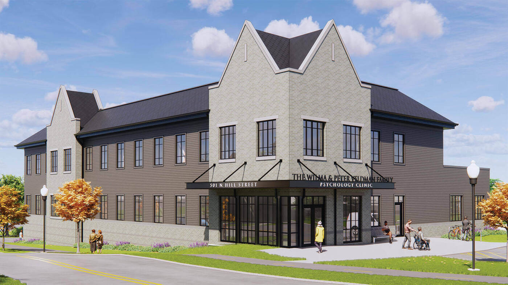

## Facility Statements

{width=75%}

### Veldman Family Psychology Clinic and Notre Dame Human Neuroimaging Center

The proposed research will be conducted within the Veldman Family Psychology Clinic, a dedicated 35,000-square-foot clinical and research facility located in the lower level of the Notre Dame Human Neuroimaging Center. The facility provides a fully integrated environment for participant recruitment, clinical assessment, neuroimaging, electrophysiological recording, noninvasive brain stimulation, data processing, and collaborative scientific analysis.

The clinic includes dedicated participant-facing spaces consisting of a reception area (117 ft$^2$), two consultation rooms (83 and 100 ft$^2$), two changing rooms (80 and 79 ft$^2$), and two interview rooms (110 and 112 ft$^2$). Research-dedicated spaces include a mock MRI scanner room (226 ft$^2$), two EEG laboratories (157 and 161 ft$^2$), an EEG control room (104 ft$^2$), EEG preparation room (182 ft$^2$), MRI vestibule (308 ft$^2$), MRI storage room (179 ft$^2$), MRI scanner and control suite (~500 ft$^2$), a dedicated TMS laboratory (385 ft$^2$), image processing room (270 ft$^2$), conference room (257 ft$^2$), and three research offices (121, 102, and 103 ft$^2$).

The facility is staffed by an experienced MRI Technologist, MRI Physicist, MRI Analyst, and Operations Coordinator who provide technical support, protocol implementation, quality assurance, participant scheduling, regulatory compliance, and investigator training.

### Magnetic Resonance Imaging Resources
Human neuroimaging studies are performed on a Siemens Healthineers MAGNETOM Cima.X 3T MRI system operating on the syngo MR XA61 platform. The system combines advanced research capabilities with a participant-friendly short-bore design featuring a 60-cm open bore architecture.

The scanner incorporates a highly homogeneous superconducting 3T magnet with exceptional field stability (<0.1 ppm/hour) and high-performance passive and active shimming capabilities. Automated subject-specific 3D shimming can be completed in approximately 15 seconds, ensuring optimal magnetic field homogeneity for advanced neuroimaging applications. Fifth-generation active shielding and Siemens External Interference Shielding technology minimize environmental magnetic disturbances and maintain image quality during demanding functional and diffusion imaging studies.

Image acquisition is supported by Siemens Gemini gradients capable of maximum gradient amplitudes of ≥200 mT/m per axis and slew rates of 200 T/m/s per axis, with vector performance reaching 346 mT/m and 346 T/m/s. These capabilities enable high-resolution structural imaging, advanced diffusion imaging, and rapid functional MRI acquisition with reduced distortion and improved signal fidelity.

The system employs Siemens DirectRF digital architecture and TimTX TrueForm/TrueShape parallel transmit technology to optimize RF homogeneity and signal stability. Up to 204 coil elements and 64 simultaneous receiver channels can be utilized during data acquisition, providing high signal-to-noise ratios and supporting accelerated imaging protocols.

Advanced imaging capabilities include diffusion imaging with b-values up to 16,000 s/mm², automated prospective motion correction with real-time six-degree-of-freedom tracking, parallel-transmit-enabled selective excitation (ZOOMit), and AI-assisted workflow tools through Siemens BioMatrix and myExam Companion technologies. These capabilities support state-of-the-art structural MRI, functional MRI, diffusion tensor imaging, tractography, and quantitative neuroimaging investigations.

### MRI Simulation and Participant Training Resources
The facility houses an Encore MRI Simulator (Psychology Software Tools/RadSim), which provides a realistic MRI environment for participant acclimation, protocol piloting, and training. The simulator includes a realistic 60-cm bore, motorized participant table, integrated positioning lasers, environmental lighting, cooling systems, and participant safety monitoring.

The simulator reproduces scanner acoustics and vibration using high-fidelity recordings obtained from Siemens and GE MRI systems. Visual presentation is delivered through a dedicated 22-inch high-definition display with integrated audio communication and real-time participant monitoring through an in-bore camera system.

The simulator incorporates interchangeable mock head coils replicating Siemens and GE acquisition environments and includes response devices for behavioral task practice. The MoTrak motion tracking system provides real-time monitoring of participant head motion across three translational and three rotational axes, allowing participants to receive immediate feedback regarding movement. This capability substantially improves participant compliance and reduces motion-related data loss during actual MRI sessions, particularly among pediatric and anxiety-prone populations.

### Functional MRI Research Infrastructure
Functional MRI studies are supported by a comprehensive NordicNeuroLab (NNL) hardware and software ecosystem designed specifically for advanced neuroimaging research and clinical mapping applications.

Visual stimulus presentation is provided through either a 40-inch MR-compatible 4K UHD display system or NordicNeuroLab VisualSystem HD stereoscopic goggles. These systems support high-resolution visual paradigms, visual field mapping, immersive task presentation, and real-time participant monitoring.

Behavioral responses are collected using MR-compatible fiber-optic ResponseGrips that minimize participant movement while providing reliable acquisition of task performance data. Synchronization between MRI pulse sequences and experimental paradigms is achieved through the NNL SyncBox system, which provides scanner-independent synchronization with timing accuracy of ±0.5 ms.

Experimental paradigm delivery is managed using nordicAktiva software, which includes validated libraries of motor, language, cognitive, and clinical paradigms while also supporting custom paradigm development. The platform permits synchronized control of stimulus presentation and image acquisition and provides rehearsal modes for participant training.

Advanced image processing is supported by nordicMEDiVA, a web-based neuroimaging analysis environment supporting task-based fMRI, diffusion imaging, tractography, and perfusion analysis. Automated preprocessing includes motion correction, spatial normalization, diffusion distortion correction, and statistical modeling using General Linear Models. Interactive tools support activation mapping, tract reconstruction, ROI-based analyses, and collaborative review among multiple investigators.

### Electrophysiology and Neuromodulation Resources
The facility contains two dedicated EEG acquisition laboratories, a centralized EEG control room, and a participant preparation suite supporting high-density electrophysiological recording. These resources facilitate cognitive, developmental, affective, and clinical neuroscience investigations requiring millisecond temporal resolution.

Noninvasive brain stimulation studies are conducted in a dedicated TMS laboratory equipped for experimental and translational neuromodulation research. The co-location of MRI, EEG, and TMS resources supports multimodal neuroimaging and neurostimulation investigations.

### Data Processing, Storage, and Computational Resources

#### Imaging Workstations and Local Data Infrastructure

Primary image management and analysis are supported by Apple Mac Studio workstations utilizing Apple Silicon architectures with unified memory systems, hardware-accelerated media processing, and dedicated neural processing engines. These systems support image visualization, machine learning workflows, statistical analysis, and neuroimaging software development.

The workstations are connected to a dedicated Promise Technology Pegasus RAID storage subsystem providing 104 TB of fault-tolerant local storage. The storage architecture utilizes hardware RAID redundancy and predictive data migration technologies to ensure data integrity and uninterrupted operation. High-bandwidth Thunderbolt connectivity supports efficient processing of large multimodal imaging datasets.

DICOM image management, visualization, and anonymization are performed using the Horos imaging platform. Investigators have access to advanced multiplanar reconstruction, volume rendering, quantitative ROI analysis, and secure de-identification tools that support compliance with institutional and federal human subjects protections.

#### Departmental Computing Resources
The research team maintains access to a dedicated departmental computing rack providing approximately 256 CPU cores for local high-throughput processing. This infrastructure supports image reconstruction, quality assurance, machine learning development, containerized neuroimaging pipelines, and rapid deployment of computational workflows.
Dedicated Linux workstations provide optimized environments for FSL, FreeSurfer, AFNI, ANTs, MATLAB, Python, and other neuroimaging software packages. These systems include dedicated GPU acceleration to support computationally intensive analyses such as probabilistic tractography, deep-learning-based segmentation, and large-scale image processing.

Institutional High-Performance Computing Resources
The project additionally has access to the University’s High-Performance Computing (HPC) infrastructure through the Center for Research Computing. This resource provides approximately 1,280 dedicated MRI-analysis CPU cores interconnected through a high-bandwidth, low-latency network fabric designed for parallel scientific computing.
The HPC environment is integrated with approximately 800 TB of enterprise-grade storage capable of supporting large-scale neuroimaging studies, longitudinal datasets, and multimodal analyses. Advanced workload management systems facilitate efficient execution of computationally intensive pipelines including fMRIPrep, FreeSurfer, diffusion tractography, machine learning workflows, and group-level statistical analyses.

### Overall Research Environment
The Veldman Family Psychology Clinic and Notre Dame Human Neuroimaging Center provide an exceptional environment for NIH-funded neuroscience and behavioral research. The co-location of advanced MRI, EEG, TMS, participant training facilities, dedicated technical personnel, extensive computational infrastructure, and large-scale data storage resources enables efficient implementation of sophisticated multimodal research protocols. These integrated facilities provide all equipment, personnel, and computational resources necessary to successfully conduct the proposed studies and support high-quality, reproducible neuroimaging research.
