This page is under construction.

# Summary
This page provides both user instructions for operating the following research hardware:

- [MRI Simulator](#ssec:mock)
- Stimulus Control Computer
- DICOM Management Computer

# Hardware
## Mock Scanner {#ssec:mock}
The MRI simulator (mock) provides two main features: the ability to [simulate](#sssec:mock_sim) the MRI environment, from the coils and bore to acquisition sounds, and to [monitor](#sssec:mock-move) head movement.

### Simulate {#sssec:mock-sim}
These steps describe how to conduct a simulated MRI experience.

#### Setup Instructions

**Setup 1:** Turn mock scanner on using both switches (red arrows) at the back of the device.

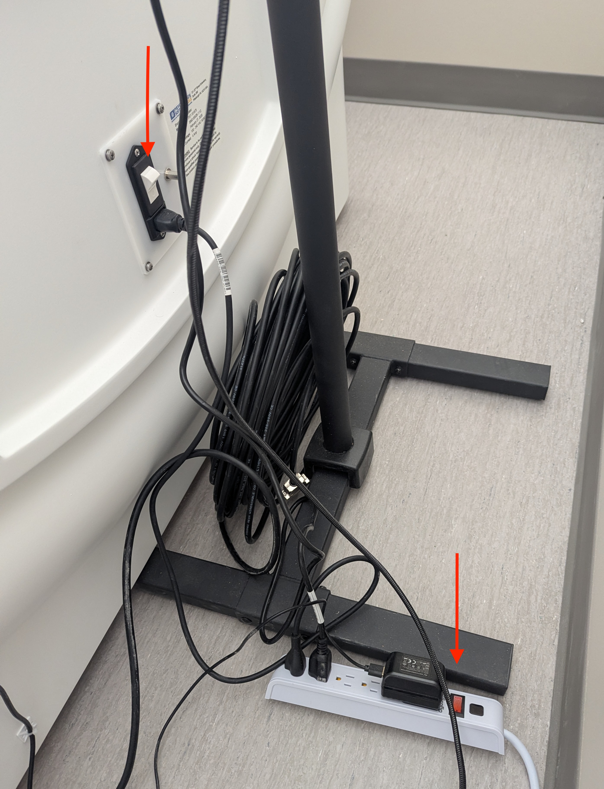{width=50% fig-align="center"}

**Setup 2:** Wait 3 minutes for system to boot.

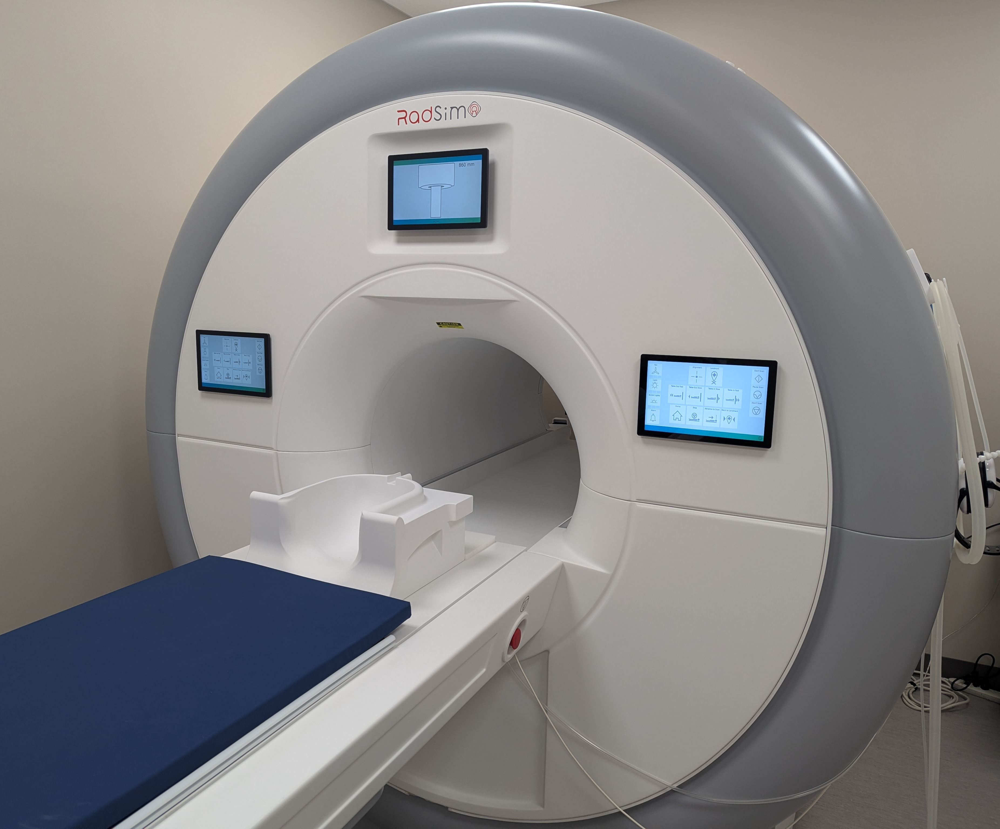{width=70% fig-align="center"}

**Setup 3:** Verify screen inverter is working (mirror selected, Input solid).

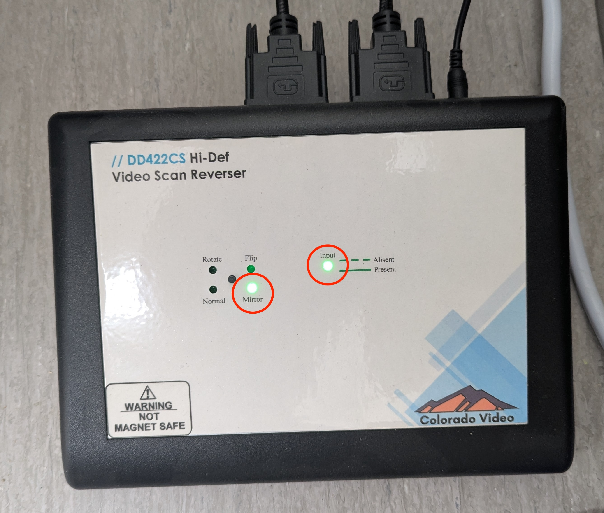{width=70% fig-align="center"}

**Setup 4:** Customize simulation. Enter Options menu ([Mock Control](#fig:mock-control), R).

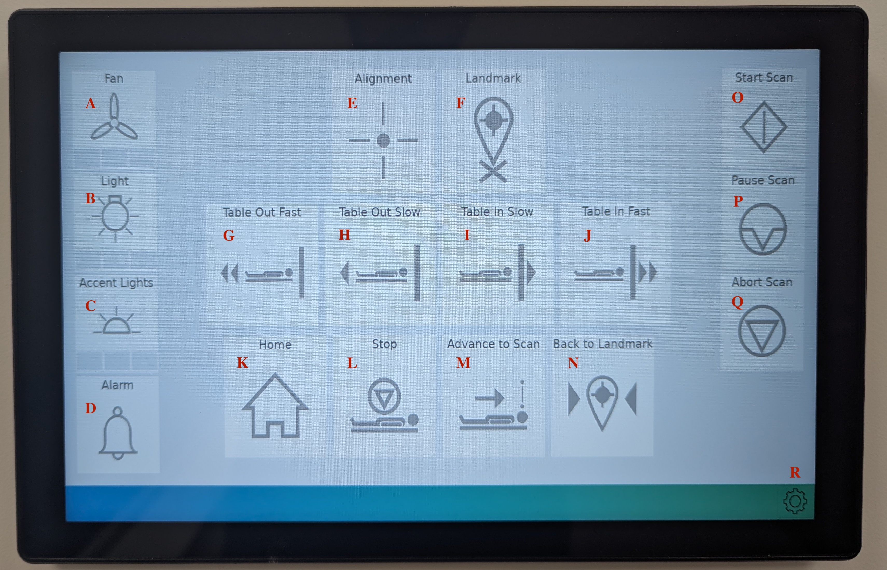{#fig:mock-control width=70% fig-align="center"}

**Setup 5:** Specify your customization of:

- Bore and Accent colors ([Mock Customize](#fig:mock-custom), A & B)
- Ambient sound ([Mock Customize](#fig:mock-custom), C)
- Protocol sound and duration ([Mock Customize](#fig:mock-custom), D)
- Alarm volume ([Mock Customize](#fig:mock-custom), E)
- Button sound ([Mock Customize](#fig:mock-custom), F)

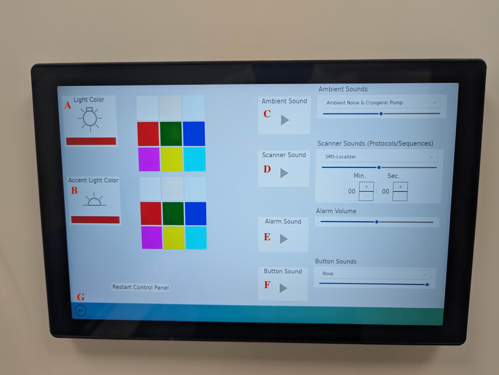{#fig:mock-custom width=70% fig-align="center"}

**Setup 6:** Once customization is complete, return to the Control menu ([Mock Customize](#fig:mock-custom), G).

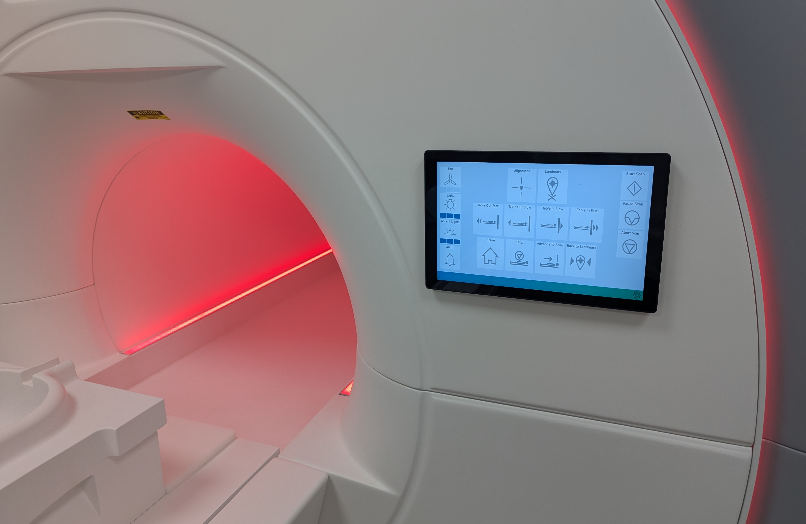{width=70% fig-align="center"}

**Setup 7:** Specify fan, core light, and accent light strength ([Mock Control](#fig:mock-control), A-C).

#### Simulate participant

**Simulate 1:** Have participant lay supine, with the top of the head near the apex of the coil base.

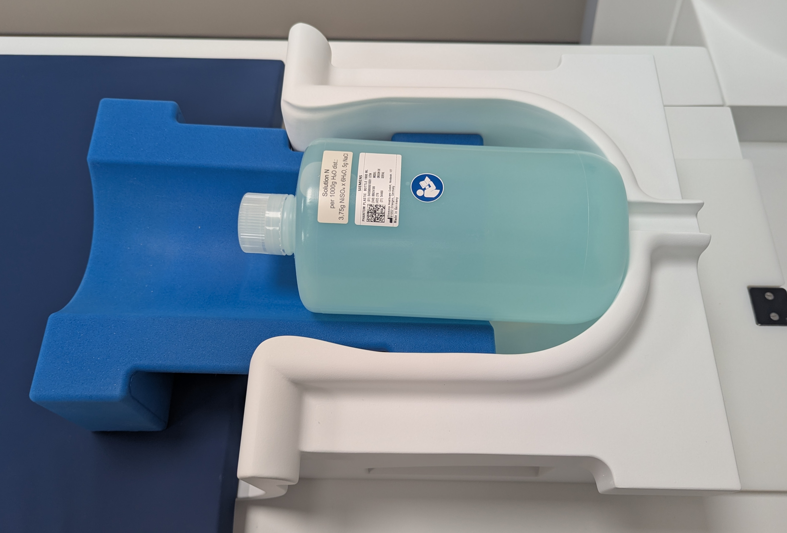{width=70% fig-align="center"}

**Simulate 2:** Provide headphones and squeeze ball ([Mock Equipment](#fig:mock-equip), A & C [black]).

- Test squeeze ball; deactivate alarm with Alarm ([Mock Control](#fig:mock-control), D).

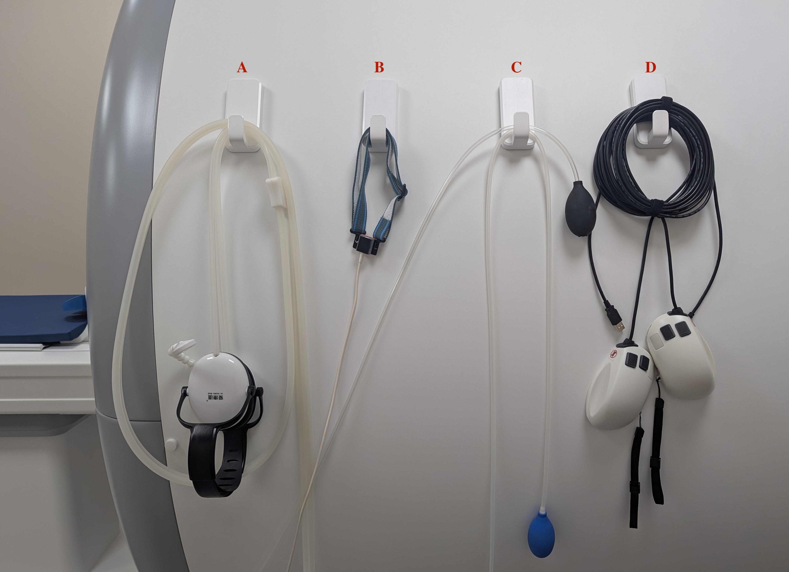{#fig:mock-equip width=70% fig-align="center"}

**Simulate 3:** Add coil top, ensure participant can see through the eye fields.

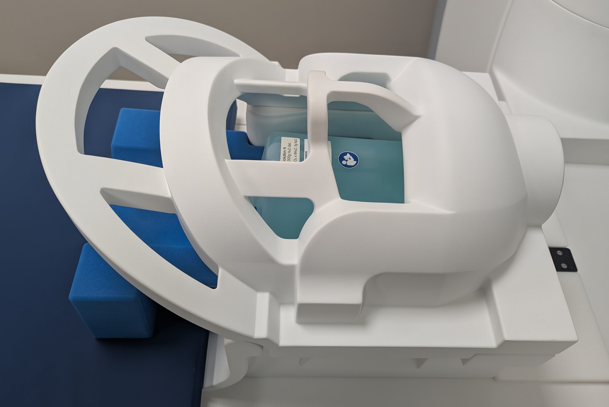{width=70% fig-align="center"}

**Simulate 4:** Use Table In Slow ([Mock Control](#fig:mock-control), I) to drive participant to alignment. Have participant close eyes.

- **SAFETY**: Closing eyes is critical to avoid damaging the eyeball with alignment laser!

**Simulate 5:** Turn laser on ([Mock Control](#fig:mock-control), E). Use Table In/Out Slow ([Mock Control](#fig:mock-control), H & I) to align laser between eyebrows.

- Turn off laser ([Mock Control](#fig:mock-control), E).

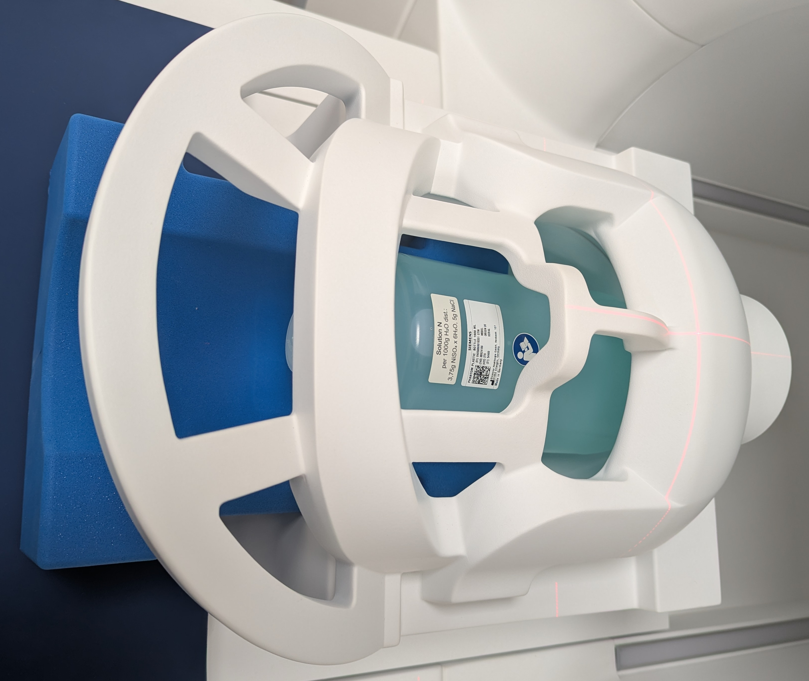{width=70% fig-align="center"}

**Simulate 6:** Attach mirror to coil top. Adjust mirror (superior/inferior) until participant can see monitor screen.

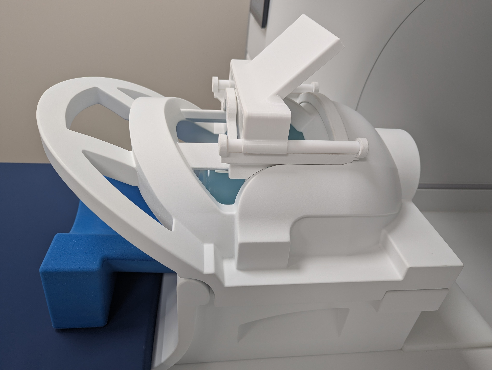{width=70% fig-align="center"}

**Simulate 7:** Send participant to isocenter via Advance to Scan ([Mock Control](#fig:mock-control), M).

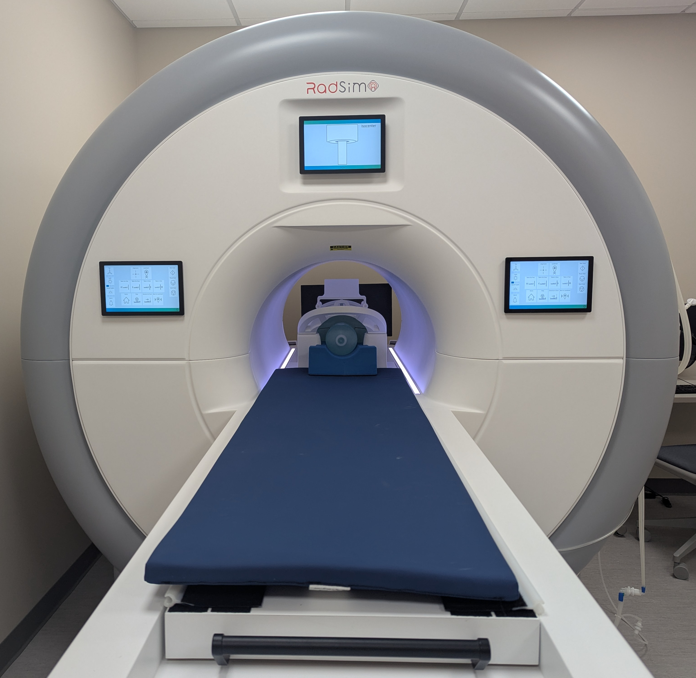{width=70% fig-align="center"}

**Simulate 8:** Conduct simulation via Start Scan ([Mock Control](#fig:mock-control), O).

- End simulation with Pause/Abort Scan ([Mock Control](#fig:mock-control), P & Q).
- Use Options menu to select additional sequences ([Mock Control](#fig:mock-control), R).

<!-- Load participant
Drive to alignment
Align with laser
Send to isocenter
Run Simulation
Deactivate alarm -->

#### End simulation
Move to Home
Emergency override
Manual Home

### Monitor Movement {#sssec:mock-move}

[Manual](../media/MoTrak-Operator-Manual.pdf){target="_blank"}

## Stimulus Computer

## DICOM Computer

