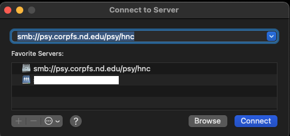
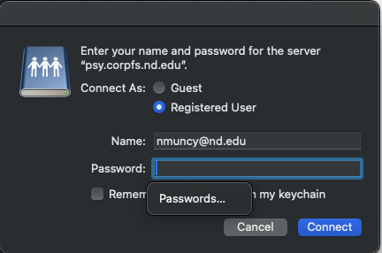
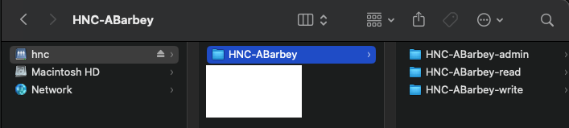
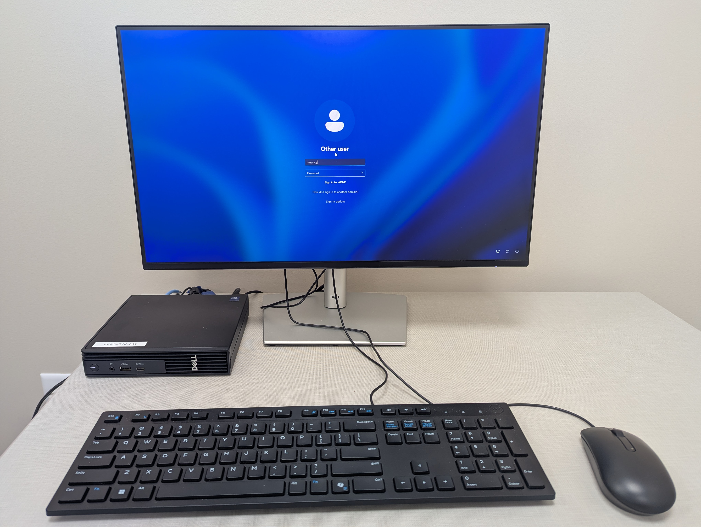
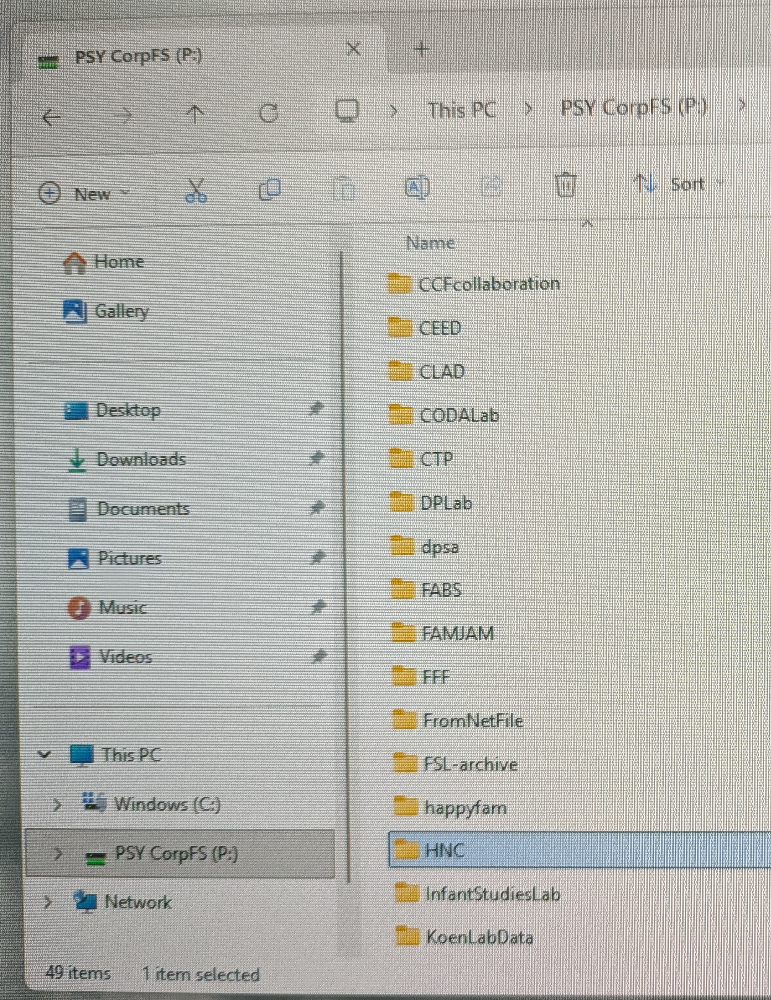
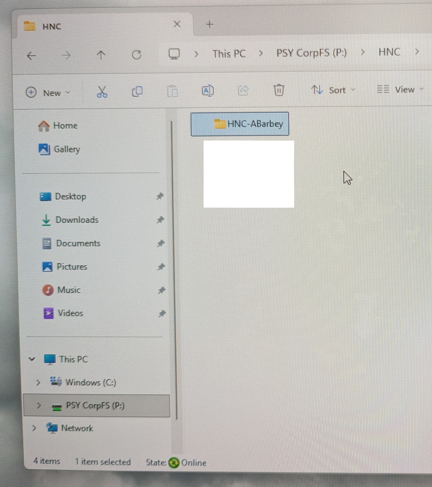
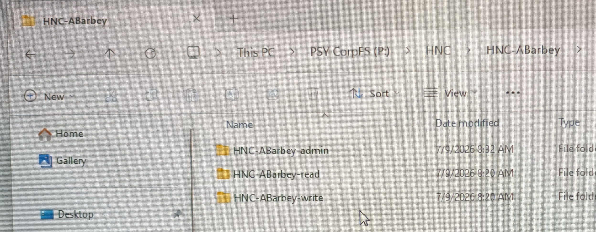

# Overview

Large labs and long-term projects commonly have multiple waves of research assistants. To effectively conduct research at the ND-HNC, the research team needs to coordinate and centralize task deployment and data capture. For clinical studies, data may be a mixture of non-sensitive data, Personally Identifiable Information (PII), and Personal Health Information (PHI). Additionally, the Institutional Review Board (IRB) has specific policies for the transfer of data, depending on the method and sensitivity.

Each lab which partners with the ND-HNC will receive access to the centralized data system [CorpFS](https://esc.nd.edu/services/storage/), which facilitates task deployment and data management across multiple sites and users. Directories are organized by the Primary Investigator's (PI) name (i.e. **HNC-PI**) and contain three specialized directories with distinct permission levels:

1. **HNC-PI-admin:** A highly restricted folder dedicated to securely housing sensitive PHI/PII data and important files. Only group administrators will be able to read, write, or execute in this directory.
1. **HNC-PI-read:** A standardized folder where all team members can read and execute research tasks but cannot modify or delete files. This is useful for ensuring that all research assistants administer identical tasks.
1. **HNC-PI-write:** A shared repository where all research assistants can save participant output data. This helps ensure that data is centralized and not left on the research assistant's login account.

# Access

- Contact [Nathan Muncy](../people.qmd) to be added to the CorpFS HNC group.

# Connect: OSx

1. Establish an [SMB](https://learn.microsoft.com/en-us/windows-server/storage/file-server/file-server-smb-overview) connection with CorpFS HNC:

    - 'CMD-K' opens "Connect to Server"
    - Connect to 'smb://psy.corpfs.nd.edu/psy/hnc'

{width=50% fig-align="center"}

2. Login with your Notre Dame credentials.

{width=50% fig-align="center"}

3. View directory structure in Finder.

{width=50% fig-align="center"}

# Connect: Windows

1. Log into PC workstation.

{width=50% fig-align="center"}

2. Navigate to PSY CorpFS (P:) > HNC.

{width=50% fig-align="center"}

3. Select appropriate PI directory.

{width=50% fig-align="center"}

4. View user directory structure.

{width=50% fig-align="center"}

# Notes

- These instructions refer to ND-owned devices connected to the [eduroam network](https://nd.service-now.com/nd_portal?id=kb_article_view&sys_kb_id=60a2ae6147f9cb10d1e4e739736d434e&spa=1).