# Overview

Instructions for managing files exported from the MRI Control computer.

# Hardware

DICOM files output from the MRI Control Computer are sent to our DICOM computer and storage device, which consist of an Apple Mac Studio (16-core CPU, 40-core GPU, 128 GB RAM, 4 TB SSD) connected to a Pegasus R12 RAID system (108TB). The Mac Studio is configured as a dual NIC, allowing it to connect both to the MRI intranet as well as the university's system, and A 40 Gbps Thunderbolt connects the Mac Studio to the Pegasus. The Pegasus is configured as RAID 10 to allow for both a high write speed and data redundancy (54TB).

**Note:** Given the limited Pegasus disk space, ***data will be removed on a First In, First Out (FIFO) basis.*** While it is anticipated that the Pegasus can provide ~1 month of storage capacity when the center is operating at full capacity, this depends on actual usage. **WE ENCOURAGE RESEARCH TEAMS TO EXPORT THEIR DATA ON THE SAME DAY THEY ARE COLLECTED.**

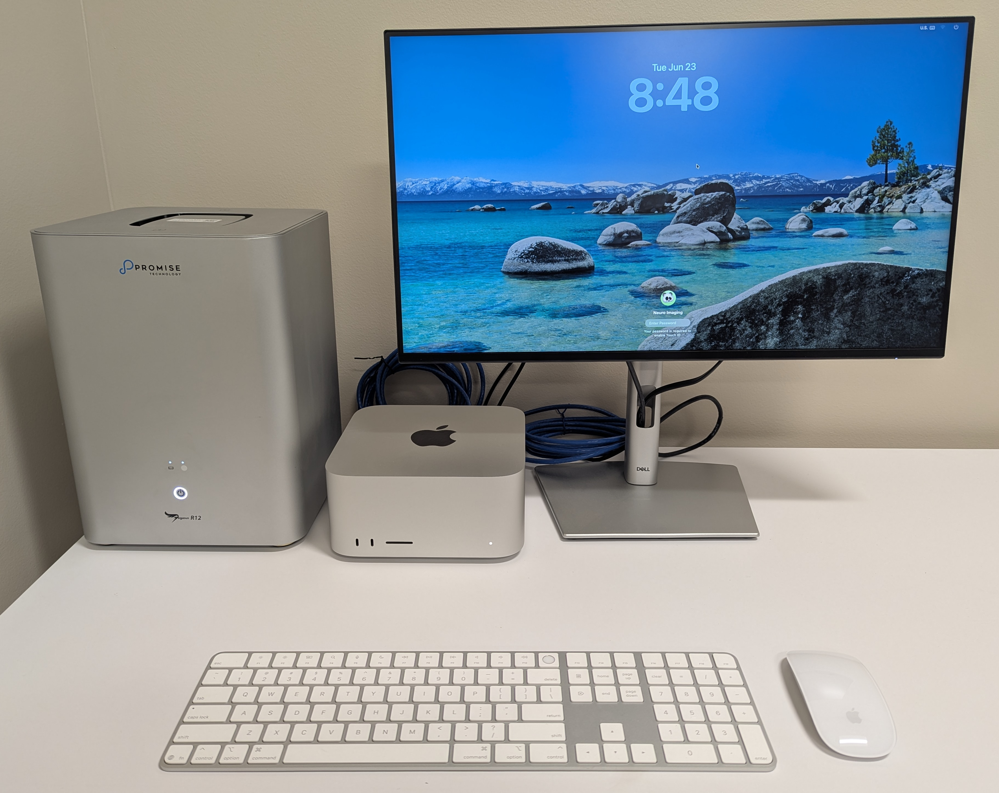{width=60% fig-align="center"}

# Export DICOMs

[Horos](https://horosproject.org) runs on the Mac Studio as our research PACS. Data are sent from the MRI Control computer to the DICOM computer, where Horos receives, organizes, and manages the data.

Two methods are available for extracting data from the Horos database.

## GUI Export

1. Right-click the desired Patient name in Horos.

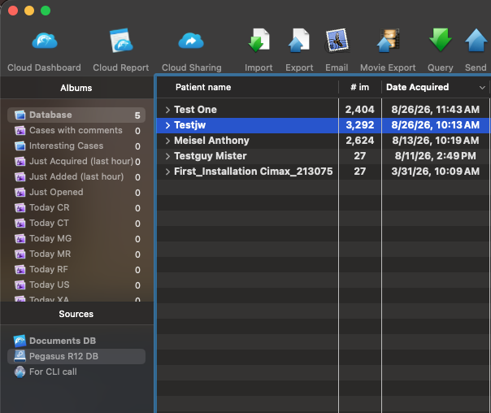{width=60% fig-align="center"}

2. Specify "Export to DICOM File(s)" and select the desired output location.

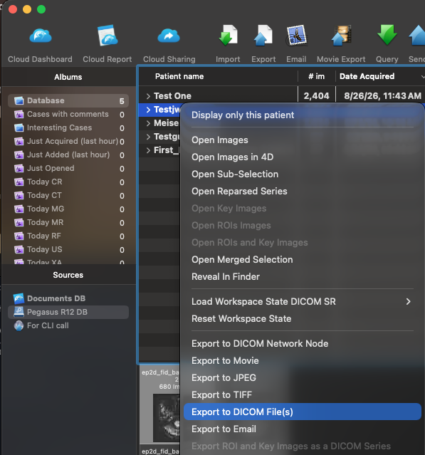{width=60% fig-align="center"}

## CLI Export

1. Run the `find_copy_dcm.sh` command in the terminal, without arguments, to provide a help.

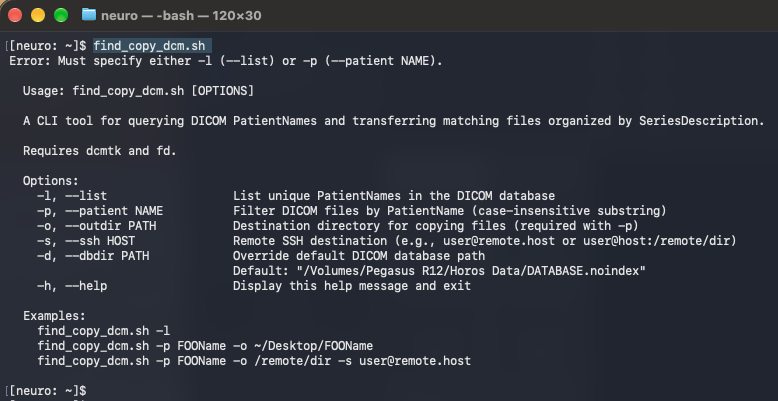{width=80% fig-align="center"}

2. Use `find_copy_dcm.sh -l` to identify all unique Patient Names in the database.

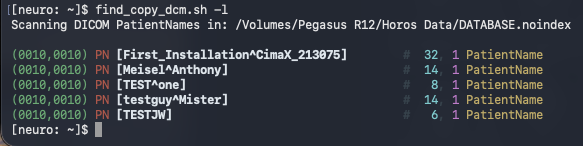{width=60% fig-align="center"}

### Export Local

3. Use the `-p` and `-o` options to send data for a specific Patient Name to a local location. This option is not as fast as the GUI Export.

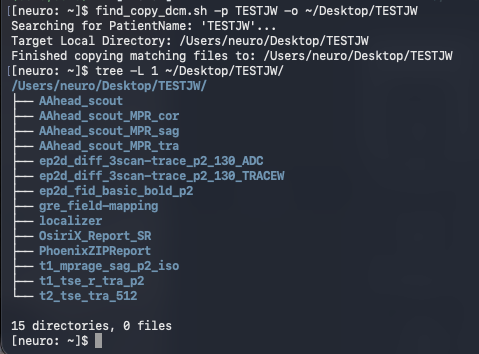{width=60% fig-align="center"}

### Export Remote

3. Use the `-p`, `-o`, and `-s` options to send data for a specific Patient Name to a remote location over an SSH connection. Provide your password when prompted.

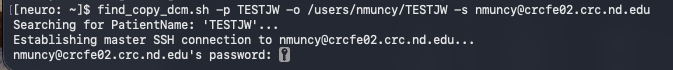{width=80% fig-align="center"}

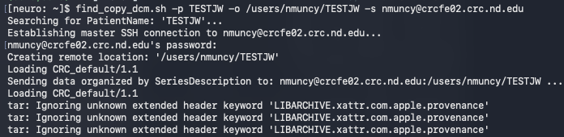{width=80% fig-align="center"}

# DICOM listener

In order to send data from the MRI Control computer to the Mac Studio, Horos must be running and configured as a listener.

1. Open Horos Settings.

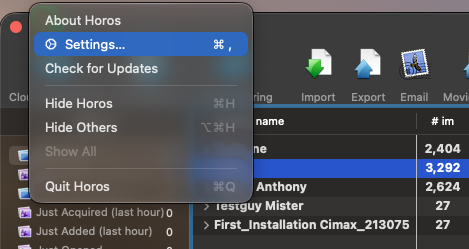{width=60% fig-align="center"}

2. Select "Listener" under the "Sharing" options.

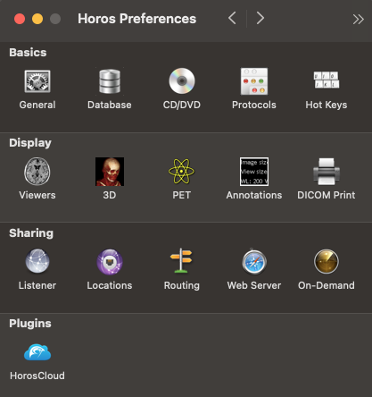{width=40% fig-align="center"}

3. Specify:
    * AETitle: neruosmacstudio
    * Port Number: 11112
    * Address(es): 192.168.1.12, 10.49.13.225
    * Host Name: neuroscmacstudio.dhcp.nd.edu

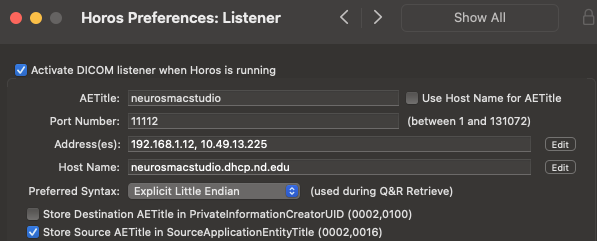{width=60% fig-align="center"}

# Wiring

* B27-Data B-20 Port --> Mac Studio ethernet port
* B27-Data B-21 Port --> Belkin Adapter --> Mac Studio USB-C port