# Warning: Magnetic Field!

The Encore MRI Simulator is a training device designed to help participants practice remaining perfectly still during a scan, using specialized MoTrak software to monitor movement.

To power this motion-tracking feature, the simulator is equipped with an internal magnetic field generator. Because this generator emits a real magnetic field, ***the simulator is not compatible with pacemakers or other implanted medical devices***.

# Simulate MRI {#sec:mock-sim}

## Setup Instructions {#ssec:mock-setup}

**Setup 1:** Turn mock scanner on using both switches (red arrows) at the back of the device.

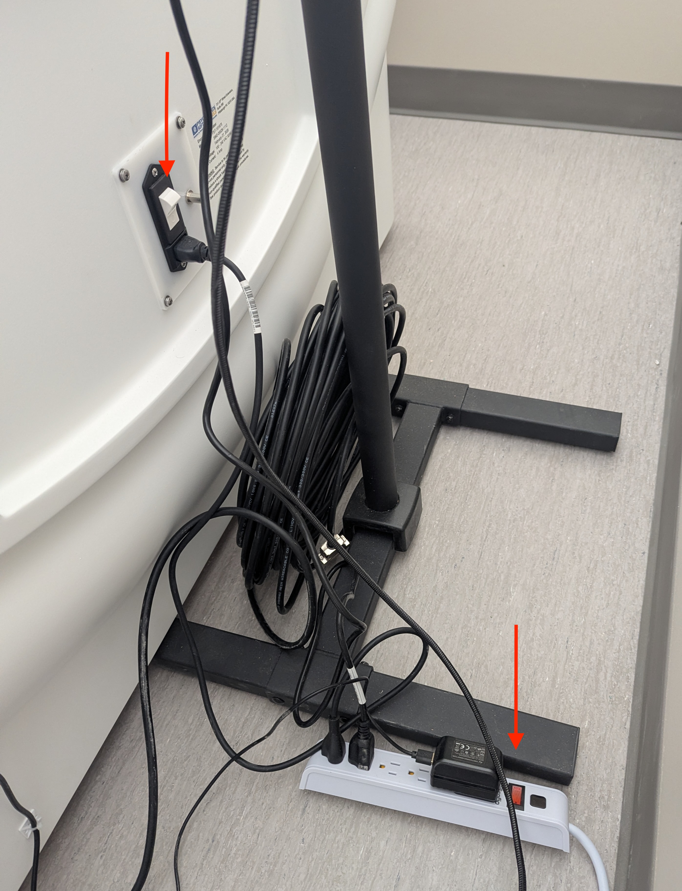{width=50% fig-align="center"}

**Setup 2:** Wait 3 minutes for system to boot.

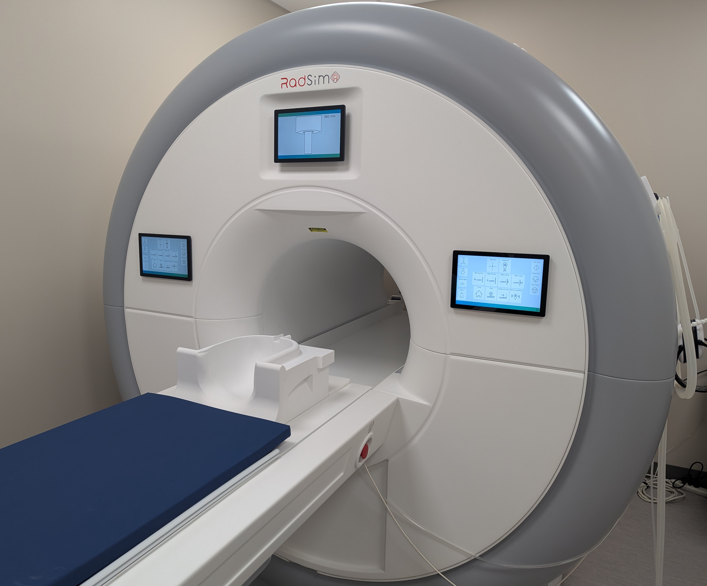{width=70% fig-align="center"}

**Setup 3:** Verify screen inverter is working (mirror selected, Input solid).

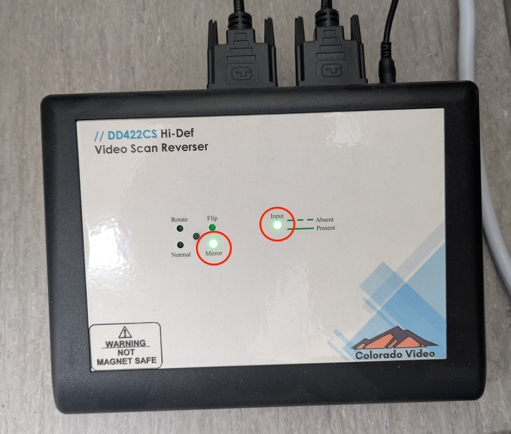{width=70% fig-align="center"}

**Setup 4:** Customize simulation. Enter Options menu ([Mock Control](#fig:mock-control), R).

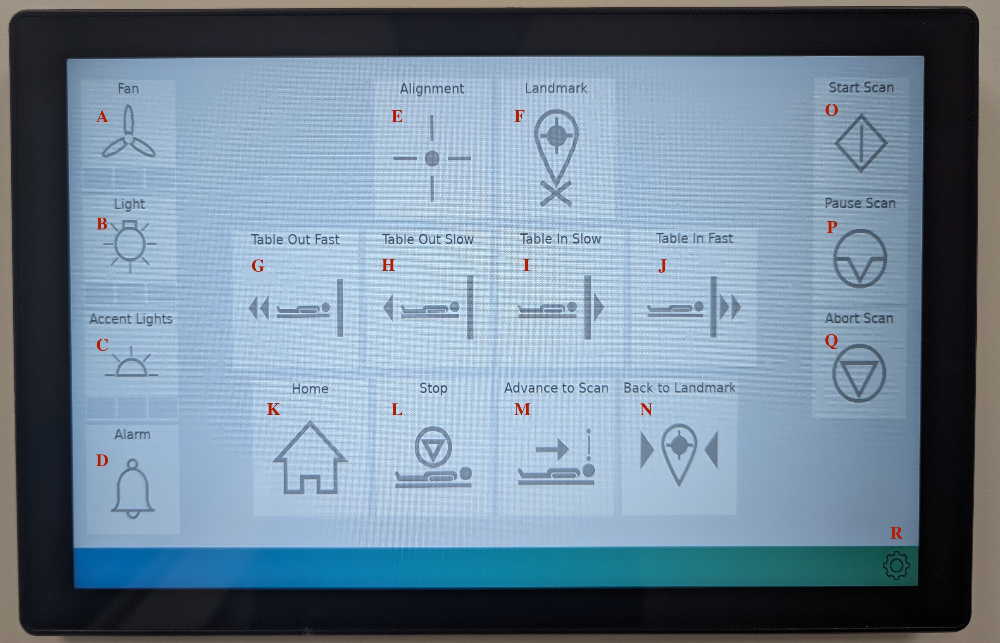{#fig:mock-control width=70% fig-align="center"}

**Setup 5:** Specify your customization of:

- Bore and Accent colors ([Mock Customize](#fig:mock-custom), A & B)
- Ambient sound ([Mock Customize](#fig:mock-custom), C)
- Protocol sound and duration ([Mock Customize](#fig:mock-custom), D)
- Alarm volume ([Mock Customize](#fig:mock-custom), E)
- Button sound ([Mock Customize](#fig:mock-custom), F)

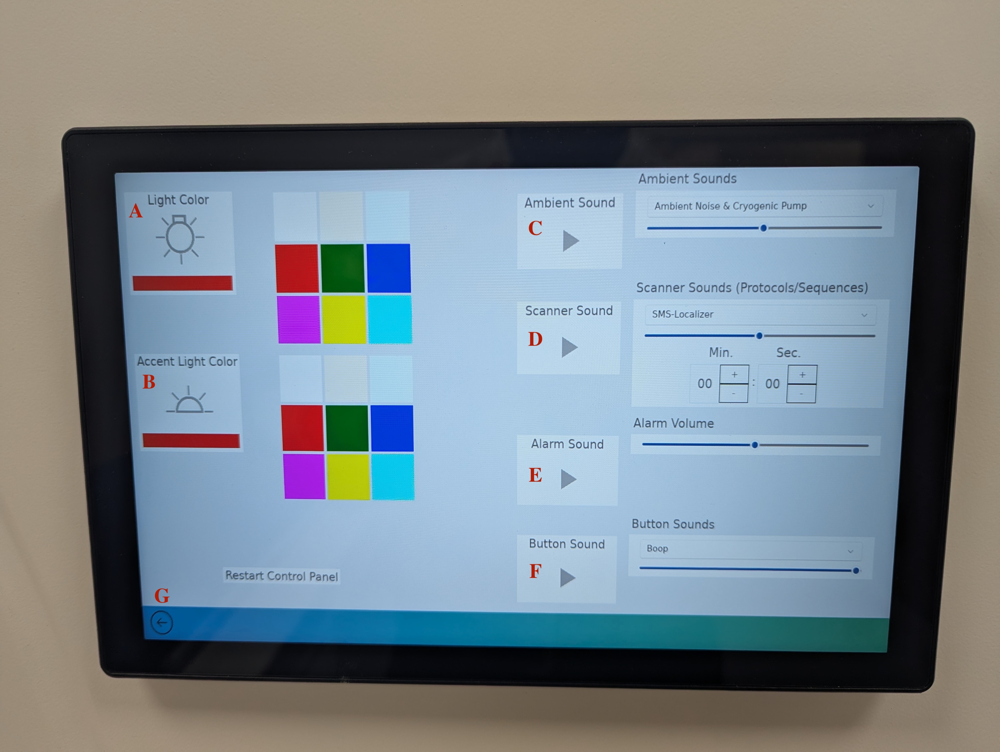{#fig:mock-custom width=70% fig-align="center"}

**Setup 6:** Once customization is complete, return to the Control menu ([Mock Customize](#fig:mock-custom), G).

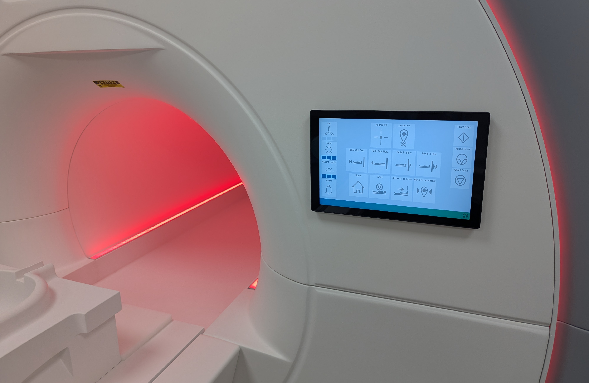{width=70% fig-align="center"}

**Setup 7:** Specify fan, core light, and accent light strength ([Mock Control](#fig:mock-control), A-C).

**Setup 8:** If you intend to use Motrak, please also note setup instructions in [Monitor Movement](#sec:monitor) (steps 1-4).

## Simulate Scan {#ssec:mock-simulate}

**Simulate 1:** Have participant lay supine, with the top of the head near the apex of the coil base.

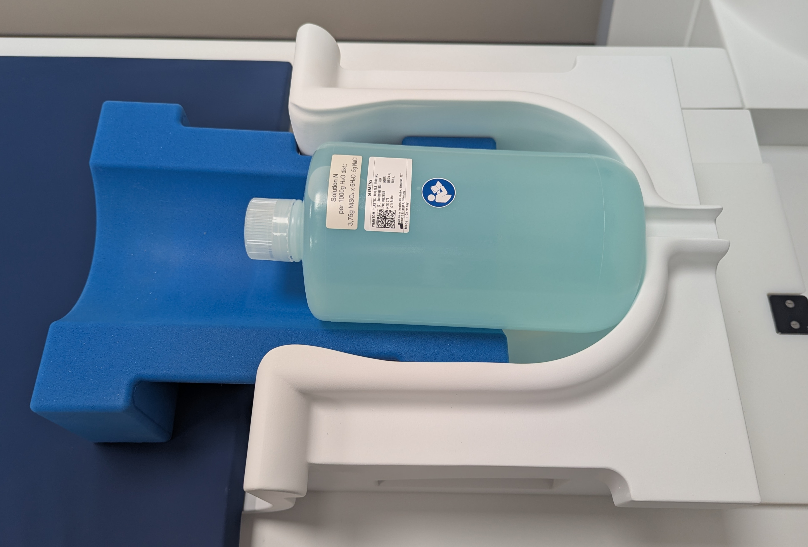{width=70% fig-align="center"}

**Simulate 2:** Provide headphones and black squeeze ball ([Mock Equipment](#fig:mock-equip), A & C).

- Test squeeze ball; deactivate alarm with Alarm ([Mock Control](#fig:mock-control), D).

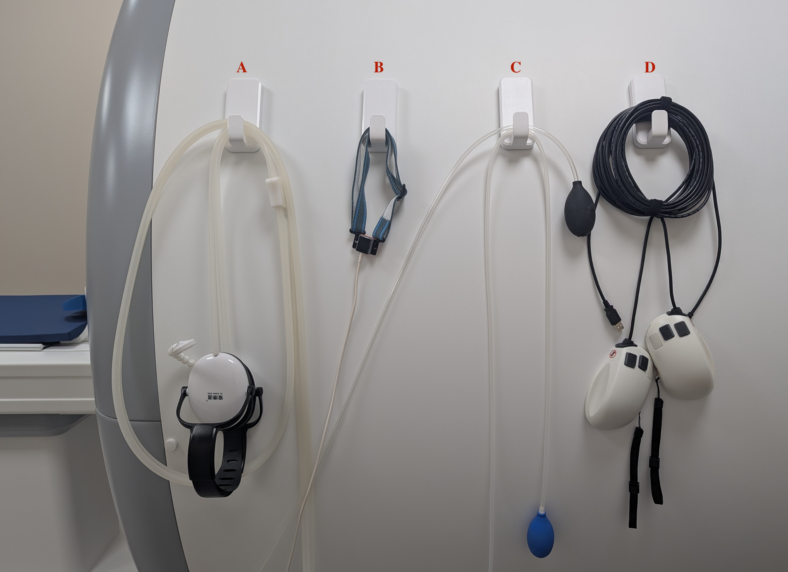{#fig:mock-equip width=70% fig-align="center"}

**Simulate 3:** Add coil top, ensure participant can see through the eye fields.

- For Motrak, see also [Monitor Movement](#sec:monitor) (step 5).

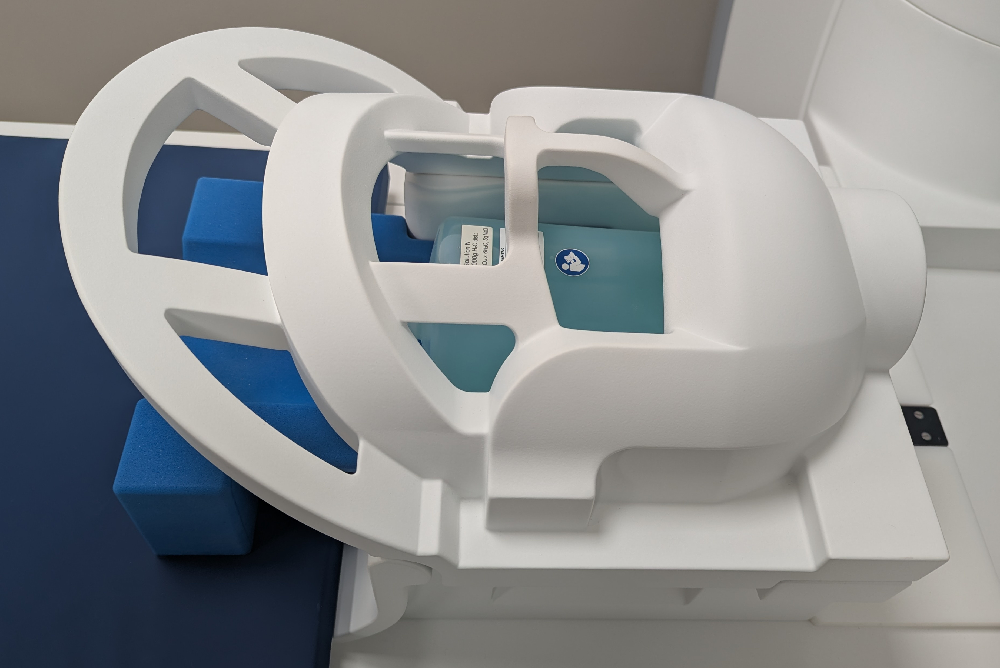{width=70% fig-align="center"}

**Simulate 4:** Use Table In Slow ([Mock Control](#fig:mock-control), I) to drive participant to up to alignment. Have participant close eyes.

- **SAFETY**: Closing eyes is critical to avoid damaging the eyeball with alignment laser!

**Simulate 5:** Turn laser on ([Mock Control](#fig:mock-control), E). Use Table In/Out Slow ([Mock Control](#fig:mock-control), H & I) to align laser between eyebrows.

- Turn off laser ([Mock Control](#fig:mock-control), E).

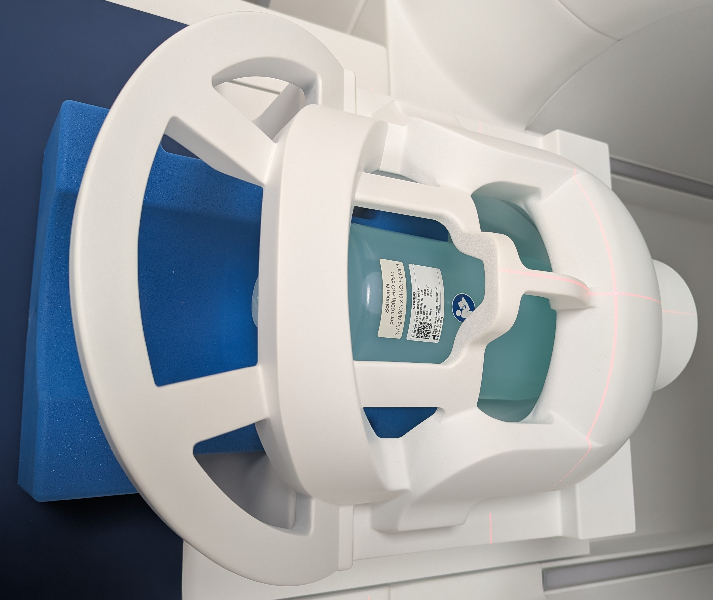{width=70% fig-align="center"}

**Simulate 6:** Attach mirror to coil top. Adjust mirror (superior/inferior) until participant can see monitor screen.

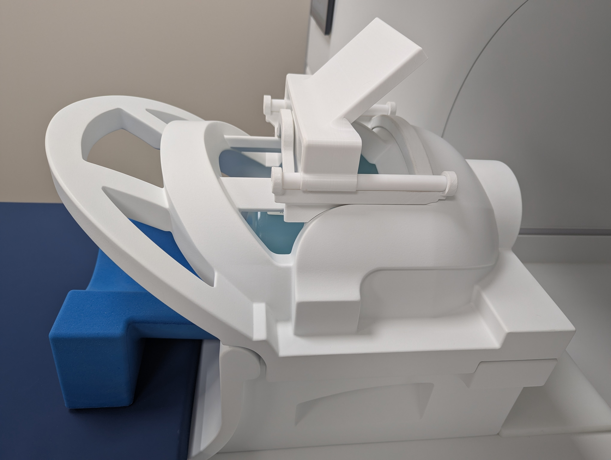{width=70% fig-align="center"}

**Simulate 7:** Send participant to isocenter via Advance to Scan ([Mock Control](#fig:mock-control), M).

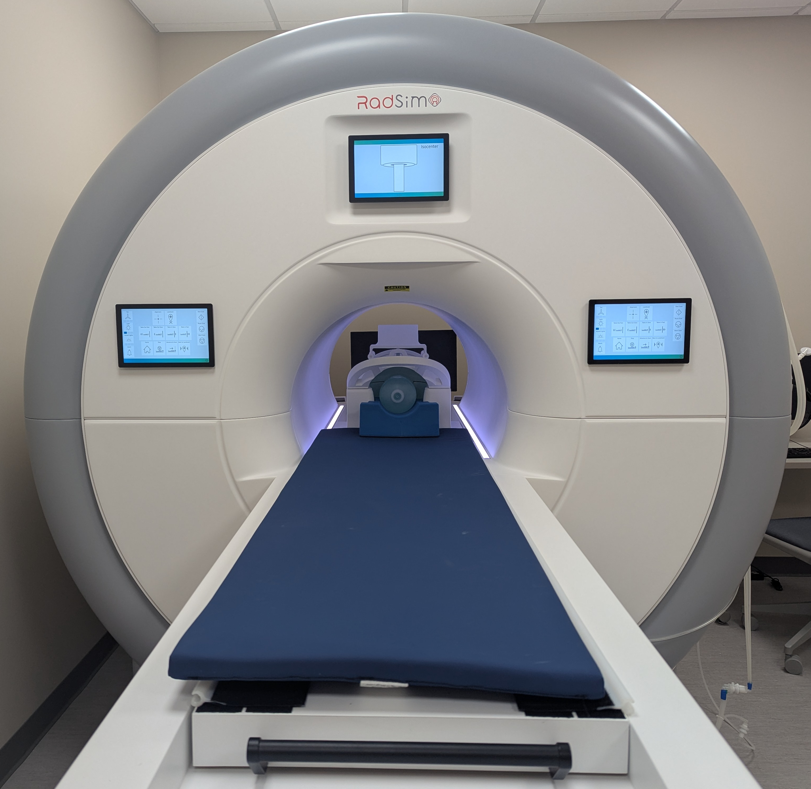{width=70% fig-align="center"}

**Simulate 8:** Conduct simulation via Start Scan ([Mock Control](#fig:mock-control), O).

- Use Options menu to select additional sequences ([Mock Control](#fig:mock-control), R).

## End Simulation

**End 1:** Stop simulation with Pause/Abort Scan ([Mock Control](#fig:mock-control), P & Q).

**End 2:** Return participant to home position with Home ([Mock Control](#fig:mock-control), K).

- It is also possible to drive the participant to the home position with Table Out Fast/Slow ([Mock Control](#fig:mock-control), G & H).

**End 3:** For power failure, issues with the table moving: press the table release button.

- Manually pull table to home position.
- Twist release button clockwise to reset table and clear the error.

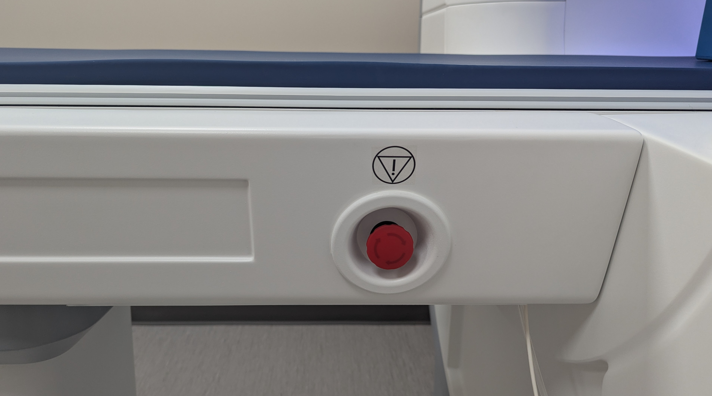{width=70% fig-align="center"}

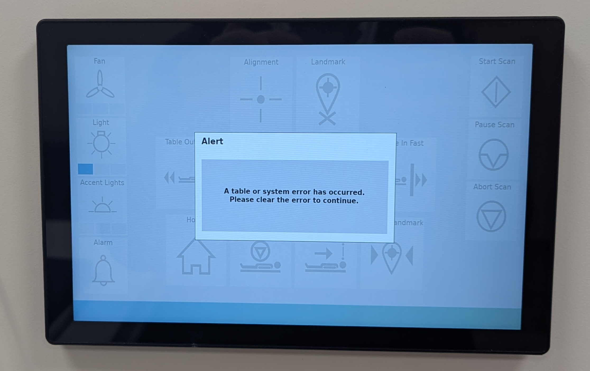{width=70% fig-align="center"}

# Monitor Movement {#sec:monitor}

The Encore MRI Simulator is equiped with [Motrak](https://pstnet.com/products/motrak/) hard/software. The complete user manual is available [here](../../media/pages/MoTrak-Operator-Manual.pdf).

**Monitor 1:** Log into the mock control computer using your Notre Dame credentials.

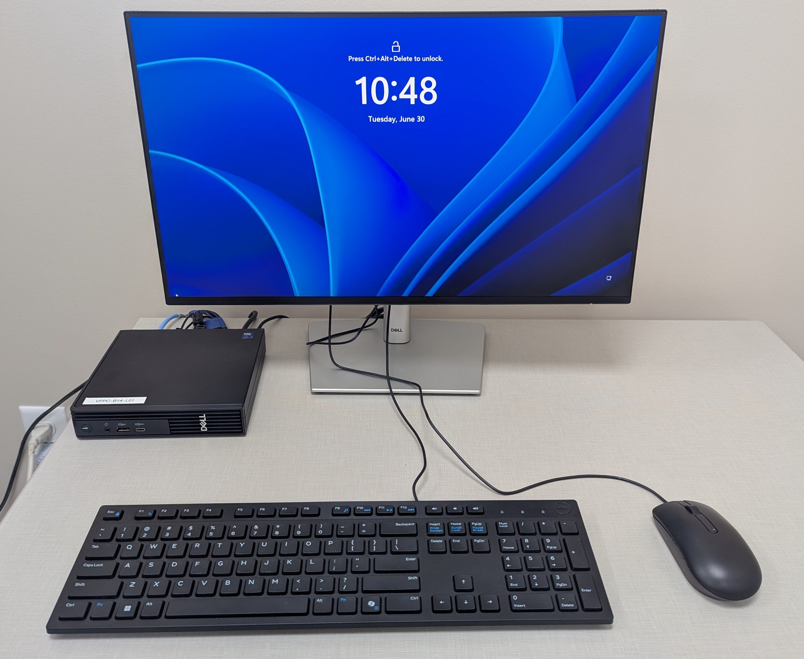{width=70% fig-align="center"}

**Monitor 2:** Start the Motrak software.

- Note: upon mock [startup](#ssec:mock-setup), the Motrak hardware requires 5 minutes of warmup time before being operational.

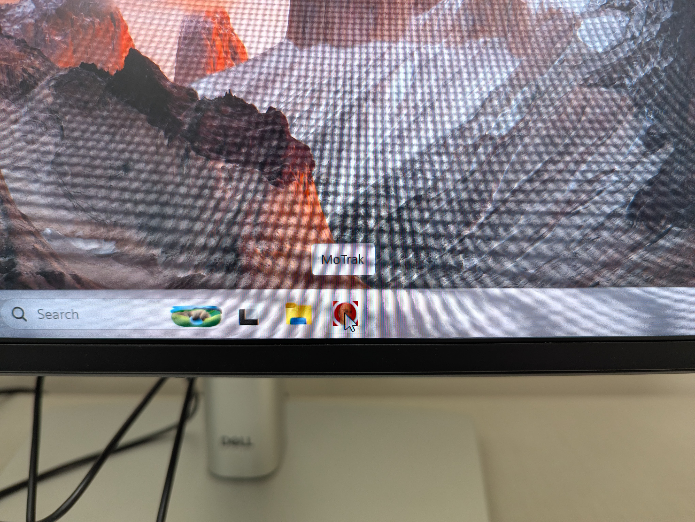{width=70% fig-align="center"}

**Monitor 3:** Indicate whether to save log files. If saving, designate the proper output CorpFS [location](corpfs.qmd).

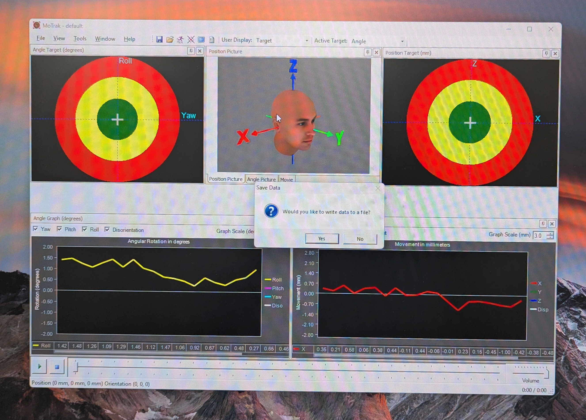{width=70% fig-align="center"}

**Monitor 4:** Motrak has two user interfaces: the control screen and participant target viewer.

- The Participant target viewer is available via F11 and should be presented on the stimulus monitor.
- Use the Full Screen option ([Motrak Options](#fig:mock-motrak), C).

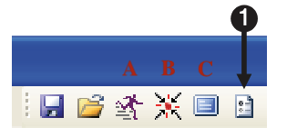{#fig:mock-motrak width=30% fig-align="center"}

**Monitor 5:** Load participant onto mock bed (see, [above](#ssec:mock-simulate)).

- Have the participant wear the Sensor headband ([Mock Equipment](#fig:mock-equip), B), with the Sensor in the middle of the forehead.
- Align the Sensor cable with the exit port at the top of the coil.

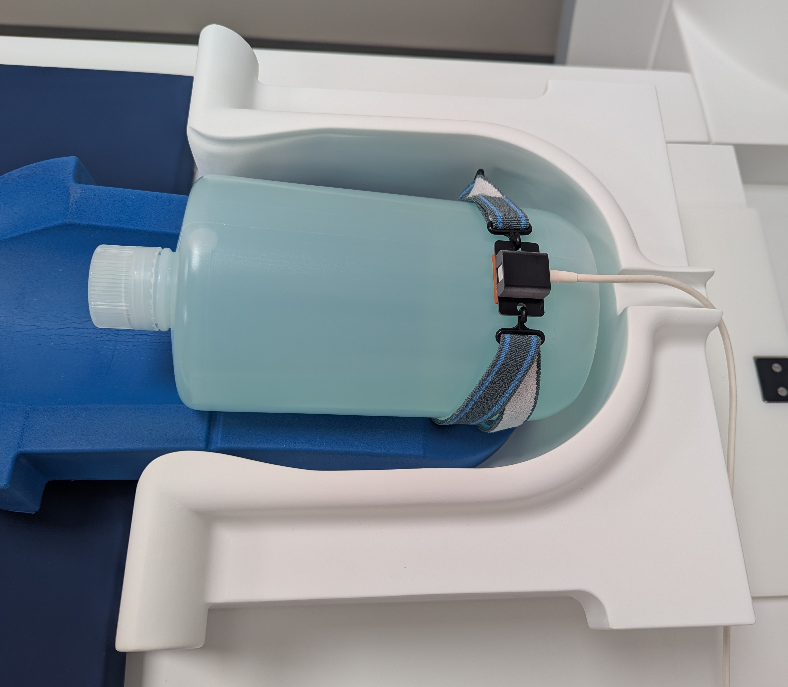{width=70% fig-align="center"}

**Monitor 6:** Send participant to isocenter, conduct MRI simulation.

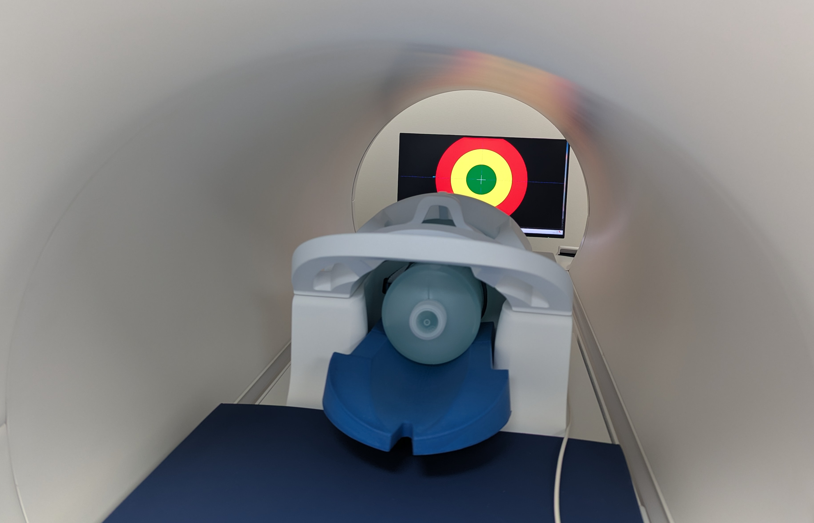{width=70% fig-align="center"}

**Monitor 7:** Start motion tracking ([Motrak Options](#fig:mock-motrak), A).

**Monitor 8:** When head motion stabilizes, reset crosshairs ([Motrak Options](#fig:mock-motrak), B).
