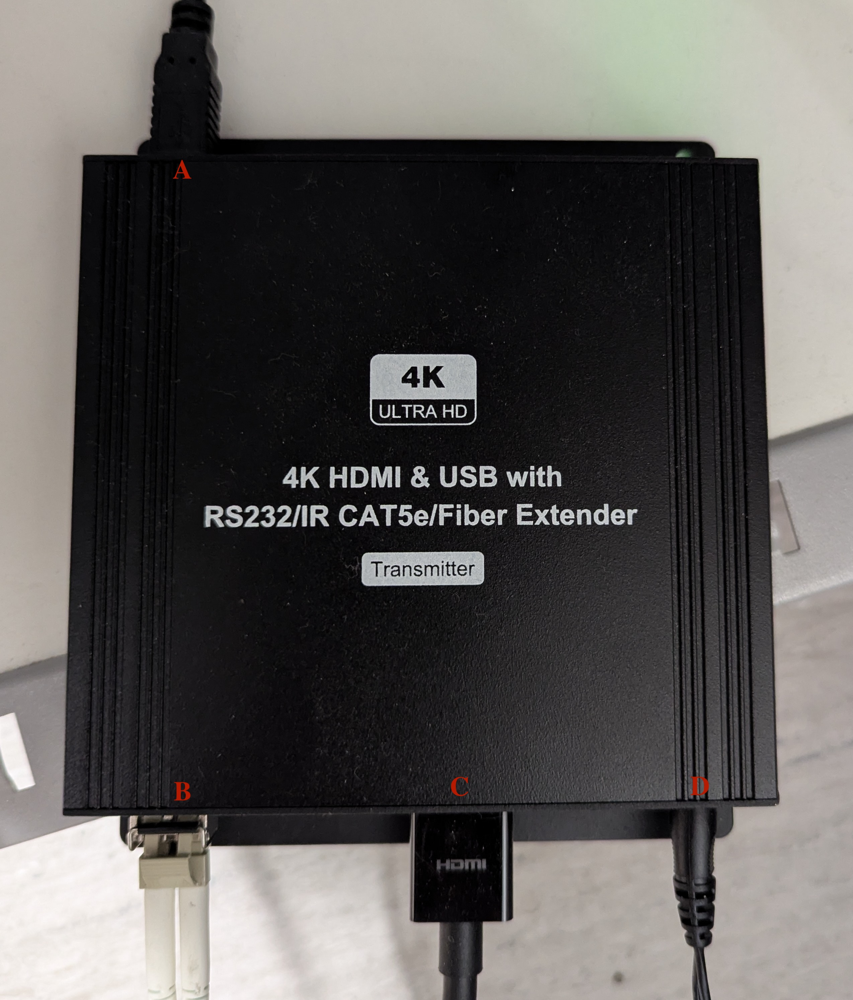
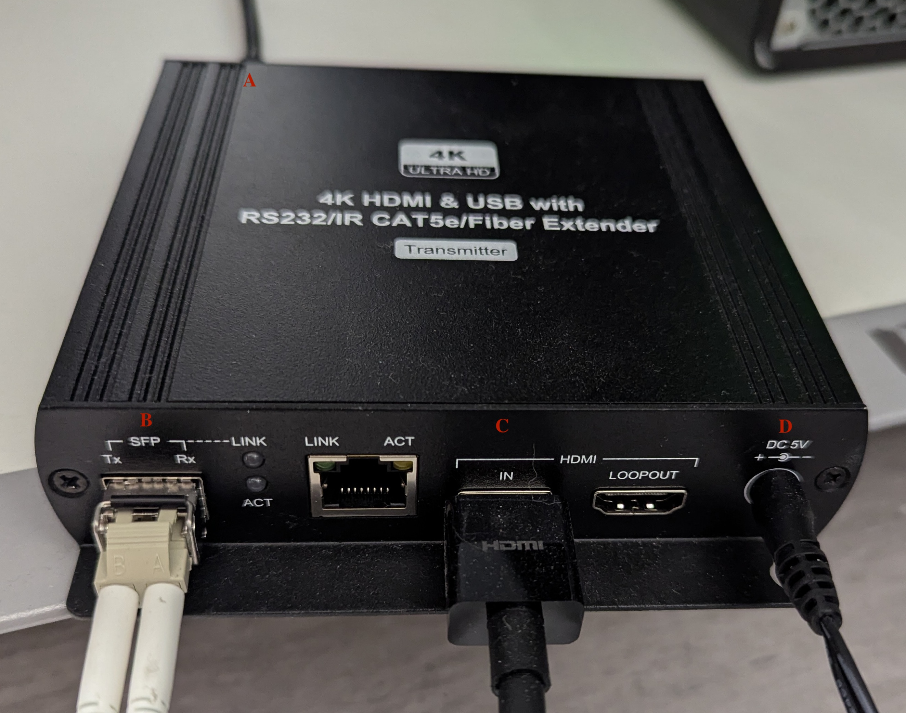

# Overview

The Nordic Neuro Lab (NNL) SyncBox helps align participant responses (real time) with fMRI acquistion (volume time). To do this, the SyncBox receives (a) synchronization pulse from the scanner and (b) participant responses. These are converted from fiber optic to serial output and sent to a computer via USB.

Unlike more common synchronization boxes, the NNL SyncBox does not passively listen for input once a session is begun. Rather, the user most program the number of volumes and TR length for each session. This can be done in Manual or Controlled Mode.

# SyncBox Operations

{width=70% fig-align="center"}

* The NNL SyncBox operates as a serial device. Install this [driver](https://ftdichip.com/drivers/vcp-drivers/) on the device connecting to the SyncBox (e.g. stimulus computer).
* Use the USB cable on the left side of SyncBox to connect with the stimulus computer.
* Power the SyncBox on with the toggles on the right side.

{width=70% fig-align="center"}

## Manual Mode

Two manual modes exist, Simulation and Synchronization. These are identical, save (a) Simulation generates faux synchronization pulses, and (b) Synchronization listens for the scanner synchronization pulse.

1. Setup:
    * Verify Serial mode: Sync/Simulation -> Go to Options menu -> USB Mode -> Serial.
        * HID is still an option (but does not work).
    * Manually send a sync pulse to your program (for testing): Sync/Simulation -> Send triggerpulse to PC.
2. Use:
    * Configure session by specifying TR length and number of volumes.
        * **Note:** the SyncBox will stop listening after the specified number of volumes.
    * Start the box listening for synchronization pulse and/or response grip input: Sync/Simuation -> Start Session.
        * Use center button to exit Session.


## Controlled Mode

* This is the vendor preferred method of using the SyncBox.
* An example of using Python to connect the SyncBox to PsychoPy is available [here](https://github.com/ND-HNC/nnl_psychopy).


# SyncBox Configuration
## Front
* The SyncBox consists of the User Interface (A) and Response Capture (B).
    * The User Interface provides a navigation pad, LCD screen, and USB output for a task computer.
    * The Response Capture contains one green power light and four response lights.


{width=70% fig-align="center"}

* The Response Capture mappings are:

    | Light | Grip Button | Character |
    | ---- | ---- | ---- |
    | 1 | L. Thumb | A |
    | 2 | L. Index | B |
    | 3 | R. Index | C |
    | 4 | R. Thumb | D |

## Back
* The User Interface receives input from the fMRI Trigger Converter box (A1), Response Capture (A2), and Power (A3).
* The Response Capture receives input from the Response Grips (B1) and Power (B3), and sends output to the User Interface (B2).

{width=70% fig-align="center"}


# Video Converter Configuration

Video from the stimulus computer is sent to the presentation monitor in Zone 4 via the 4K HDMI to Fiber Extender. While this box is capable of bidirectional communication (Tx/Rx), the only 'downstream' device is the monitor.

{width=70% fig-align="center"}

* A. USB, unused but could send/receive serial data (keyboard, mouse).
* B. Fiber output, connects to the presentation monitor.
* C. HDMI input, from the stimulus computer.
* D. Power.

{width=70% fig-align="center"}


# fMRI Trigger Configuration

* The Siemens fMRI Trigger Converter box is located in the MRI Equipment Room (B18A).

{width=70% fig-align="center"}

* The fMRI trigger box receives a synchronization pulse as fiber optic (Cable W13470) input to the port "opt_trig_in" (I1). It is powered by a 5V 500mA adapter via a USB B-Type cable (I2).

{width=70% fig-align="center"}

* The fMRI trigger box then sends output from ports "opt_trig_out" (Cable W13471; O1) and "opt_trig_out_aux" (O2). When the fMRI trigger box is in "impulse" mode a synchronization pulse is sent for every volume, and every other volume in "toggle" mode.

{width=70% fig-align="center"}

* The fiber optic cable connected to "opt_trig_out_aux" (O2) is the input for the NNL SyncBox (A1).


# Wiring Diagram

```{mermaid}

---
config:
  theme: 'neutral'
---

flowchart LR

    subgraph MRIRoom
        MriMon[Monitor]
        MriRespGrip[Response Grips]
        MriScan[MRI Scanner]

        subgraph fMRITrigger
            fMriTrigI1[opt_trig_in]
            fMriTrigO2[opt_trig_out_aux]
        end
    end

    subgraph ControlRoom

        subgraph StimulusComp
            StimUsb[USB]
            StimHdmi[HDMI]
        end

        subgraph SyncBox
            subgraph UserInterface
                SyncUsb[USB]
                SyncTrig[fMRI Trigger]
                SyncTtlIn[TTL]
            end
            subgraph ResponseCapture
                SyncRespGrip[Response Grips]
                SyncTtlOut[TTL]
            end
        end

        subgraph VideoConverter
            VidHdmi[HDMI In]
            VidOptic[Optic Out]
        end
    end

    MriScan -- W13470 --> fMriTrigI1
    fMriTrigO2 --> SyncTrig
    MriRespGrip --> SyncRespGrip
    SyncTtlOut --> SyncTtlIn
    SyncUsb <--> StimUsb
    StimHdmi --> VidHdmi
    VidOptic --> MriMon

    style MRIRoom fill:#ffffff,stroke:#800080
    style ControlRoom fill:#ffffff,stroke:#00FF00
    style fMRITrigger fill:#ffffff,stroke:#008080
    style StimulusComp fill:#ffffff,stroke:#0000FF
    style SyncBox fill:#ffffff,stroke:#FF0000
    style UserInterface fill:#ffffff,stroke:#000000
    style ResponseCapture fill:#ffffff,stroke:#000000
    style VideoConverter fill:#ffffff,stroke:#000000
```
