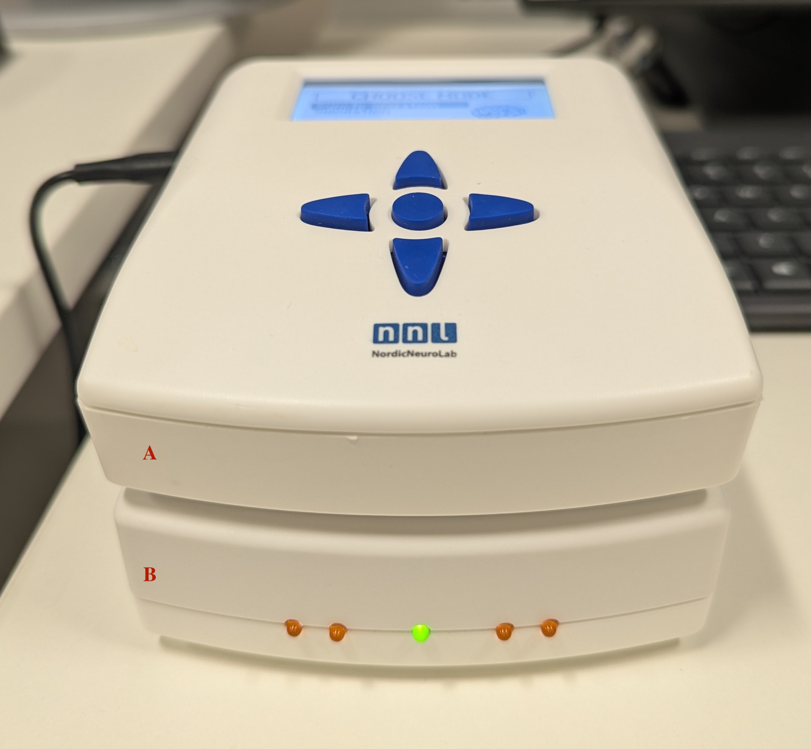
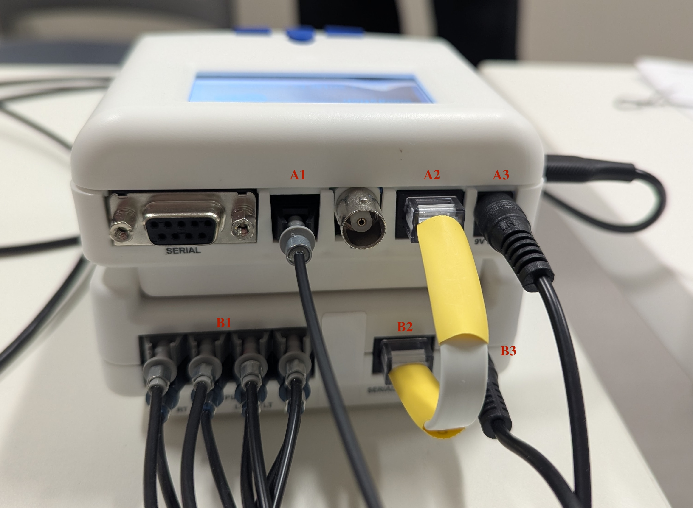
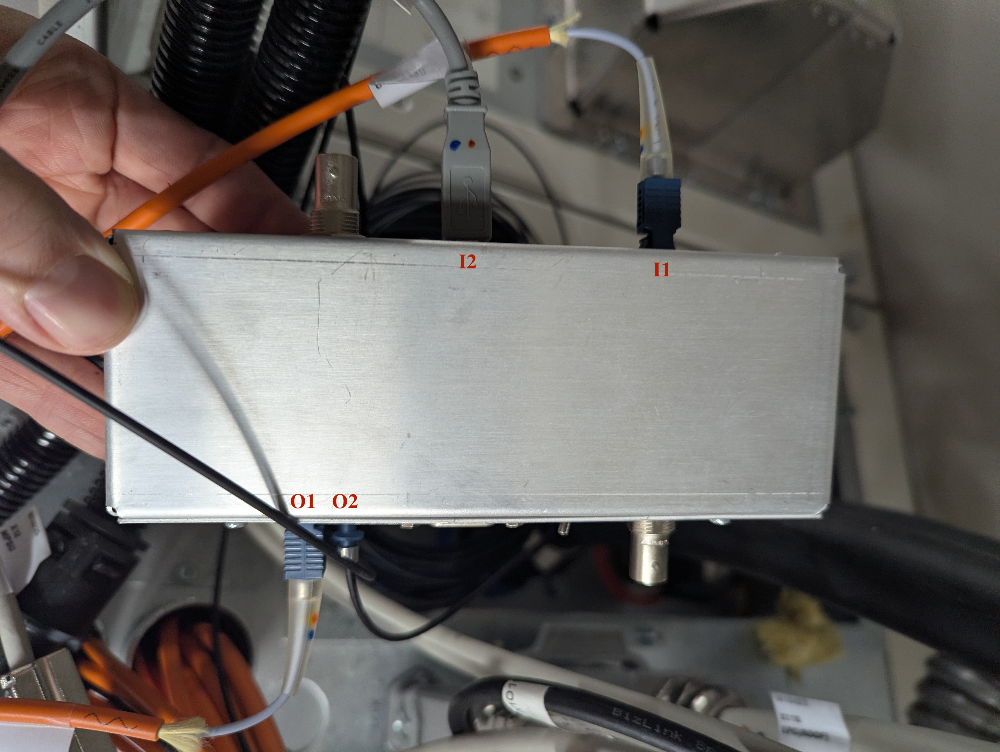
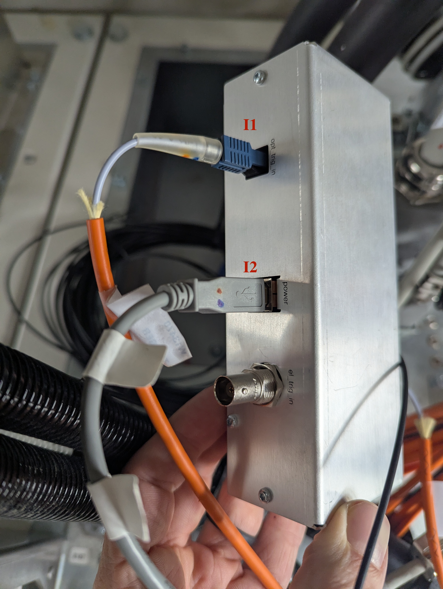
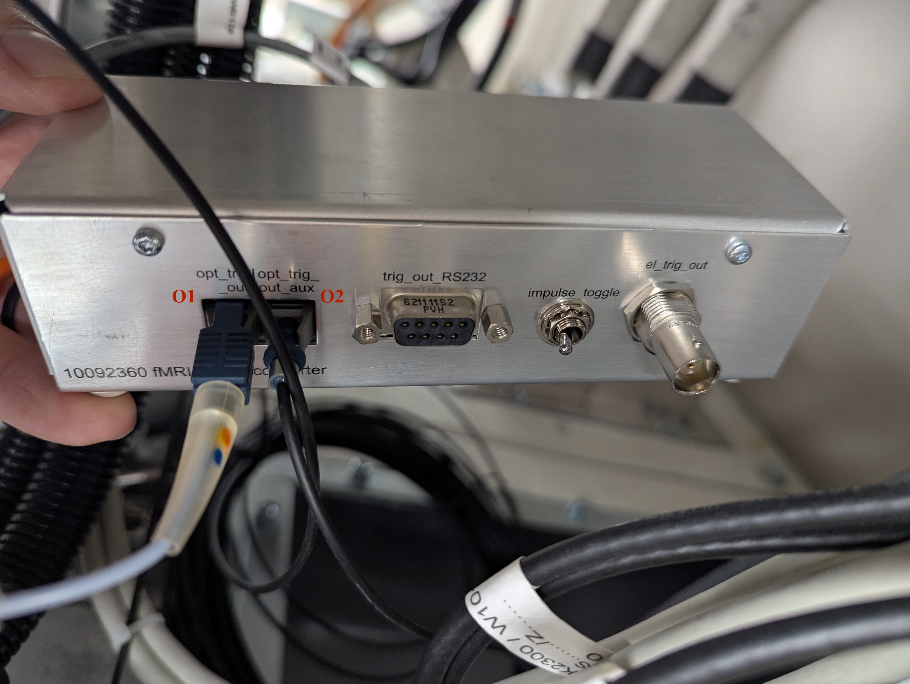

# SyncBox Operations

# SyncBox Configuration
## Front
* The SyncBox consists of the User Interface (A) and Response Capture (B).
    * The User Interface provides a navigation pad, LCD screen, and USB output for a task computer.
    * The Response Capture contains one green power light and four response lights.

{width=70% fig-align="center"}

* The Response Capture mappings are:

    | Light | Grip Button | Character |
    | ---- | ---- | ---- |
    | 1 | L. Thumb | A |
    | 2 | L. Index | B |
    | 3 | R. Index | C |
    | 4 | R. Thumb | D |

## Back
* The User Interface receives input from the fMRI Trigger Converter box (A1), Response Capture (A2), and Power (A3).
* The Response Captre receives input from the Response Grips (B1) and Power (B2), and send output to the User Interface (B2).

{width=70% fig-align="center"}

# fMRI Trigger Configuration

* The Siemens fMRI Trigger Converter box is located in the MRI Equipment Room (B18A).

{width=70% fig-align="center"}

* The fMRI trigger box receives a synchronization pulse as fiber optic (Cable W13470) input to the port "opt_trig_in" (I1). It is powered by a 5V 500mA adapter via a USB B-Type cable (I2).

{width=70% fig-align="center"}

* The fMRI trigger box then sends output from ports "opt_trig_out" (Cable W13471; O1) and "opt_trig_out_aux" (O2). When the fMRI trigger box is in "impulse" mode a synchronization pulse is sent for every volume, and every other volume in "toggle" mode.

{width=70% fig-align="center"}

* The fiber optic cable connected to "opt_trig_out_aux" (O2) is the input for the NNL SyncBox (A1).