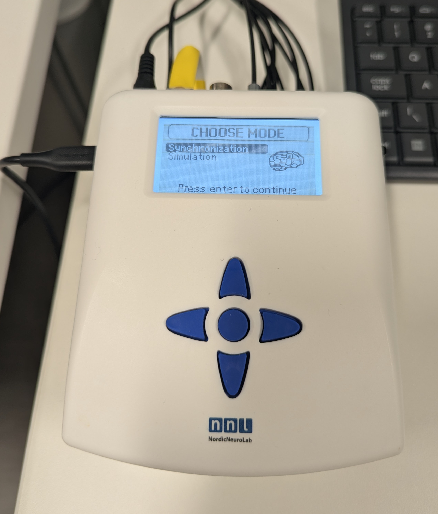
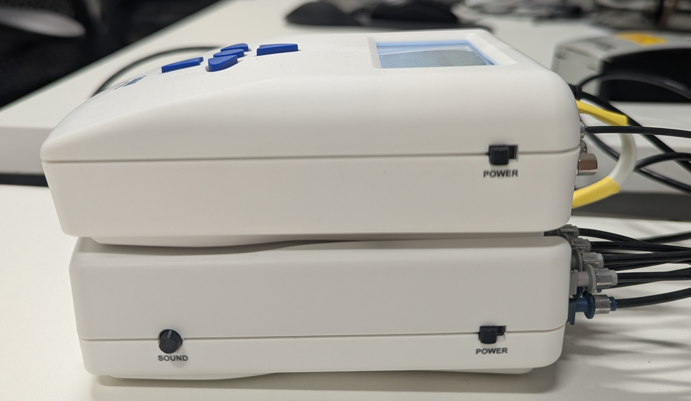

This page is under construction.

# Overview

The SyncBox helps align participant responses (which happen in real time) with fMRI acquistion (volume time). To do this, the SyncBox receives (a) synchronization pulse from the scanner and (b) participant responses. These are converted from fiber optic to serial output, and sent to a computer via USB.

# SyncBox Operations

{width=70% fig-align="center"}

* The Nordic Neuro Lab (NNL) SyncBox operates as a serial device.
    * Install this [driver](https://ftdichip.com/drivers/vcp-drivers/) on the device connecting to the SyncBox (e.g. stimulus computer).
* Power the SyncBox on with the toggles on the right side

{width=70% fig-align="center"}

* The SyncBox contains two modes of operation, manual and computer controlled.

## Manual Mode

***Manual mode is discouraged as you are required to set the TR length and number of volumes!***

Two manual modes exist, Synchronization and Simulation. These are identical, save:

* Simulation generates faux synchonization pulses, and
* Synchronization listens for the scanner synchonization pulse.

Setup:

* Verify Serial mode: Sync/Simulation -> Go to Options menu -> USB Mode -> Serial.
    * HID is still an option (but does not work).
* Manually send a sync pulse to your program (for testing): Sync/Simulation -> Send triggerpulse to PC.

Use:

* Configure session by specifying TR length and number of volumes.
    * **Note:** the SyncBox will stop listening after the specified number of volumes.
* Start the box listening for synchronization pulse and/or response grip input: Sync/Simuation -> Start Session.
    * Use center button to exit Session.

## Controlled Mode

* This is the vendor-preferred method of using the SyncBox.
* An example of using Python to connect the SyncBox to PsychoPy is available [here](https://github.com/ND-HNC/nnl_psychopy).

# SyncBox Configuration
## Front
* The SyncBox consists of the User Interface (A) and Response Capture (B).
    * The User Interface provides a navigation pad, LCD screen, and USB output for a task computer.
    * The Response Capture contains one green power light and four response lights.

{width=70% fig-align="center"}

* The Response Capture mappings are:

    | Light | Grip Button | Character |
    | ---- | ---- | ---- |
    | 1 | L. Thumb | A |
    | 2 | L. Index | B |
    | 3 | R. Index | C |
    | 4 | R. Thumb | D |

## Back
* The User Interface receives input from the fMRI Trigger Converter box (A1), Response Capture (A2), and Power (A3).
* The Response Captre receives input from the Response Grips (B1) and Power (B2), and send output to the User Interface (B2).

{width=70% fig-align="center"}

# fMRI Trigger Configuration

* The Siemens fMRI Trigger Converter box is located in the MRI Equipment Room (B18A).

{width=70% fig-align="center"}

* The fMRI trigger box receives a synchronization pulse as fiber optic (Cable W13470) input to the port "opt_trig_in" (I1). It is powered by a 5V 500mA adapter via a USB B-Type cable (I2).

{width=70% fig-align="center"}

* The fMRI trigger box then sends output from ports "opt_trig_out" (Cable W13471; O1) and "opt_trig_out_aux" (O2). When the fMRI trigger box is in "impulse" mode a synchronization pulse is sent for every volume, and every other volume in "toggle" mode.

{width=70% fig-align="center"}

* The fiber optic cable connected to "opt_trig_out_aux" (O2) is the input for the NNL SyncBox (A1).

# Wiring Diagram