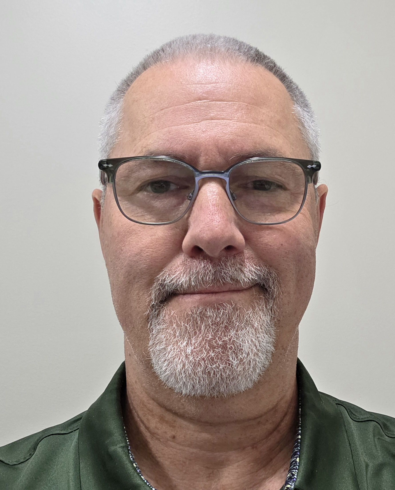

## Staff

```{=html}
<style>
.staff-card {
  display: flex;
  flex-direction: column;
  justify-content: flex-start;
  height: 100%;
}
.staff-img-container {
  height: 200px; /* Adjust height as needed */
  display: flex;
  align-items: center;
  justify-content: center;
  margin-bottom: 1rem;
}
.staff-img-container img {
  max-height: 100%;
  max-width: 100%;
  object-fit: contain;
}
</style>
```

::::: {.grid .text-center}
:::: {.g-col-12 .g-col-md-4 .staff-card}
::: {.staff-img-container}
{width=50%}
:::

| **Jeffrey Fox**
| B.Sc. RT. (R)(MR)(ARRT)
| *MRI Technologist*
| [jfox22@nd.edu](mailto:jfox22@nd.edu)
| (574) 631-5058
::::

:::: {.g-col-12 .g-col-md-4 .staff-card}
::: {.staff-img-container}
{width=75%}
:::

| **Nathan Muncy, Ph.D.**
| *MRI Analyst*
| [nmuncy@nd.edu](mailto:nmuncy@nd.edu)
::::

:::: {.g-col-12 .g-col-md-4 .staff-card}
::: {.staff-img-container}
{width=65%}
:::

| **Alex Musser, M.Sc.**
| *Operations Coordinator*
| [amusser2@nd.edu](mailto:amusser2@nd.edu)
| (574) 631-7276
::::
:::::

