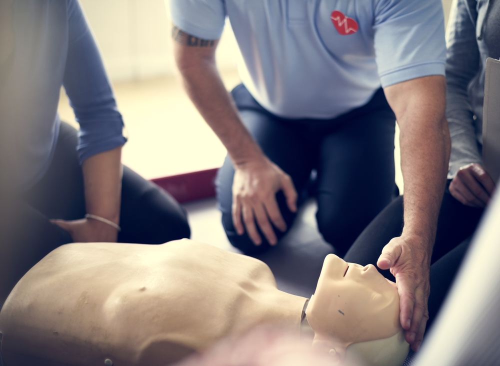

{width=60% fig-align="left"}

## Overview
The ND-HNC follows the American College of Radiology recommendations for building layout and MRI access: the ND-HNC is comprised of restricted Safety Zones (1-4, below) and specialized training is required to gain access to Zones 2-4.

All researchers, staff, and faculty who wish to enter Zones 2-4 must complete the appropriate level of training. This helps to ensure that everyone working at the ND-HNC, whether or not they are collecting MRI data, understands the importance of MRI safety and the relevant procedures and policies. Please see SOP [202](../resources/sops/200_operation/2_zone_access/sop_202_zone_access.pdf) for additional details.

## ND-HNC Layout

Use of MRI Zones 2-4 is restricted to personnel with the appropriate access Level; individuals without an access Level are escorted in these Zones. See [Upcoming Trainings](#ssec:train) to register for safety courses.

| Access | Safety Zone | Purpose | Restrictions |
|-----|-----|-----|-----|
| Public | 1 - orange | Reception | None |
| Level 1 | 2 - purple | Non-MRI research | B14 |
| Level 2 | 2 - purple | MRI preparation | |
| Level 3 | 3 - green | MRI control | B18A |
| Level 4 | 4 - blue | MRI scanning | |

: {tbl-colwidths="[25,25,25,25]"}

{fig-align="center" width=75%}

## Upcoming Trainings {#ssec:train}

Please review the schedule to select the relevant training session (and see [Level Description](#ssec:level-desc) for help determining the appropriate access Level). Register for a training session [here](https://nd.qualtrics.com/jfe/form/SV_3lcjn6KulWrGw3c).

| Topic | Date | Time | Location |
|-----|-----|-----|-----|
| Level 1 | 2026-09-09 | 9-10am | VFPC 148 |
| Level 1 | 2026-10-05 | 9-10am | VFPC 148 |
| Level 1 | 2027-02-02 | 9-10am | VFPC 148 |
| Level 1 | 2027-03-02 | 9-10am | VFPC 148 |
| Level 2 | 2026-09-09 | 11am-12pm | VFPC 148 |
| Level 2 | 2026-10-05 | 11am-12pm | VFPC 148 |
| Level 2 | 2027-02-02 | 11am-12pm | VFPC 148 |
| Level 2 | 2027-03-02 | 11am-12pm | VFPC 148 |
| CPR/AED | 2026-11-02 | 9-10am | TBD |

: {tbl-colwidths="[25,25,25,25]"}

Additional notes:

- Level 1 & 2 trainings are limited to 48 attendees.
- CPR/AED is required for Level 2 and above (recommended for Level 1).
- CPR/AED training cost is $65/person and is limited to 18 attendees.

## Level Description {#ssec:level-desc}

This sections is designed to help with training selection. See SOP [202](../resources/sops/200_operation/2_zone_access/sop_202_zone_access.pdf) for complete descriptions, restrictions, and requirements.

### Level 1
This access Level grants individuals entry into Zone 2 where they can use the interview, neuroprep, EEG, and TMS rooms. This access relates to non-MRI activities and does not grant access to the Mock room (B14) or Zones 3-4.

### Level 2
This access Level grants individuals complete access to Zone 2 (including the Mock room), the ability to conduct the first review of Form RO01: [MRI Safety Screen](../resources/forms/form_RO01_mri_screen.pdf), and supervised access to Zone 3 to assist in MRI-related research activities. Access to the Stimulus Control and DICOM computers in the MRI Control room is also granted. Individuals with this Level of accesss may enter Zone 4 under the supervision of the MRI Technologist or a researcher with Level 4 access. Level 2 access is granted to under/graduate students and other research staff; most research assistants in the MRI suite are Level 2.

### Level 3
This access Level grants independence in Zone 3, the ability to train to become an MRI operator (Level 4) for project-specific reasons (e.g. weekend pediatric scanning), and supervised access to Zone 4. It does not grant access to the Equipment Room in Zone 3 (B18A), or the ability to conduct the second review of Form RO01: [MRI Safety Screen](../resources/forms/form_RO01_mri_screen.pdf). Level 3 access is granted to post-baccalaureate research staff, graduate students, post-doctoral fellows, and faculty.

### Level 4
This access Level grants independence in the MRI research suite (including conducting MRI scanning) but these individuals operate at the discretion of the MRI Technologist. The ability to conduct the second review of Form RO01: [MRI Safety Screen](../resources/forms/form_RO01_mri_screen.pdf) is granted, as long as they did not also conduct the first review. Another person with at least Level 2 access is required to be present in the MRI Control room when a visitor or participant is in Zone 4. Level 4 access is granted to Ph.D. candidates, post-doctoral fellows, and faculty.