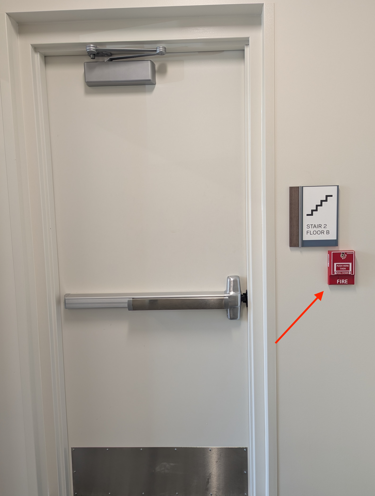
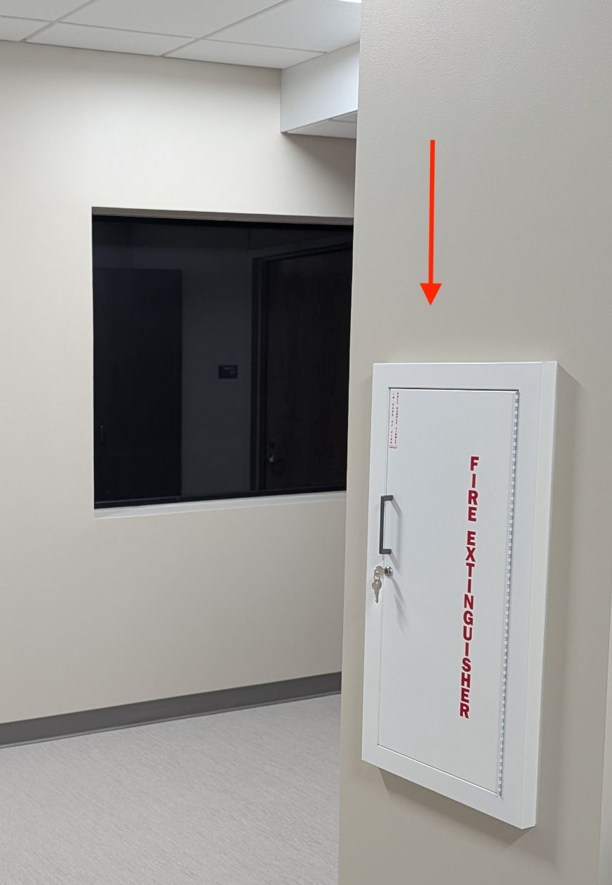

# Emergency Responses
## Evacuation Emergencies (Fire, Gas)
::::: columns
:::: {.column width="50%" style="font-size: 65%;"}
**Location of Fire Extinguishers:**

- Laundry room near the loading dock (E1)
- Across from the elevator bay in reception (E2)
- Outside the Neuro Lab Prep Room, B21 (E3)
- South Staff Entrance (E4)
- MRI Zone 3 Vestibule, B15 (E5)
- [NOTE:]{style="color: red"} Fire Extinguishers are **NOT** MRI Compatible

**Location of Fire Pulls (think exits):**

- Loading Dock Doors (P1)
- North and South Stairwells (P2, P4)
- South Staff Entrance (P3)

::::

:::: {.column width="50%"}
::: {.r-stack}

{fig-align="right"}

:::
::::
:::::

---

## Procedures - Fire/Gas (Zones I, II)
::::: columns
:::: {.column width="50%" style="font-size: 65%;"}

1. Pull the nearest Fire Alarm
2. Call 911 to notify the South Bend Fire Department (SBFD) and
    a. Say “We have [fire, smoke, gas] in the MRI Center at Veldman Family Psychology Clinic, 501 North Hill Street”.
3. Fight small fires ONLY IF:
    a. The Fire Department has been notified
    b. The fire is not spreading to other areas
    d. An escape route is available
    e. The fire extinguisher is in working condition and you are trained to use it

::::

:::: {.column width="50%" layout-ncol=2}

{fig-align="right"}

{fig-align="right"}

::::
:::::

---

## Procedures - Fire/Gas (Zones I, II), cont'd
::::: columns
:::: {.column width="50%" style="font-size: 65%;"}

4. Gather in the designated Safe Meeting Spot (next slide)
5. If you are unable to evacuate, draw attention to yourself by yelling out

::::

:::: {.column width="50%"}
::: {.r-stack}

{fig-align="right"}

:::
::::
:::::