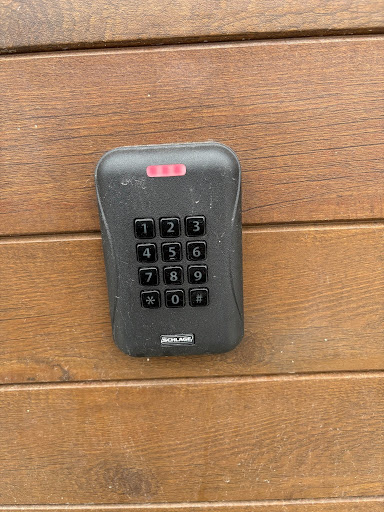
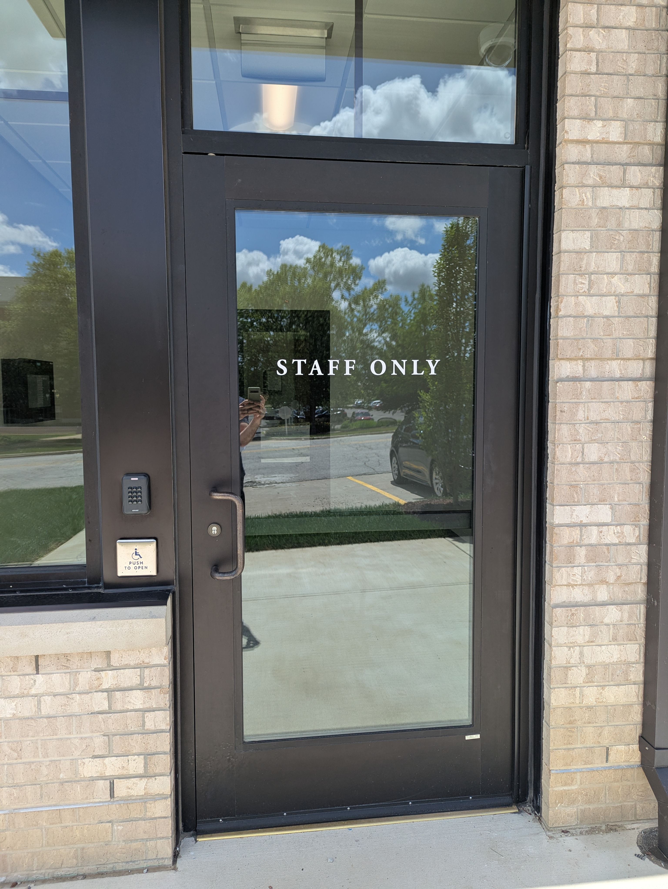
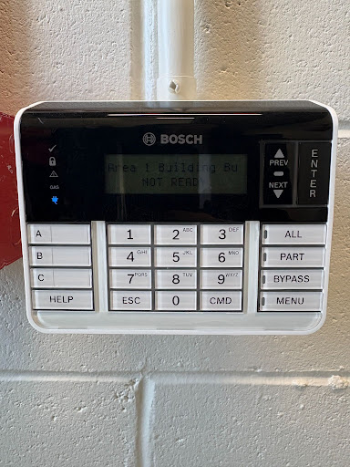
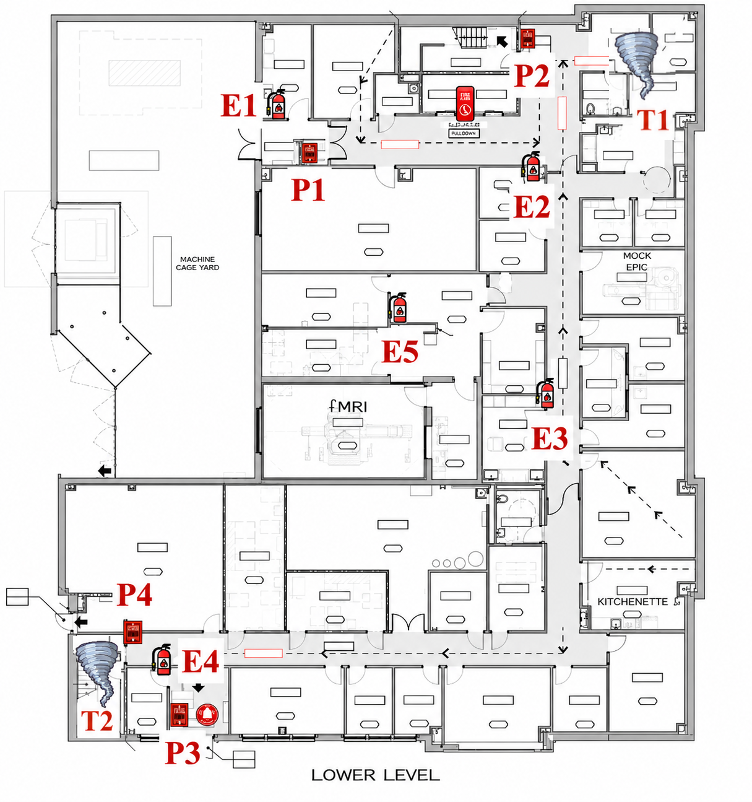
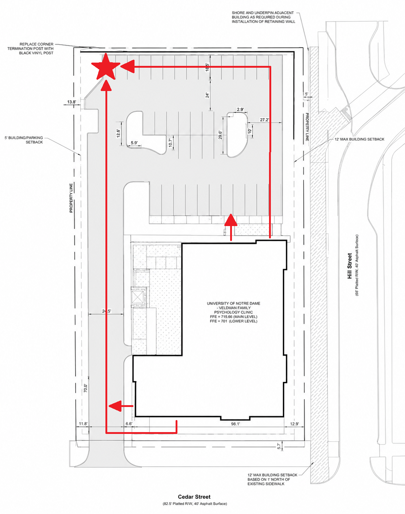
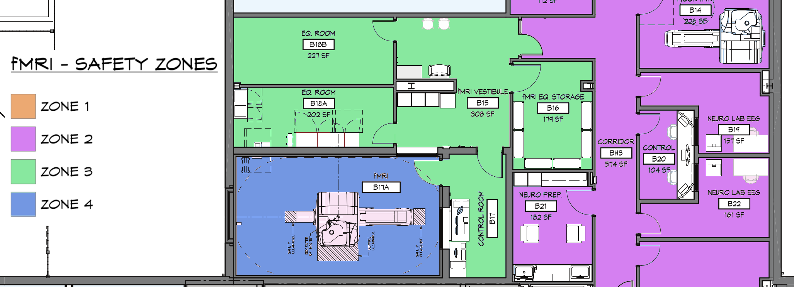
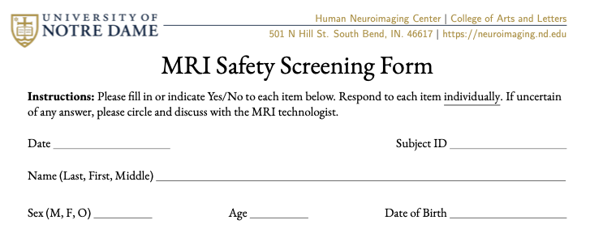

# Welcome to our Center!

<!-- 1. Center (10 min, Staff, website, scheduling, building hours, general emergency)
2. MRI Science (10 min)
3. Zones (10 min) -->

<!-- Section 1: Center -->
<!-- Staff intro
website
access
building hours
general emergency -->

## The Team
::::: columns
:::: {.column width="50%" style="font-size: 65%;"}
- Aron Barbey, Ph.D.
    - Director
- Jeff Fox, B.Sc. RT. (R)(MR)(ARRT)
    - Technologist
- Nathan Muncy, Ph.D.
    - Analyst
- Alex Musser, M.Sc.
    - Operations Coordinator
::::

:::: {.column width="50%"}
::: {.r-stack}

{.fragment .fade-in-then-out fig-align="center" width=70%}

{.fragment .fade-in-then-out fig-align="center" width=60%}

{.fragment .fade-in-then-out fig-align="center" width=80%}

{.fragment .fade-in-then-out fig-align="center" width=60%}

:::
::::
:::::

---

## Website Organization
::::: columns
:::: {.column width="50%" style="font-size: 65%;"}
- Help with all aspects of MRI research
    - [Grant preparation](https://nd-hnc.github.io/website/pages/facilities.html)
    - [Training](https://nd-hnc.github.io/website/pages/training.html)
    - [Computing](https://nd-hnc.github.io/website/pages/compute.html)
    - [Storage](https://nd-hnc.github.io/website/pages/storage.html)
- Centralized resources
    - [Forms](https://nd-hnc.github.io/website/pages/forms.html)
    - [SOPs](https://nd-hnc.github.io/website/pages/sops.html)
    - [Policies](https://nd-hnc.github.io/website/pages/policies.html)

::::

:::: {.column width="50%" style="font-size: 65%;"}
[https://nd-hnc.github.io/website](https://nd-hnc.github.io/website/)
::::
:::::

::: {style="font-size: 65%; text-align: center;"}

**Expectation:** all users have read and understand SOPs and Policies.
:::

---

## Building Access
::::: columns
:::: {.column width="50%" style="font-size: 65%;"}
1. Enter through Main and Staff entrances
1. Present Irish1Card to card reader
1. Provide PIN

Receive access:

- Contact ND-HNC staff for building access
- Set/access PIN at [https://idcardpin.nd.edu](https://idcardpin.nd.edu)
::::

:::: {.column width="50%"}
::: {.r-stack}

{.fragment .fade-in-then-out width="90%" fig-align="right"}

{.fragment .fade-in width="80%" fig-align="right"}

:::
::::
:::::

---

## Building Hours

::::: columns
:::: {.column width="50%" style="font-size: 65%;"}

Regular hours of operation:

- Mon-Thur, 7am-7pm
- Fri, 7am-4pm

Building alarm system armed:

- Weekdays, 10pm-6am
- Weekends, all

Set or access your 6-digit security PIN:

- Contact ND-HNC staff

::::

:::: {.column width="50%"}

{fig-align="right" width="70%"}

::::
:::::

---

## Emergency Response

<!-- TODO: add pics of fire extinguishers, pulls -->

::::: columns
:::: {.column width="50%" style="font-size: 65%;"}
- Fire and Gas
- Tornado
- Active Violence
::::

:::: {.column width="50%"}
::: {.r-stack}

{.fragment width="90%"}

{.fragment .fade-in-then-out width="90%"}

:::
::::
:::::


<!-- Section 2: MRI Science -->
# MRI: An introduction
## What is MRI?
::::: columns
:::: {.column width="50%" style="font-size: 65%;"}
Magnetic Resonance Imaging

- **Magnetic**: certain elements have known behaviors in magnetic fields:
    - Align with field,
    - Precesses at given frequency.
- **Resonance**: introduce energy at same frequency as precession.
    - Protons move to higher energy states, eventually decay.
- **Imaging**: researchers capitalize on different tissue properties (e.g. density) to create contrasts.
::::

:::: {.column width="50%"}
::: {.r-stack}

{fig-align="right"}

{.fragment .fade-in-then-out fig-align="right"}

{.fragment .fade-in-then-out fig-align="right"}

:::
::::
:::::

---

## Magnet Strength
::::: columns
:::: {.column width="50%" style="font-size: 65%;"}
- Typically measured in Tesla (T).
- The Earth’s magnetic field is roughly 0.00005 Tesla.
    - Standard 3 Tesla scanner is ~60,000 times stronger than Earth's field.
- Meaning: 3 Tesla is [significant](https://www.youtube.com/watch?v=6BBx8BwLhqg){target="_blank"}.
::::

:::: {.column width="50%"}

{fig-align="right"}

::::
:::::

---

## Magnet Is Always On!
::::: columns
:::: {.column width="50%" style="font-size: 65%;"}
- Electrical resistance decreases with temperature.
    - At very (very) low temperatures, copper has superconductive properties.
- MRI scanner filled with liquid helium:
    - Ramp up (charge coil) from the electrical grid.
    - Then disconnect!
    - Perpetual current = persistent field strength.
- Magnetic field is independent of power in:
    - Room,
    - Veldman Family Psychology Clinic,
    - South Bend.
::::

:::: {.column width="\"50%"}
::: {.r-stack}

{.fragment .fade-in-then-out fig-align="right"}

{.fragment .fade-in-then-out fig-align="right"}

{.fragment .fade-in-then-out fig-align="right"}

{.fragment .fade-in-then-out fig-align="right"}

:::
::::
:::::

---

## Safety Considerations

::::: columns
:::: {.column width="50%" style="font-size: 65%;"}
- Rarely are rooms [fatal](https://smithchason.edu/mri-safety-lessons-1980-2001-2025/){target="_blank"}.
- Injuries are more [common](../../media/articles/inaguma_2023_injuries.pdf){target="_blank"} than they should be.
- American College of Radiology ([ACR](https://www.acr.org/){target="_blank"}) recommends a 4 [zone](https://mriquestions.com/acr-safety-zones.html){target="_blank"} strategy for controlling access.
::::

:::: {.column width="\"50%"}

{fig-align="right"}

::::
:::::

---

## Safety Zones



---


## Safety Screener

<!-- TODO: Detail -->

::::: columns
:::: {.column width="50%" style="font-size: 65%;"}
- Everyone who enters Zone 3 **MUST** fill out an [MRI Safety Screener](../forms/form_RO01_mri_screen.pdf){target="_blank"}.
- Check for compatibility with 3 Tesla field.
- Reviewed by two people, check for:
    - MR contraindications (e.g. pacemaker),
    - MR compatibility (e.g. magnetic lashes).
::::

:::: {.column width="\"50%"}

{fig-align="right" .bordered-fig}

```{css, echo=FALSE}
.bordered-fig {
  border: 2px solid black !important;
}
```

::::
:::::


# ND-HNC MRI Zones

## Zone 1 - Orange
::::: columns
:::: {.column width="50%" style="font-size: 65%;"}
- Contains:
    - Offices
    - Conference
    - Reception
- Use:
    - Meet participants
- Access:
    - Public
::::

:::: {.column width="\"50%"}

{fig-align="right"}

::::
:::::

---

## Zone 2 - Purple
::::: columns
:::: {.column width="50%" style="font-size: 65%;"}
- Contains:
    - Changing rooms
    - Interview, testing
    - Non-MRI research (EEG, TMS)
    - Mock MRI
- Use:
    - Non-MRI research
    - MRI preparation
- Access:
    - Levels 1, 2+
    - Escorted Visitors
::::

:::: {.column width="\"50%"}

{fig-align="right"}

::::
:::::

---

## Zone 3 - Green
::::: columns
:::: {.column width="50%" style="font-size: 65%;"}
- Contains:
    - Equipment
    - Storage
    - Control
- Use:
    - Access MRI scanner
    - Maintain equipment
    - Collect MRI data
- Access:
    - Level 3+ (Supervised Level 2)
    - Screened, escorted Visitors
::::

:::: {.column width="\"50%"}

{fig-align="right"}

::::
:::::

---

## Zone 4 - Blue
::::: columns
:::: {.column width="50%" style="font-size: 65%;"}
- Contains:
    - Magnet
- Use:
    - Scan participants
- Access:
    - Level 4+ (Supervised Level 2+)
    - Screened, escorted Visitors
::::

:::: {.column width="\"50%"}

{fig-align="right"}

::::
:::::


# Sources
:::: {.columns}
::: {.column width="50%" style="font-size: 50%"}
What is MRI?

- [NMR Property](https://link.springer.com/chapter/10.1007/978-3-031-91447-8_2)
- [Axial T1-weighted image](https://mrimaster.com/index-2/)

MRI Strength

- [Tesla distance](https://www.researchgate.net/figure/Comparison-of-fringe-magnetic-fields-of-two-clinical-MRI-systems-Fringe-magnetic-fields_fig1_334496429)

Always On!

- [Superconductivity](https://mriquestions.com/superconductivity.html)
- [Magnet cross section](https://mriquestions.com/superconductive-design.html)
- [Magnet and grid](https://www.sciencedirect.com/topics/engineering/superconducting-coil)
- [Electromagnet](https://www.sciencefacts.net/solenoid-magnetic-field.html)

:::
::: {.column width="\"50%" style="font-size: 50%"}

Safety Considerations

- [2x2 Scanner Accident](https://www.purdue.edu/hhs/mri/MR%20Safety/MR%20Safety.html)
- [Article Selection](https://smithchason.edu/mri-safety-lessons-1980-2001-2025/)
- [MRI Zones](https://mriquestions.com/acr-safety-zones.html)

:::
::::