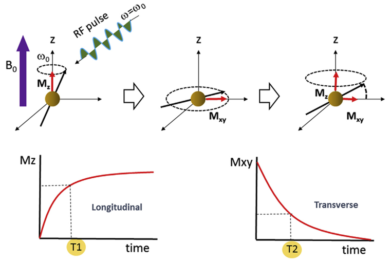

# MRI
## MRI is Cool
cool
magnet
proton

---

## What is MRI?
::::: columns
:::: {.column width="50%" style="font-size: 65%;"}
- Nuclear Magnetic Resonance Imaging:
    - Certain nuclei (H+) align with magnetic field
    - Respond to secondary field
    - Emit electromagnetic signal
- Number of discoveries:
    - [Rabi](../articles/rabi_1938.pdf) - NMR (molecular beams)
    - [Bloch](../articles/bloch_1946.pdf) and Purcell - NMR (liquids, solids)
    - [Lauterbur](../articles/lauterbur_1973_mri.pdf) and Mansfield - MRI
- Intersection: Physics, Engineering, CompSci, Neuroscience, Psychology
::::

:::: {.column width="\"50%"}
::: {.r-stack}

{.fragment}
:::
::::
:::::

::: {.notes}
- Isidor Rabi (1938) first described NMR; Nobel Prize 1944
- Felix Bloch, Edward Purcell extended to liquids, solids; Nobel Prize 1952
- Lauterbur, Mansfield; biologically useful MRI, EPI; Nobel Prize 2003
:::

---

## Magnetic Field
::::: columns
:::: {.column width="50%" style="font-size: 65%;"}
- Principles of [electromagnetism](https://www.youtube.com/watch?v=tXI7Wd1ElF8)
- Superconductivity
    - Copper
    - Liquid He+
- 3 Tesla ([2000+](https://www.youtube.com/watch?v=6BBx8BwLhqg) lbs attraction)
    - Smooth, consistent field
    - Always ON!
::::

:::: {.column width="\"50%"}
::: {.r-stack}

{.fragment .fade-in-then-out}

{.fragment .fade-in-then-out}

{.fragment .fade-in-then-out}

{.fragment}
:::
::::
:::::

::: {.notes}
(charge machine before strength)
:::

## Proton

# MRI Strength
## Tesla tesla
foot pounds
videos

---

## Safety Considerations
::::: columns
:::: {.column width="50%" style="font-size: 65%;"}
- Rarely are rooms [fatal](https://smithchason.edu/mri-safety-lessons-1980-2001-2025/)
- Strict [Zoning](https://mriquestions.com/acr-safety-zones.html) helps
- Diligence: avoid complacency and [survivorship bias](https://en.wikipedia.org/wiki/Survivorship_bias)
- Magnetic field has significant [acceleration](https://www.youtube.com/watch?v=IF6CMrjGNN4)
- Injuries are more [common](articles/inaguma_2023_injuries.pdf) than they should be
::::

:::: {.column width="\"50%"}

::::
:::::

::: {.notes}
- Survivor bias: seatbelts, climbing
(Rope on chair)
:::

# Zones
## Zone 1

Access
Use
Restrictions

---

## Zone 2
Access
Use
Restrictions

---

## Zone 3
Access
Use
Restrictions

---

## Zone 4
Website

---

# Access
## Access 1

1-4

---

## Access 2

---

## Access 3

---

## Access 4

---

# Dilligence
Badge
Close doors
Challenge

# Schedule

# Policies

# Relevant SOPs

