# MRI: An introduction
## What is MRI?
::::: columns
:::: {.column width="50%" style="font-size: 65%;"}
- (Nuclear) Magnetic Resonance Imaging
- Nuclear Magnetic: certain elements have known behaviors in magnetic fields
    - Align with field
    - Precesses at known frequency
- Resonance: introduce energy at same frequency as precession
    - Protons move to higher energy states, eventually decay
- Imaging: researchers capitalize on different tissue properties (e.g. density) to create contrasts
::::

:::: {.column width="50%"}
::: {.r-stack}

{fig-align="right"}

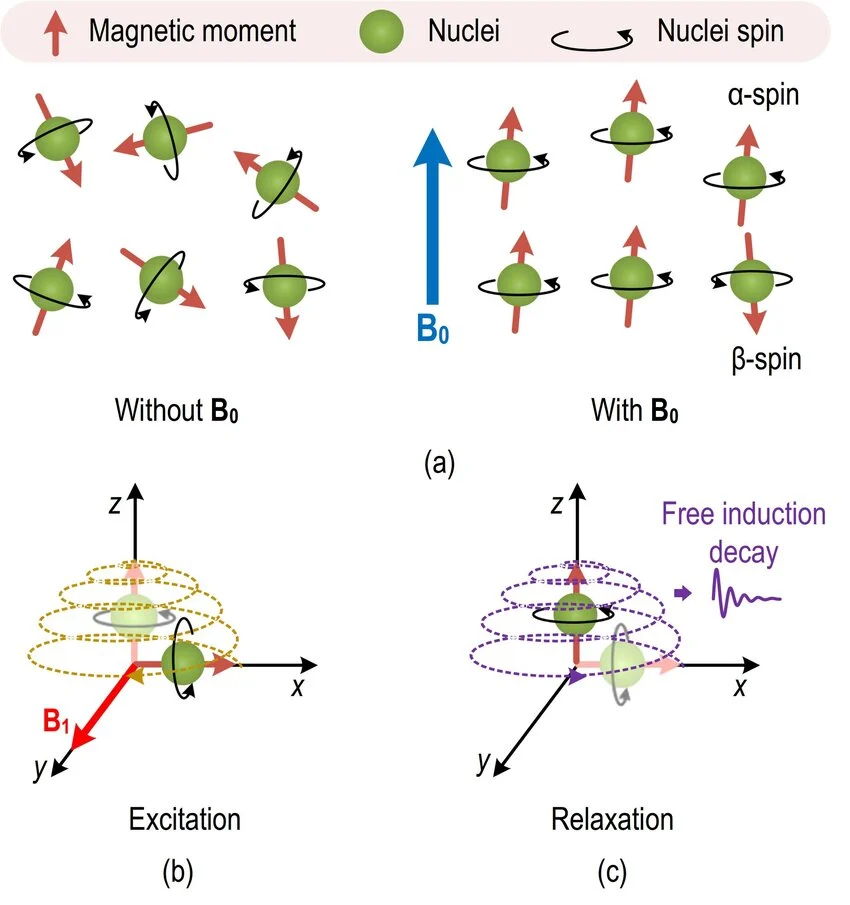{.fragment .fade-in-then-out fig-align="right"}

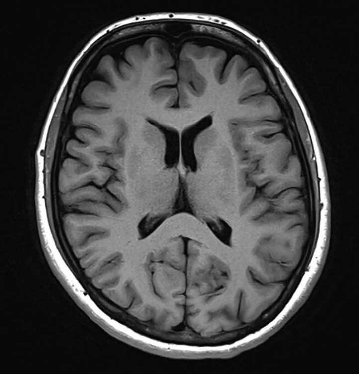{.fragment .fade-in-then-out fig-align="right"}

:::
::::
:::::

---

## Magnet Strength
::::: columns
:::: {.column width="50%" style="font-size: 65%;"}
- Typically measured in Tesla (T)
- The Earth’s magnetic field is roughly 0.00005 Tesla
    - Standard 3 Tesla scanner is ~60,000 times stronger than Earth's field.
- Meaning: 3 Tesla is [significant](https://www.youtube.com/watch?v=6BBx8BwLhqg){target="_blank"}.
::::

:::: {.column width="50%"}

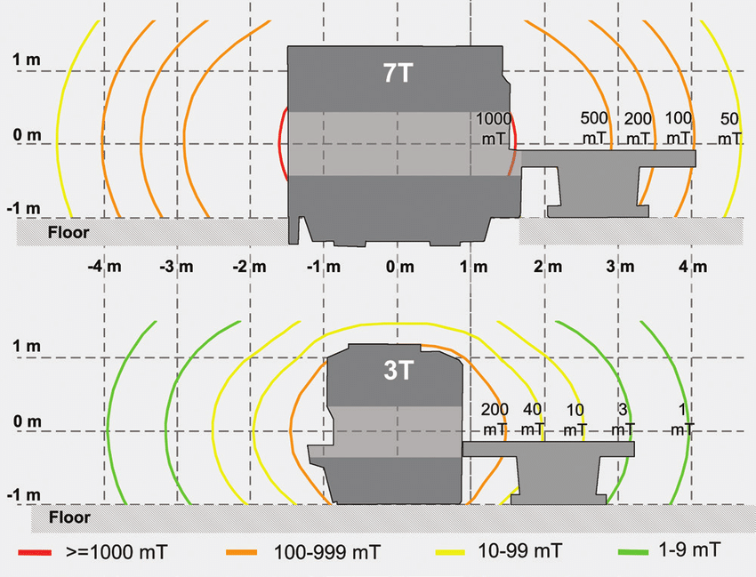{fig-align="right"}

::::
:::::

---

## Magnet Is Always On!
::::: columns
:::: {.column width="50%" style="font-size: 65%;"}
- Electrical resistance decreases with temperature
    - At very (very) low temperatures, copper has superconductive properties
- MRI scanner filled with liquid helium
    - Ramp up (charge coil) from the electrical grid
    - Then disconnect!
    - Perpetual current = persistent field strength
- Independent of power in:
    - Room
    - Veldman Family Psychology Clinic
    - South Bend
::::

:::: {.column width="\"50%"}
::: {.r-stack}

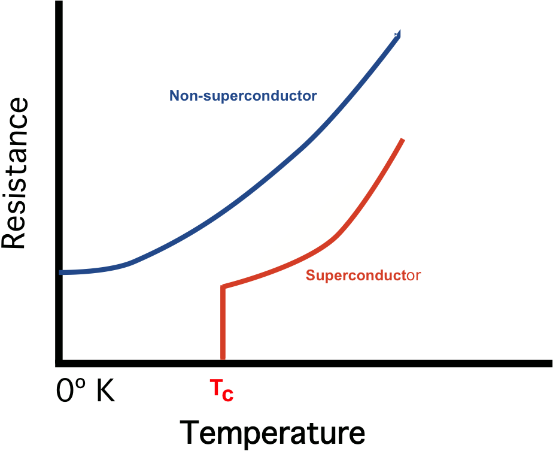{.fragment .fade-in-then-out fig-align="right"}

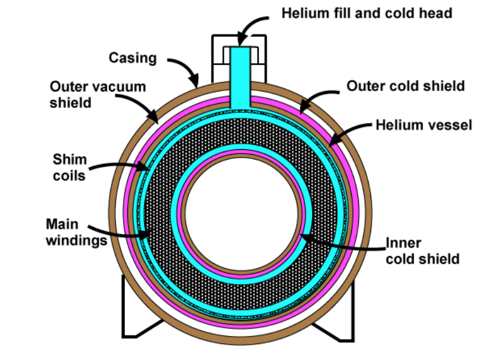{.fragment .fade-in-then-out fig-align="right"}

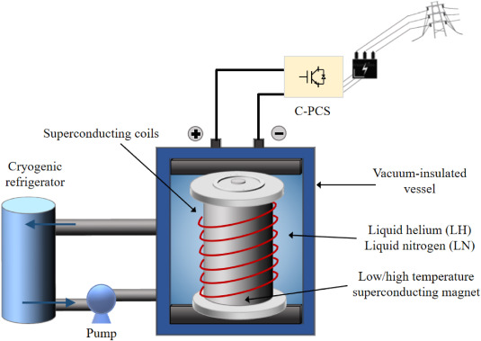{.fragment .fade-in-then-out fig-align="right"}

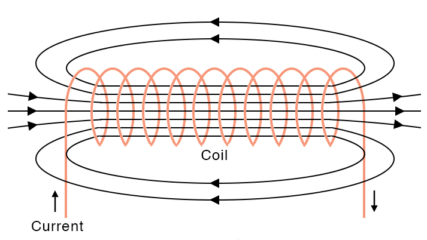{.fragment .fade-in-then-out fig-align="right"}

:::
::::
:::::

---

## Safety Considerations

::::: columns
:::: {.column width="50%" style="font-size: 65%;"}
- Rarely are rooms [fatal](https://smithchason.edu/mri-safety-lessons-1980-2001-2025/){target="_blank"}.
- Injuries are more [common](../articles/inaguma_2023_injuries.pdf){target="_blank"} than they should be.
- American College of Radiology ([ACR](https://www.acr.org/){target="_blank"}) recommends a 4 [zone](https://mriquestions.com/acr-safety-zones.html){target="_blank"} strategy for controlling access.
::::

:::: {.column width="\"50%"}

<!-- TODO: increase danger_1 -->

::: {.r-stack}

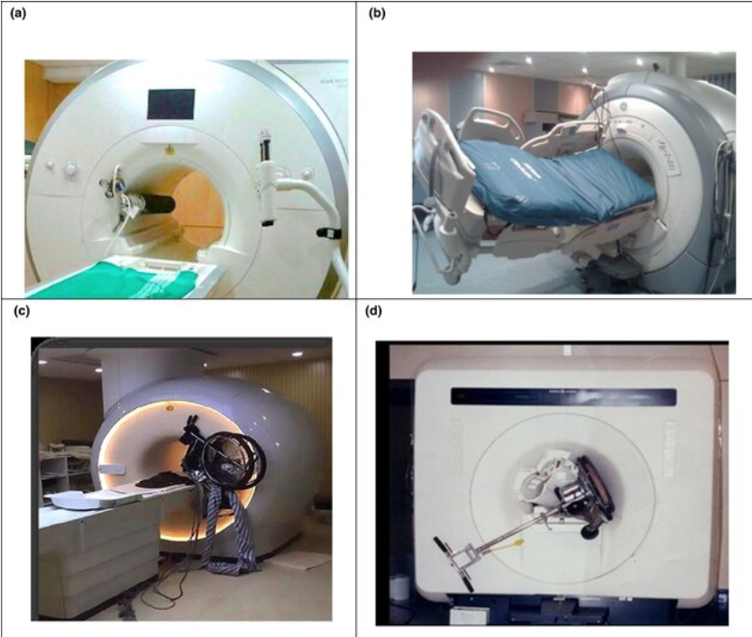{.fragment .fade-in-then-out fig-align="right"}

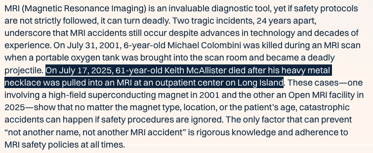{.fragment .fade-in-then-out fig-align="right"}

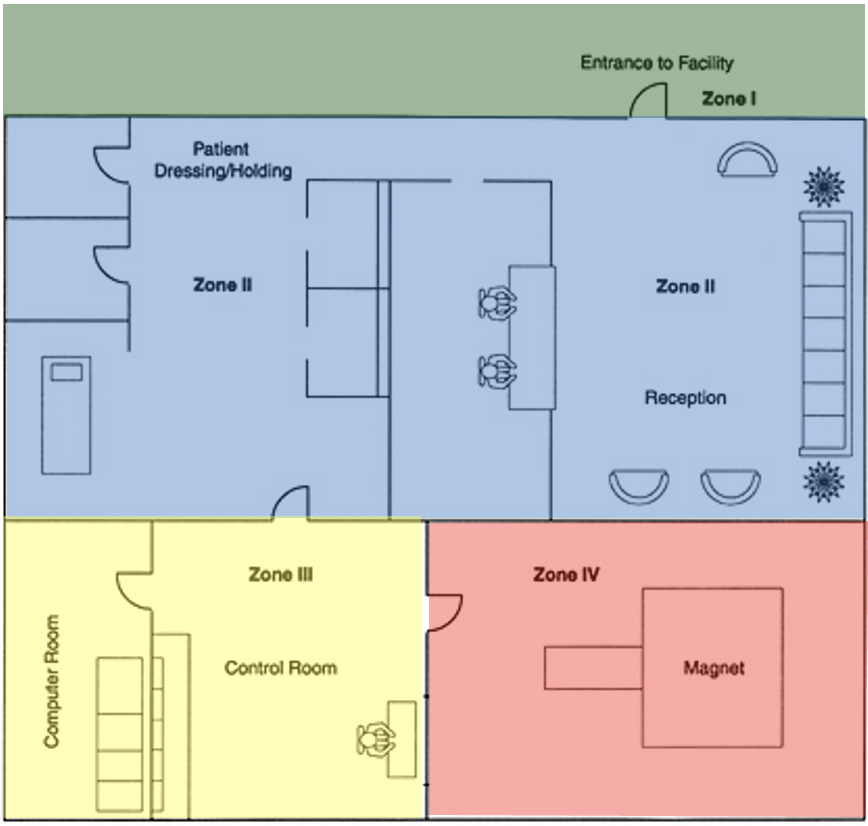{.fragment .fade-in-then-out fig-align="right"}

:::
::::
:::::

---

## Safety Screener
::::: columns
:::: {.column width="50%" style="font-size: 65%;"}
- Everyone who enters Zone 3 **MUST** fill out an [MRI Safety Screener](../forms/form_RO01_mri_screen.pdf){target="_blank"}
- Check for compatibility with 3 Tesla field
- Reviewed by two people

1. Check for contraindications:
    - Non-MRI compatible medical implants (e.g. pacemaker)
    - Metal embedded in body (shrapnel, piercings)
    - Tattoo on face or neck, permanent makeup
    - Pregnancy
::::

:::: {.column width="\"50%" style="font-size: 65%;"}
2. Check that MRI incompatible materials are removed
    - Jewelry, objects in pockets (pens, paperclips)
    - Hair accessories (bobby pins, clips, extensions)
    - Clothing (bra underwire, Lululemon Silverscent)
    - Cosmetics (colored contacts, magnetic lashes, tanning lotions, makeup/nail polish with glitter)
    - Footwear (steeltoe, buckles)
::::
:::::

# MRI Zones

ND-HNC zone [map](../sops/pics/nd-hnc_layout_zones.png){target="_blank"}.

## Zone 1 (Orange)
::::: columns
:::: {.column width="50%" style="font-size: 65%;"}
- Contains:
    - Offices
    - Conference
    - Reception
- Use:
    - Meet participants
- Access:
    - Public
::::

:::: {.column width="\"50%"}

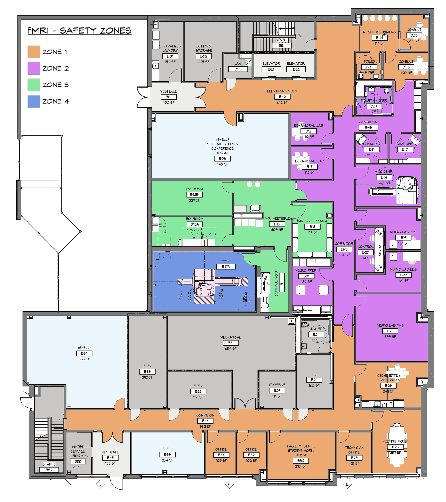{fig-align="right"}

::::
:::::

---

## Zone 2 (Purple)
::::: columns
:::: {.column width="50%" style="font-size: 65%;"}
- Contains:
    - Changing rooms
    - Interview, testing
    - Non-MRI research (EEG, TMS)
    - Mock MRI
- Use:
    - Non-MRI research
    - MRI preparation
- Access:
    - Levels 1, 2+
    - Escorted Visitors
::::

:::: {.column width="\"50%"}

{fig-align="right"}

::::
:::::

---

## Zone 3 (Green)
::::: columns
:::: {.column width="50%" style="font-size: 65%;"}
- Contains:
    - Equipment
    - Storage
    - Control
- Use:
    - Access MRI scanner
    - Maintain equipment
    - Collect MRI data
- Access:
    - Level 3+ (Supervised Level 2)
    - Screened, escorted Visitors
::::

:::: {.column width="\"50%"}

{fig-align="right"}

::::
:::::

---

## Zone 4 (Blue)
::::: columns
:::: {.column width="50%" style="font-size: 65%;"}
- Contains:
    - Magnet
- Use:
    - Scan participants
- Access:
    - Level 4+ (Supervised Level 2+)
    - Screened, escorted Visitors
::::

:::: {.column width="\"50%"}

{fig-align="right"}

::::
:::::

# MRI Access
## Level 1

::::: columns
:::: {.column width="50%" style="font-size: 65%;"}
- Requirements:
    - Annual MRI Safety training
    - Building access, safety trainings
    - Wear Level 1 badge in MRI suite
- Privileges:
    - Unsupervised access in Zone 2$^*$
- Restrictions:
    - $^*$No access to Mock Room (B14)
    - No access to Zones 3, 4
    - Cannot review MRI Safety Screen
::::

:::: {.column width="\"50%"}

{fig-align="right"}

::::
:::::

---

## Level 2

::::: columns
:::: {.column width="50%" style="font-size: 65%;"}
- Requirements:
    - Level 1 requirements
    - Current first-aid, CPR training
    - Current (at least annual) MRI Safety Screen form
- Privileges:
    - All Level 1 privileges
    - Access to Mock Scanner and computer
    - Supervised access to Zones 3, 4
    - Access to stimulus and DICOM computers
    - First review of MRI Safety Screen
    - Help un/load participants in scanner
    - Helper in emergencies
::::

:::: {.column width="\"50%"}

{fig-align="right"}

::::
:::::

---

## Level 2, cont'd

::::: columns
:::: {.column width="50%" style="font-size: 65%;"}
- Restrictions:
    - No access to Zone 3 Equipment room
    - Irish1Card access to Zone 3 not granted
::::

:::: {.column width="\"50%"}

{fig-align="right"}

::::
:::::

---

## Level 3

::::: columns
:::: {.column width="50%" style="font-size: 65%;"}
- Requirements:
    - Level 2 requirements
    - Pass Emergency SOP exam
    - ND graduate student, post-doctoral fellow, faculty
    - 30 hours of experience as Level 2 in Zone 3
- Privileges:
    - All Level 2 privileges
    - Unsupervised access to Zone 3
    - Supervised access to Zone 4
    - May train for Level 4
::::

:::: {.column width="\"50%"}

{fig-align="right"}

::::
:::::

---

## Level 3, cont'd

::::: columns
:::: {.column width="50%" style="font-size: 65%;"}
- Restrictions:
    - No unsupervised access to Zone 4
    - Cannot be second reviewer of MRI Safety Screen
::::

:::: {.column width="\"50%"}

{fig-align="right"}

::::
:::::

---

## Level 4

::::: columns
:::: {.column width="50%" style="font-size: 65%;"}
- Requirements:
    - Level 3 requirements
    - Pass operator exam
    - ND Ph.D. candidate, post-doctoral fellow, faculty
    - 30 hours of experience as Level 3
- Privileges:
    - All Level 3 privileges
    - Unsupervised access to Zone 4
    - Second reviewer of MRI Safety Screen
    - Independently scan participants
- Restrictions:
    - Must be accompanied by another researcher (Level 2+) when someone is in Zone 4
::::

:::: {.column width="\"50%"}

{fig-align="right"}

::::
:::::

## Level 4, cont'd

::::: columns
:::: {.column width="50%" style="font-size: 65%;"}
- Restrictions:
    - Must be accompanied by another researcher (Level 2+) when someone is in Zone 4
::::

:::: {.column width="\"50%"}

{fig-align="right"}

::::
:::::

# Culture of Diligence

::::: columns
:::: {.column width="50%" style="font-size: 65%;"}
- **Purpose:** have ZERO accidents with the scanner.
- Avoid complacency and [survivorship bias](https://en.wikipedia.org/wiki/Survivorship_bias){target="_blank"}.
- Follow and support policies.
- For example:
    - Wear badges for ease of identification.
    - Close doors to restrict Zone access.
    - Challenge protocol deviations.
::::

:::: {.column width="\"50%"}

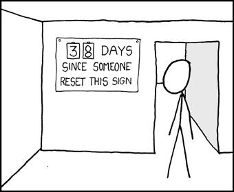{fig-align="right"}

::::
:::::

# Website
:::: {style="font-size: 65%;"}
- Find SOPs, Policies, and more information at [nd-hnc.github.io/website](https://nd-hnc.github.io/website){target="_blank"}
::::

## Sources
:::: {.columns}
::: {.column width="50%" style="font-size: 50%"}
What is MRI?

- [NMR Property](https://link.springer.com/chapter/10.1007/978-3-031-91447-8_2)
- [Axial T1-weighted image](https://mrimaster.com/index-2/)

MRI Strength

- [Tesla distance](https://www.researchgate.net/figure/Comparison-of-fringe-magnetic-fields-of-two-clinical-MRI-systems-Fringe-magnetic-fields_fig1_334496429)

Always On!

- [Superconductivity](https://mriquestions.com/superconductivity.html)
- [Magnet cross section](https://mriquestions.com/superconductive-design.html)
- [Magnet and grid](https://www.sciencedirect.com/topics/engineering/superconducting-coil)
- [Electromagnet](https://www.sciencefacts.net/solenoid-magnetic-field.html)

:::
::: {.column width="\"50%" style="font-size: 50%"}

Safety Considerations

- [2x2 Scanner Accident](https://www.purdue.edu/hhs/mri/MR%20Safety/MR%20Safety.html)
- [Article Selection](https://smithchason.edu/mri-safety-lessons-1980-2001-2025/)
- [MRI Zones](https://mriquestions.com/acr-safety-zones.html)

Culture of Diligence

- [XKCD](https://xkcd.com/363/)

:::
::::