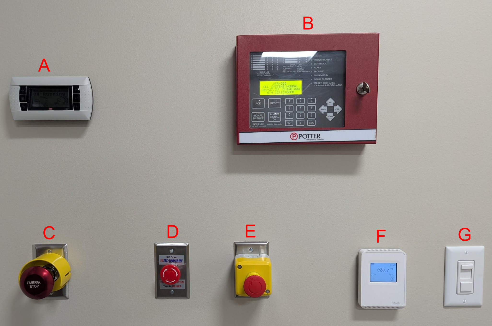
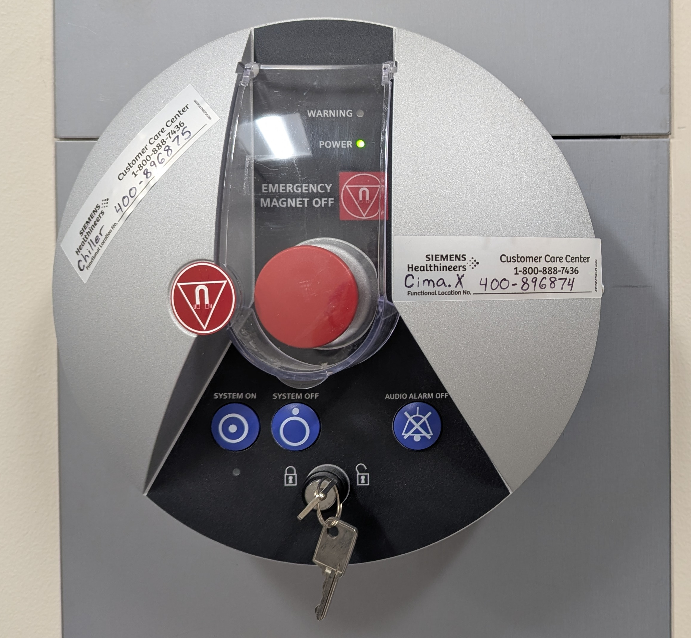
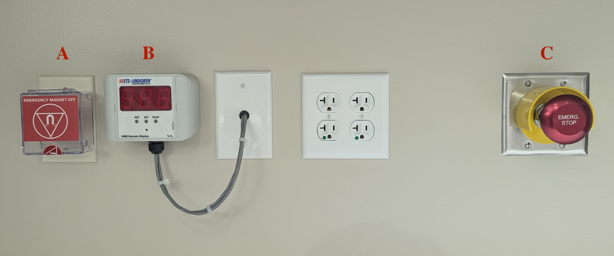
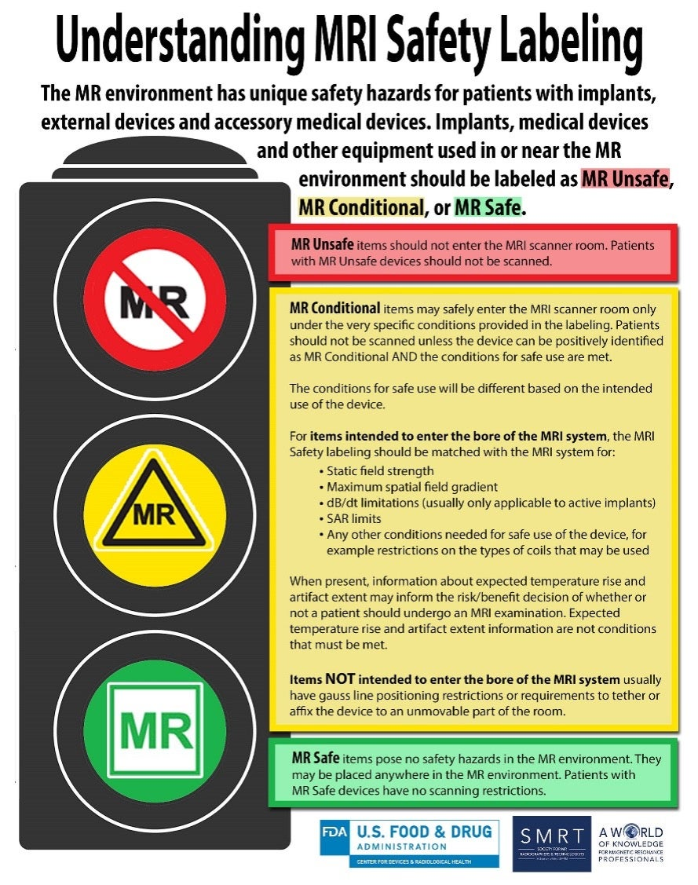

# Level 2 Access

Purpose: Assist with MRI research.

## Participant Flow

::::: columns

```{mermaid}
flowchart LR
    subgraph Zone_1 [Zone 1]
        B["`Arrive
            Screen
            Review Screen 1
            ---
            Exit`"]

    end
    style Zone_1 fill:#eca972,stroke:#000000,color:#000000,stroke-width:2px

    subgraph Zone_2 [Zone 2]
       C["`Interview
           Change
           Mock
           EEG, TMS
           (Review Screen 1)`"]
    end
    style Zone_2 fill:#d480f0,stroke:#000000,color:#000000,stroke-width:2px

    subgraph Zone_3 [Zone 3]
        D["`Review Screen 2
            Administer Task`"]
    end
    style Zone_3 fill:#88e8a0,stroke:#000000,color:#000000,stroke-width:2px

    subgraph Zone_4 [Zone 4]
        E[Scan]
    end
    style Zone_4 fill:#7397e3,stroke:#000000,color:#000000,stroke-width:2px

    A[Schedule] --> Zone_1
    Zone_1 <--> Zone_2 <--> Zone_3 <--> Zone_4

    classDef allBlack color:#000000;
    class A,B,C,D,E,F allBlack;
    classDef whiteBoxes fill:#ffffff,stroke:#000000,stroke-width:2px;
    class A,B,C,D,E,F whiteBoxes;
    linkStyle default stroke:black,stroke-width:1px;

```


{fig-align="center" width="60%"}


:::::

::: {.notes}
Mention that all MRI participants will change into scrubs.
:::

<!-- ## Data Flow

CorpFS
Stimulus presentation
Participant response
Output DICOM files -->

## Requirements

:::: {.columns}

::: {.column width="55%" style="font-size: 65%;"}
::: {.callout-note icon=false}
### Access Prerequisites
- Complete annual **ND-HNC MRI Safety training**, Level 2
- Participate in building access and safety trainings
- Wear **Level 2 access badge** at all times while in the ND-HNC research suite
:::
:::

::: {.column width="45%"}
{fig-align="center" width="100%"}
:::

::::

---

## Privileges

:::: {.columns}

::: {.column width="55%" style="font-size: 65%;"}
::: {.callout-tip icon=false}
### Zone 2 Access & Operations
- **Irish1Card access** to Zone 2
- **Unsupervised access** to Zone 2
- Escort visitors in Zone 2
- Access to **Mock Scanner** and Mock computer
- Supervised access to **Zones 3 & 4**
- Access Stimulus Control and DICOM computers
- Review and sign MRI Safety Screen
- Help load/unload Visitors into MRI scanner
- Respond as **Helper** in emergency situations
:::
:::

::: {.column width="45%"}
{fig-align="right" width="100%"}
:::

::::

---

## Restrictions

:::: {.columns}

::: {.column width="55%" style="font-size: 65%;"}
::: {.callout-important icon=true}
### Strict Access Boundaries
- **No Irish1Card access** granted to Zone 3
- **No access** to Zone 3 Equipment Room (B18A)
:::
:::

::: {.column width="45%"}
{fig-align="right" width="100%"}
:::

::::


---

## Duties

:::: {.columns}

::: {.column width="55%" style="font-size: 65%;"}
::: {.callout-note icon=false}
### Work Performed
- Screen participants
- Conduct simulation MRI (mock) scans
- Assist in MRI data collection
- Manage data (MRI, task)
- Assist during emergencies
:::
:::

::: {.column width="45%"}
{fig-align="center" width="100%"}
:::

::::


# MRI Safety

<!-- 5. MRI emergency response 2 (30 min) -->

## Incidents and Accidents
:::: {.columns}

::: {.column width="50%"}
::: {.callout-important icon=false title="Primary Drivers"}
* Rarely due to equipment malfunction
* Usually stems from improper equipment use
* Caused by breakdowns in procedure and policy
:::
:::

::: {.column width="50%"}
::: {.callout-tip icon=false title="Remedies"}

* **Policy Design:**
  * Address **predictable** scenarios
  * Prepare for **unusual or unpredictable** situations
:::
:::

::::

---

## Safety Switch Panel, Control Room
::::: columns
:::: {.column width="50%" style="font-size: 65%;"}
- **A:** Chiller status, monitor cooling system
- **B:** Fire panel
- **C:** Emergency Power Off (EPO), shut off power to table and scanner control
- **D:** Manual Zone 4 door release
- **E:** Electric Power Off (likely)
::::

:::: {.column width="\"50%" style="font-size: 65%;"}
{fig-align="right"}
::::
:::::

---

## MRI System Panel, Control Room
::::: columns
:::: {.column width="50%" style="font-size: 65%;"}
- MRI control system on/off
- Quench button, for life or limb!
::::

:::: {.column width="\"50%" style="font-size: 65%;"}
{fig-align="right"}
::::
:::::

---

## Safety Switch Panel, Magnet Room
::::: columns
:::: {.column width="50%" style="font-size: 65%;"}

- **A:** Quench button, for life or limb!
- **B:** Oxygen monitoring system
- **C:** Emergency Power Off (EPO), shut off power to table and scanner control

::::

:::: {.column width="\"50%" style="font-size: 65%;"}
{fig-align="right"}
::::
:::::

---

## REMEMBER

::::: {style="display: flex; flex-direction: column; justify-content: center; align-items: center; height: 70vh; text-align: center; color: red;"}

Magnet does **NOT** turn off after hours
or between patients.

The magnet is **ALWAYS** on.

:::::

---

## MRI Safety Concerns

:::: {.columns style="font-size: 65%;"}

::: {.column width="30%" }
### Static Magnetic Field

- Projectile
    - Possible injury
    - Can damage system
    - Costly to repair
- Medical device displacement
- Medical device disruption
- Bioeffects
:::

::: {.column width="5%"}
<!-- Empty column to create a gutter/gap -->
:::

::: {.column width="30%"}
### Radiofrequency Pulse

- Tissue heating
- Medical device heating
- Medical device disruption
- Interference with monitoring equipment

:::

::: {.column width="5%"}
<!-- Empty column to create a gutter/gap -->
:::

::: {.column width="30%"}
### Pulsed Gradient Magnetic Field

- Peripheral nerve stimulation
- Acoustic Noise
- Interference with monitoring equipment

:::
::::

---

## Magnetic Field Safety

::::: {.columns style="font-size: 65%;"}
- **Static field effects:**
    - Consistent uniform magnetic field produced by main superconducting magnet
    - Potential biologic effects: vertigo, nausea
    - Mechanical effects: translation, torque, Lenz’s forces
- **Time varying effects:**
    - Gradient magnetic fields (auditory, induced voltage)
    - Radiofrequency magnetic fields (biologic, thermal)
- **Spatial gradients effects:**
    - Translational force: pulls magnetic items towards area where field changes most steeply
    - Peak danger zones: highest pulling forces near the outer rim and opening of scanner
    - Implant risks: strong gradients can torque or move medical implants
:::::

---

## Magnetic Field Safety, cont'd

::::: {.columns style="font-size: 65%;"}
- **Non-magnetic field effects:**
    - Claustrophobia/anxiety
    - Cryogen and quench safety
:::::

---

## Gauss Line Locations

{fig-align="center" width=45%}

---

## Safety Screening
::::: columns
:::: {.column width="50%" style="font-size: 65%;"}
Categories of safety:

1. MRI Safe: no known hazards
1. MRI Unsafe: known to pose hazards
1. Conditional: demonstrated to pose no know threat hazard under specific conditions
    - Researched prior to scan to ensure specific conditions are met

[NO UNSAFE ITEMS IN SCANNER ROOM]{style="color: red;"}

**Implant policy:** provide MRI Technologist with part number _72 hours_ prior to appointment


::::

:::: {.column width="\"50%"}

{fig-align="right" width=90%}

::::
:::::

---

## Safety Screening, cont'd

<!-- TODO: detail prescreen/prep/screen from SOP 201 -->

::::: {.columns style="font-size: 65%;"}
[ALL STAFF, RESEARCHERS, AND VISITORS MUST BE SCREENED]{style="color: red;"}

- Remove all readily removable metallic personal items
    - Watches, jewelry, cell phones, physiological monitoring devices
    - Cosmetics with metallic particles
    - Dental implants

:::::

---

## Safety Screening, cont'd
::::: {.columns style="font-size: 65%;"}
- Dermal Implants
    - Those contacting another may increase risk of thermal injury
    - Conductive loops may be created by skin adornments such as tattoos, especially with dark ink (brown or black) and curved patterns
- Burn hazards
    - Foil patches, metal leads or skin contact with bore wall
    - Do not cross arms or legs (creates a loop)
    - Use padding to ensure no skin is touching bore wall

:::::

---

## Quenching the Magnet, What
::::: columns
:::: {.column width="50%" style="font-size: 65%;"}
Quenching the magnet is the deactivation of the magnetic field of the MRI

- Causes cryogens to rapidly boil off
- Cryogen release could displace oxygen in room
- Release could change pressure in room
    - Stay low
    - Use manual door release
- There is an emergency quench button located in scanner room and control room.

::::

:::: {.column width="\"50%"}

{fig-align="right"}

::::
:::::

---

## Quenching the Magnet, When

[ONLY]{style="color: red;"} when there is a risk to:

- [LIFE]{style="color: red;"}
- [SERIOUS INJURY]{style="color: red;"}


# Emergency Response

## General Guidelines

::: {.callout-note icon=false}
### Standard Emergency Response Pattern
Emergency situations are diverse, but immediate responses follow a consistent pattern:

1. **Move to safety** — Leave the immediate area.
2. **Get help** — Call 911 immediately.
3. **Provide care** — Administer First Aid and/or CPR if trained.
4. **Coordinate** — Hand over to professionals (EMS / Fire / Police).
:::

::: {.callout-tip visual="simple"}
**Detailed Procedures:** See [SOP 102: Medical Emergency Response](../sops/100_emergency/2_medical/sop_102_medical.pdf) for full protocols.
:::

---

## Priorities

::: {.style font-size="80%" style="font-size: 65%;"}
The presence of a strong magnetic field requires additional considerations. During an emergency situation:
:::

:::: {.columns}

::: {.column width="55%" style="font-size: 65%;"}
### 1. Protect People First
* **Visitors** — Evacuate out of Zone 4 immediately.
* **Researchers** — Evacuate out of Zone 4.
* **Emergency Responders** (EMS/Fire/Police)
  * *Critical:* Restrict un-screened access (e.g., lock Zone 4 doors).
:::

::: {.column width="45%" style="font-size: 65%;"}
### 2. Protect Equipment
* **Emergency Power Off (EPO)**
  * Trigger only after human safety is secured or if directed by SOPs.
:::

::::

---

## Emergency Responder Roles

::: {style="font-size: 65%;"}
Clear organization during an emergency is critical.
:::

:::: {.columns}

::: {.column width="50%" style="font-size: 65%;"}
### 1. Lead Responder
*(MRI Technologist, Level 3–4)*

* **Role:** Primary decision-maker; in charge of the scene.
* **Focus:** Protect **people** first, then equipment.
:::

::: {.column width="50%" style="font-size: 65%;"}
### 2. Helper
*(Level 1–4)*

* **Role:** Assist the Lead Responder.
* **Focus:** **Get help** (call 911) and coordinate logistics.
:::
::::

---

## MRI-related Emergencies
::::: columns
:::: {.column width="50%" style="font-size: 65%;"}

A person is pinned to the magnet. Consider risk to LIFE or LIMB:

- NO RISK: call MRI staff
    - It is possible to ramp down the magnet.
- RISK: quench the magnet

::::

:::: {.column width="50%" style="font-size: 65%;"}


::::

:::::


---

## MRI-unrelated Emergencies

::::: {.columns}

:::: {.column width="45%" style="font-size: 85%;"}
::: {.callout-tip title="Common Scenarios"}
- Injury to limb or head
- Heart attack / Cardiac arrest
- Seizure
- Acute stroke
:::
::::

:::: {.column width="55%" style="font-size: 85%;"}
::: {.callout-important title="Action Protocol"}
1. **Call for help** immediately.
2. **Evacuate:** Move individual out of **Zone 4** before using medical equipment.
3. **Administer:** Provide First-Aid / CPR.
4. **Transfer:** Coordinate directly with EMS.
:::
::::
:::::


# Culture of Diligence

::::: columns
:::: {.column width="50%" style="font-size: 65%;"}
- **Purpose:** have ZERO accidents with the scanner.
- Avoid complacency and [survivorship bias](https://en.wikipedia.org/wiki/Survivorship_bias){target="_blank"}.
- Follow and support policies, for example:
    - Wear badges for ease of identification.
    - Close doors to restrict Zone access.
    - Challenge, log, report protocol deviations.
::::

:::: {.column width="\"50%"}

{fig-align="right"}

::::
:::::


# Sources
:::: {.columns}
::: {.column width="50%" style="font-size: 50%"}


Gauss Line Locations

- [Diagram](https://appliedradiology.com/articles/assessing-mri-facility-damage-post-hurricane-best-practices-and-safety-considerations); Del Rey-Vasquez, L. P. (2024). Assessing MRI Facility Damage Post-Hurricane: Best Practices and Safety Considerations. Applied Radiology, 53(6), 12-17.

Safety Screening Devices

- [MRI Label](https://appliedradiology.com/articles/mri-safety-an-update)

Culture of Diligence

- [XKCD](https://xkcd.com/363/)

:::
::::