# MRI: An introduction
## What is MRI?
::::: columns
:::: {.column width="50%" style="font-size: 65%;"}
- (Nuclear) Magnetic Resonance Imaging
- Nuclear **Magnetic**: certain elements have known behaviors in magnetic fields:
    - Align with field,
    - Precesses at given frequency.
- **Resonance**: introduce energy at same frequency as precession.
    - Protons move to higher energy states, eventually decay.
- **Imaging**: researchers capitalize on different tissue properties (e.g. density) to create contrasts.
::::

:::: {.column width="50%"}
::: {.r-stack}

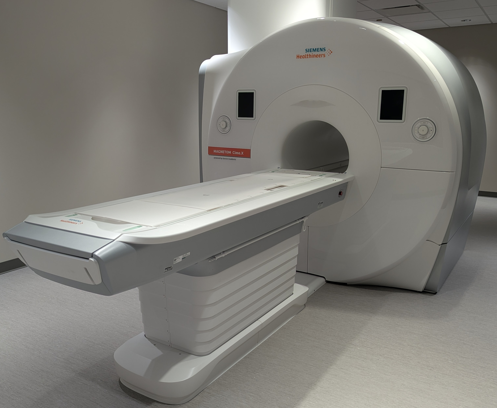{fig-align="right"}

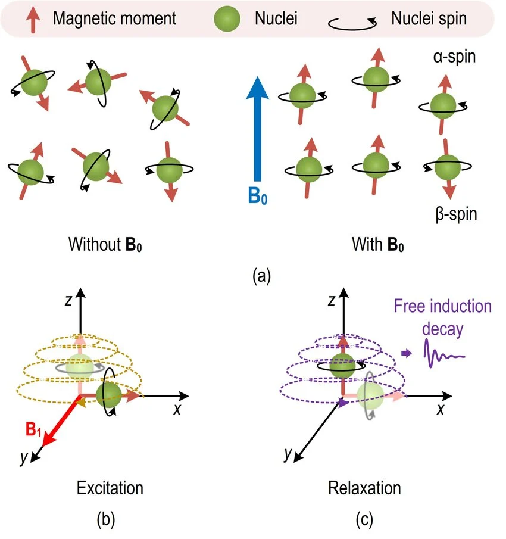{.fragment .fade-in-then-out fig-align="right"}

{.fragment .fade-in-then-out fig-align="right"}

:::
::::
:::::

---

## Magnet Strength
::::: columns
:::: {.column width="50%" style="font-size: 65%;"}
- Typically measured in Tesla (T).
- The Earth’s magnetic field is roughly 0.00005 Tesla.
    - Standard 3 Tesla scanner is ~60,000 times stronger than Earth's field.
- Meaning: 3 Tesla is [significant](https://www.youtube.com/watch?v=6BBx8BwLhqg){target="_blank"}.
::::

:::: {.column width="50%"}

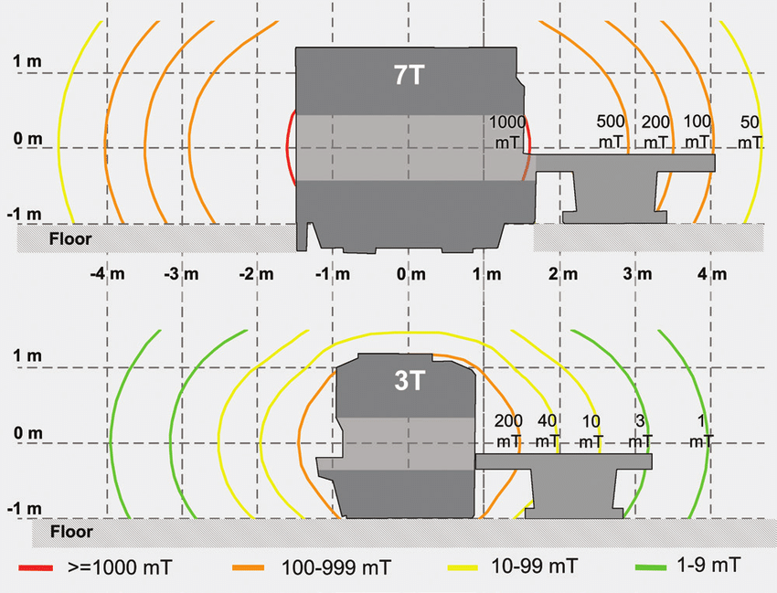{fig-align="right"}

::::
:::::

---

## Magnet Is Always On!
::::: columns
:::: {.column width="50%" style="font-size: 65%;"}
- Electrical resistance decreases with temperature.
    - At very (very) low temperatures, copper has superconductive properties.
- MRI scanner filled with liquid helium:
    - Ramp up (charge coil) from the electrical grid.
    - Then disconnect!
    - Perpetual current = persistent field strength.
- Magnetic field is independent of power in:
    - Room,
    - Veldman Family Psychology Clinic,
    - South Bend.
::::

:::: {.column width="\"50%"}
::: {.r-stack}

{.fragment .fade-in-then-out fig-align="right"}

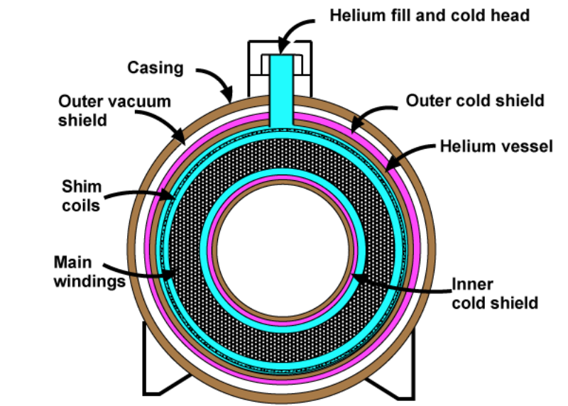{.fragment .fade-in-then-out fig-align="right"}

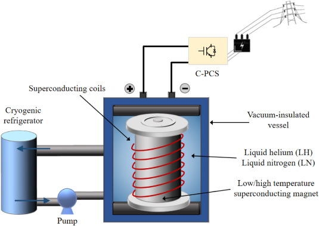{.fragment .fade-in-then-out fig-align="right"}

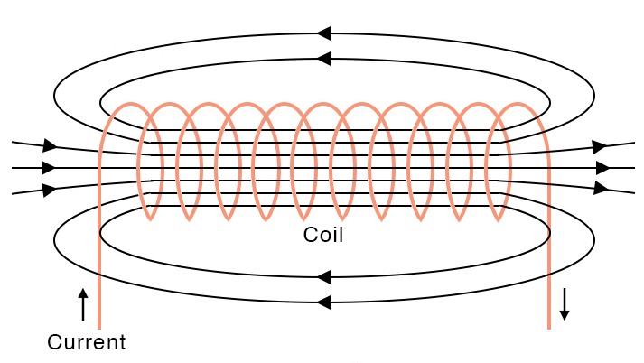{.fragment .fade-in-then-out fig-align="right"}

:::
::::
:::::

---

## Safety Considerations

::::: columns
:::: {.column width="50%" style="font-size: 65%;"}
- Rarely are rooms [fatal](https://smithchason.edu/mri-safety-lessons-1980-2001-2025/){target="_blank"}.
- Injuries are more [common](../../media/articles/inaguma_2023_injuries.pdf){target="_blank"} than they should be.
- American College of Radiology ([ACR](https://www.acr.org/){target="_blank"}) recommends a 4 [zone](https://mriquestions.com/acr-safety-zones.html){target="_blank"} strategy for controlling access.
::::

:::: {.column width="\"50%"}
::: {.r-stack}

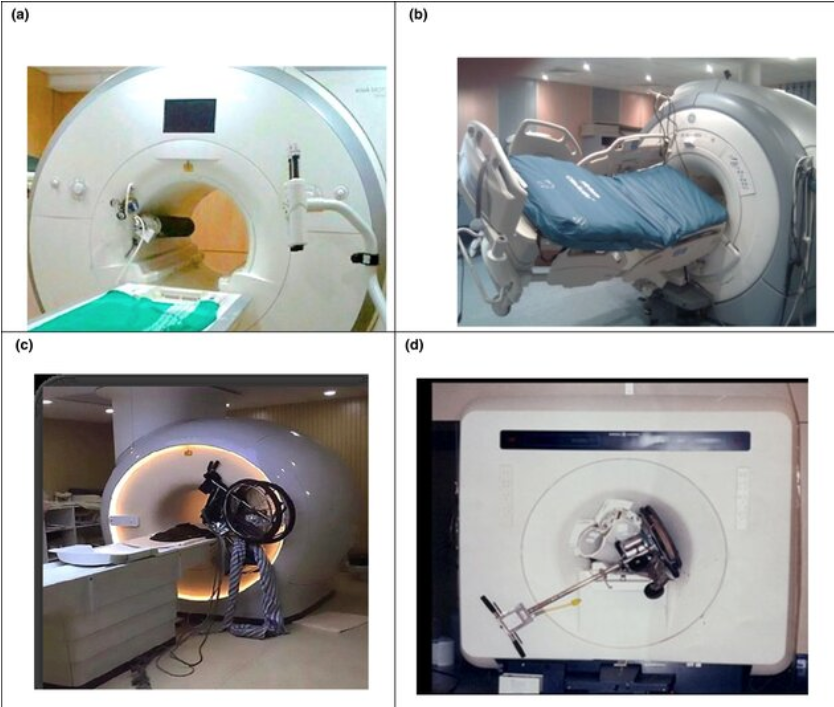{.fragment .fade-in-then-out fig-align="right"}

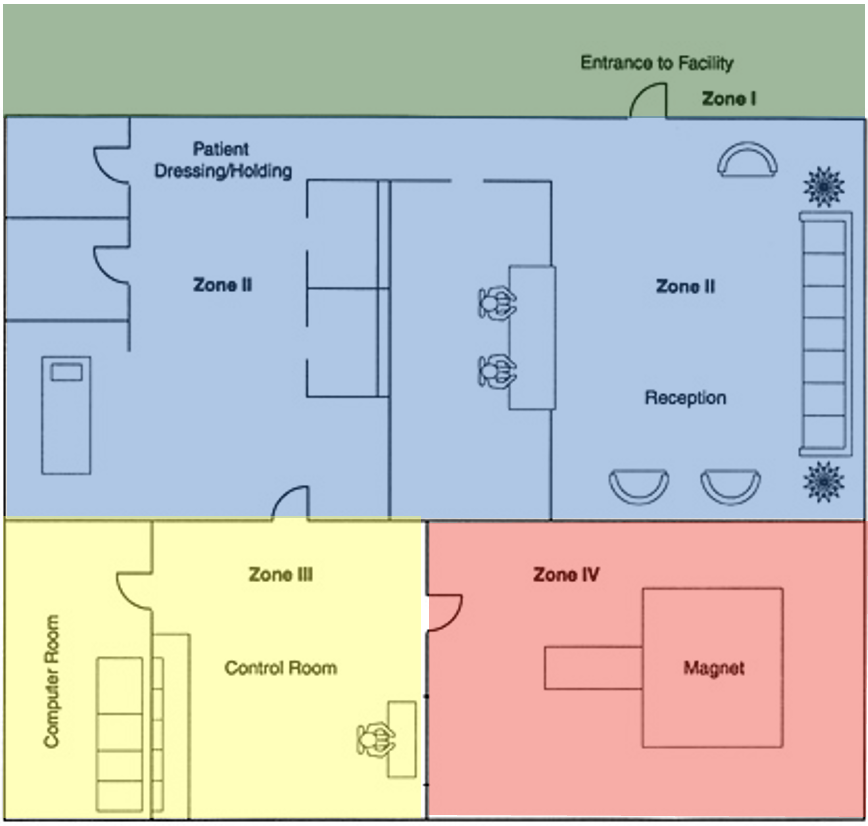{.fragment .fade-in-then-out fig-align="right"}

:::
::::
:::::

---

## Safety Screener

<!-- TODO: Detail -->

::::: columns
:::: {.column width="50%" style="font-size: 65%;"}
- Everyone who enters Zone 3 **MUST** fill out an [MRI Safety Screener](../forms/form_RO01_mri_screen.pdf){target="_blank"}.
- Check for compatibility with 3 Tesla field.
- Reviewed by two people, check for:
    - MR contraindications (e.g. pacemker),
    - MR compatibility (e.g. magnetic lashes).
::::
:::::


# MRI Zones

ND-HNC zone [map](../../media/sops/nd-hnc_layout_zones.png){target="_blank"}.

## Zone 1 - Orange
::::: columns
:::: {.column width="50%" style="font-size: 65%;"}
- Contains:
    - Offices
    - Conference
    - Reception
- Use:
    - Meet participants
- Access:
    - Public
::::

:::: {.column width="\"50%"}

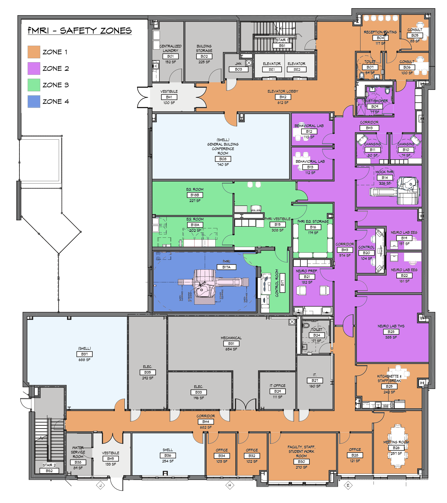{fig-align="right"}

::::
:::::

---

## Zone 2 - Purple
::::: columns
:::: {.column width="50%" style="font-size: 65%;"}
- Contains:
    - Changing rooms
    - Interview, testing
    - Non-MRI research (EEG, TMS)
    - Mock MRI
- Use:
    - Non-MRI research
    - MRI preparation
- Access:
    - Levels 1, 2+
    - Escorted Visitors
::::

:::: {.column width="\"50%"}

{fig-align="right"}

::::
:::::

---

## Zone 3 - Green
::::: columns
:::: {.column width="50%" style="font-size: 65%;"}
- Contains:
    - Equipment
    - Storage
    - Control
- Use:
    - Access MRI scanner
    - Maintain equipment
    - Collect MRI data
- Access:
    - Level 3+ (Supervised Level 2)
    - Screened, escorted Visitors
::::

:::: {.column width="\"50%"}

{fig-align="right"}

::::
:::::

---

## Zone 4 - Blue
::::: columns
:::: {.column width="50%" style="font-size: 65%;"}
- Contains:
    - Magnet
- Use:
    - Scan participants
- Access:
    - Level 4+ (Supervised Level 2+)
    - Screened, escorted Visitors
::::

:::: {.column width="\"50%"}

{fig-align="right"}

::::
:::::


# Level 2 Access
Purpose: Assist with MRI research.

## Participant Flow

<!-- Schedule
Arrive
Screen
Interview
Mock
Scan -->

```{mermaid}
flowchart LR
    subgraph Zone_1 [Zone 1]
        B["`Arrive
            Screen
            Review Screen 1
            ---
            Exit`"]

    end
    style Zone_1 fill:#eca972,stroke:#000000,color:#000000,stroke-width:2px

    subgraph Zone_2 [Zone 2]
       C["`Interview
           Mock
           EEG, TMS
           (Review Screen 1)`"]
    end
    style Zone_2 fill:#d480f0,stroke:#000000,color:#000000,stroke-width:2px

    subgraph Zone_3 [Zone 3]
        D["`Review Screen 2
            Administer Task`"]
    end
    style Zone_3 fill:#88e8a0,stroke:#000000,color:#000000,stroke-width:2px

    subgraph Zone_4 [Zone 4]
        E[Scan]
    end
    style Zone_4 fill:#7397e3,stroke:#000000,color:#000000,stroke-width:2px

    A[Schedule] --> Zone_1
    Zone_1 <--> Zone_2 <--> Zone_3 <--> Zone_4

    classDef allBlack color:#000000;
    class A,B,C,D,E,F allBlack;
    classDef whiteBoxes fill:#ffffff,stroke:#000000,stroke-width:2px;
    class A,B,C,D,E,F whiteBoxes;
    linkStyle default stroke:black,stroke-width:1px;

```

<!-- ## Data Flow

CorpFS
Stimulus presentation
Participant response
Output DICOM files -->

## Requirements

::::: columns
:::: {.column width="50%" style="font-size: 65%;"}
- Complete annual ND-HNC MRI Safety training, Level 2.
- Participate in building access and safety trainings.
- Wear Level 2 access badge while in the ND-HNC research suite.
:::::
:::::

---

## Privileges

::::: columns
:::: {.column width="50%" style="font-size: 65%;"}
- Irish1Card access to Zone 2.
- Unsupervised access to Zone 2.
- Escort visitors in Zone 2.
- Access to Mock Scanner and Mock computer.
- Supervised access to Zones 3 & 4.
- Access Stimulus Control, DICOM computers.
- Review and sign MRI Safety Screen.
- Help un/load Visitors into MRI scanner.
- Respond as Helper in emergency situations.
::::

:::: {.column width="\"50%" style="font-size: 65%;"}
{fig-align="right"}
::::
:::::

---

## Restrictions

::::: columns
:::: {.column width="50%" style="font-size: 65%;"}
- Irish1Card access to Zone 3 not granted.
- No access to Zone 3 Equipment Room (B18A).
::::

:::: {.column width="\"50%" style="font-size: 65%;"}
{fig-align="right"}
::::

:::::

---

## Duties

::::: columns
:::: {.column width="50%" style="font-size: 65%;"}
- Assist during emergencies.
    - Staying in Zones 1, 2.
::::

:::: {.column width="\"50%" style="font-size: 65%;"}
{fig-align="right"}
::::
:::::


# MRI Safety
Incidents and Accidents

## Rarely Due to Equipment Malfunction
::::: columns
:::: {.column width="50%" style="font-size: 65%;"}
- Usually due to how equipment is used
    - Breakdown in following procedure and policy
- Design policies that address:
    - Predictable situations
    - Unusual or unpredictable situations
::::
:::::

---

## Safety Switch Use and Function

::::: columns
:::: {.column width="50%" style="font-size: 65%;"}
- Power to scanner
    - Used to shut off electrical power to table and scanner controls
- Fire suppression panel
    - Status of scan room fire alarm and suppresion system
- MRI system panel
    - Powers system up and down
    - Quench button
- Quench button
    - Second button in scanner room
::::
:::::

---

## REMEMBER

::::: {style="text-align: center; color: red"}


Magnet does **NOT** turn off after hours
or between patients.

The magnet is **ALWAYS** on.
:::::

---

## Primary MRI Safety Concerns

:::: {.columns style="font-size: 65%;"}

::: {.column width="30%" }
### **Static Magnetic Field**

- Projectile
    - Possible injury
    - Can damage system
    - Costly to repair
- Medical device displacement
- Medical device disruption
- Bioeffects
:::

::: {.column width="5%"}
<!-- Empty column to create a gutter/gap -->
:::

::: {.column width="30%"}
### Radiofrequency Field

- Tissue heating
- Medical device heating
- Medical device disruption
- Interference with monitoring equipment

:::

::: {.column width="5%"}
<!-- Empty column to create a gutter/gap -->
:::

::: {.column width="30%"}
### Pulsed Gradient Magnetic Field

- Peripheral nerve stimulation
- Acoustic Noise
- Interference with monitoring equipment

:::
::::

---

## Magnetic Field Safety

::::: {.columns style="font-size: 65%;"}
- Spatial gradients
    - Translational force: pulls magnetic items towards area where field changes most steeply
    - Peak danger zones: highest pulling forces near the outer rim and opening of scanner
    - Implant risks:strong gradients can torque or move medical implants
- Static field effects
    - Consistent uniform magnetic field produced by main superconducting magnet
    - Potential biologic effects: vertigo, nausea
    - Mechanical effects: translation, torque, Lenz’s forces
- Time varying effects
    - Gradient magnetic fields (auditory, induced voltage)
    - Radiofrequency magnetic fields (biologic, thermal)
:::::

---

## Magnetic Field Safety, cont'd

::::: {.columns style="font-size: 65%;"}
- Non-magnetic field effects
    - Claustrophobia/anxiety
    - Cryogen and quench safety
:::::

---

## Gauss Line Locations

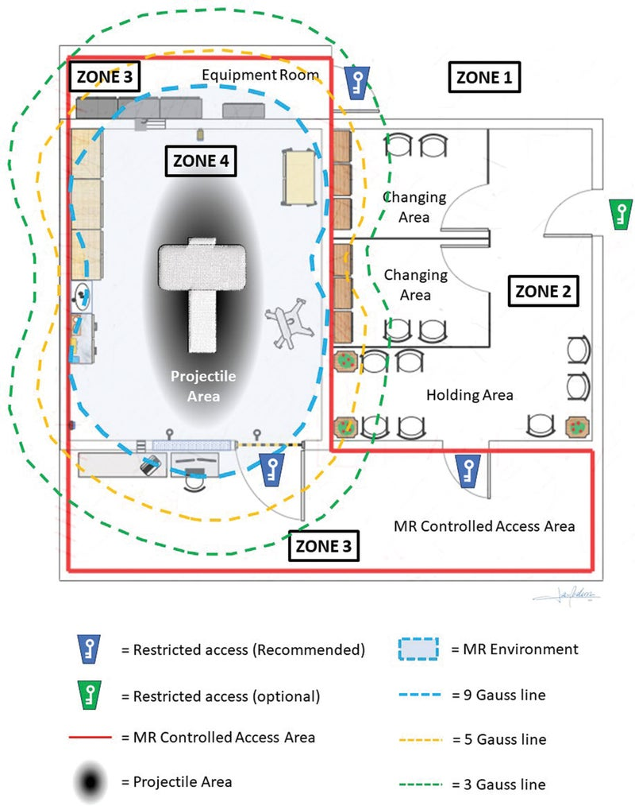{fig-align="center"}

---

## Safety Screening
::::: columns
:::: {.column width="50%" style="font-size: 65%;"}
Categories of implant safety

- MRI Safe: no known hazards
- MRI Unsafe: known to pose hazards
- Conditional: demonstrated to pose no know threat hazard under specific conditions
    - Researched prior to scan to ensure specific conditions are met
- [NO UNSAFE ITEMS IN SCANNER ROOM]{style="color: red;"}
::::

:::: {.column width="\"50%"}

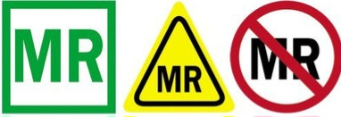{fig-align="center"}

::::
:::::

---

## Safety Screening, cont'd
::::: {.columns style="font-size: 65%;"}
ALL STAFF, RESEARCHERS, AND VISITORS MUST BE SCREENED

- Clothing
    - Check for ferromagnetic or conductive materials
    - Labels are not sufficient
    - Everyone entering the area of transmit RF (bore) should change
- Remove all readily removable metallic personal items
    - Watches, jewelry, cell phones, physiological monitoring devices
    - Cosmetics with metallic particles
    - Dental implants

:::::

---

## Safety Screening, cont'd
::::: {.columns style="font-size: 65%;"}
- Dermal Implants
    - Those contacting another may increase risk of thermal injury
    - Conductive loops may be created by skin adornments such as tattoos, especially with dark ink (brown or black) and curved patterns
- Burn hazards
    - Foil patches, metal leads or skin contact with bore wall
    - Do not cross arms or legs (creates a loop)
    - Use padding to insure no skin is touching bore wall

:::::

---

## Quenching the Magnet
::::: {.columns style="font-size: 65%;"}
Quenching the magnet is the deactivation of the magnetic field of the MRI

- Causes cryogens to rapidly boil off
- Cryogen release could displace oxygen in room
- Release could change pressure in room
    - Stay low
    - Use manual door release
- There is an emergency quench button located in scanner room and control room. (insert images)

QUENCH ONLY WHEN THERE IS A RISK TO LIFE/SERIOUS INJURY OR AN UNCONTROLLABLE FIRE IN MRI ROOM THAT REQUIRES FERROMAGNETIC FIREFIGHTING EQUIPMENT

:::::


# Culture of Diligence

::::: columns
:::: {.column width="50%" style="font-size: 65%;"}
- **Purpose:** have ZERO accidents with the scanner.
- Avoid complacency and [survivorship bias](https://en.wikipedia.org/wiki/Survivorship_bias){target="_blank"}.
- Follow and support policies, for example:
    - Wear badges for ease of identification.
    - Close doors to restrict Zone access.
    - Challenge, log, report protocol deviations.
::::

:::: {.column width="\"50%"}

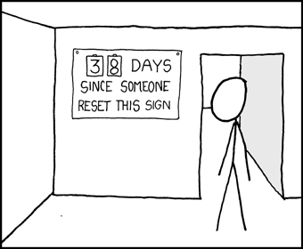{fig-align="right"}

::::
:::::


# Sources
:::: {.columns}
::: {.column width="50%" style="font-size: 50%"}
What is MRI?

- [NMR Property](https://link.springer.com/chapter/10.1007/978-3-031-91447-8_2)
- [Axial T1-weighted image](https://mrimaster.com/index-2/)

MRI Strength

- [Tesla distance](https://www.researchgate.net/figure/Comparison-of-fringe-magnetic-fields-of-two-clinical-MRI-systems-Fringe-magnetic-fields_fig1_334496429)

Always On!

- [Superconductivity](https://mriquestions.com/superconductivity.html)
- [Magnet cross section](https://mriquestions.com/superconductive-design.html)
- [Magnet and grid](https://www.sciencedirect.com/topics/engineering/superconducting-coil)
- [Electromagnet](https://www.sciencefacts.net/solenoid-magnetic-field.html)

:::
::: {.column width="\"50%" style="font-size: 50%"}

Safety Considerations

- [2x2 Scanner Accident](https://www.purdue.edu/hhs/mri/MR%20Safety/MR%20Safety.html)
- [Article Selection](https://smithchason.edu/mri-safety-lessons-1980-2001-2025/)
- [MRI Zones](https://mriquestions.com/acr-safety-zones.html)

Gauss Line Locations

- TODO

Culture of Diligence

- [XKCD](https://xkcd.com/363/)

:::
::::